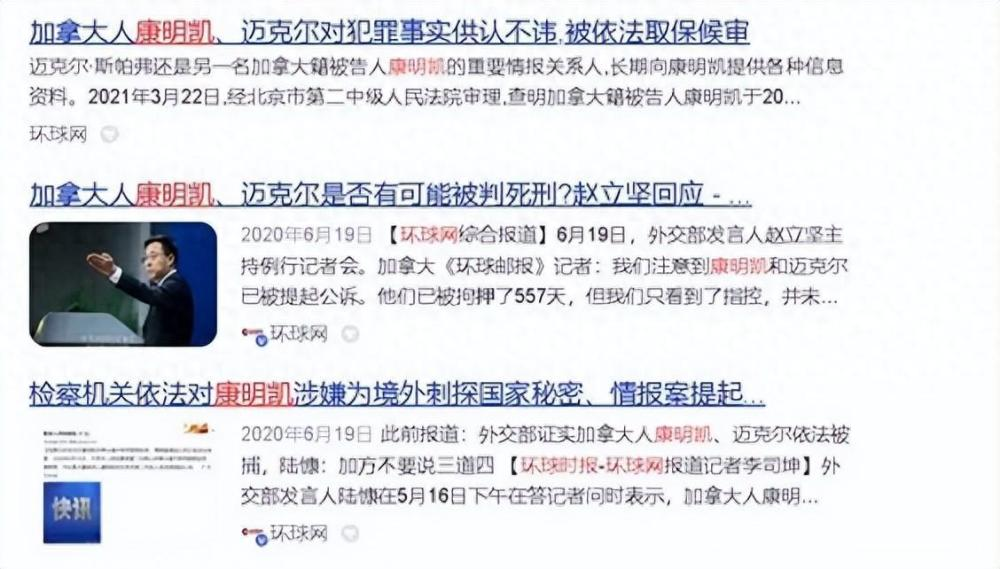
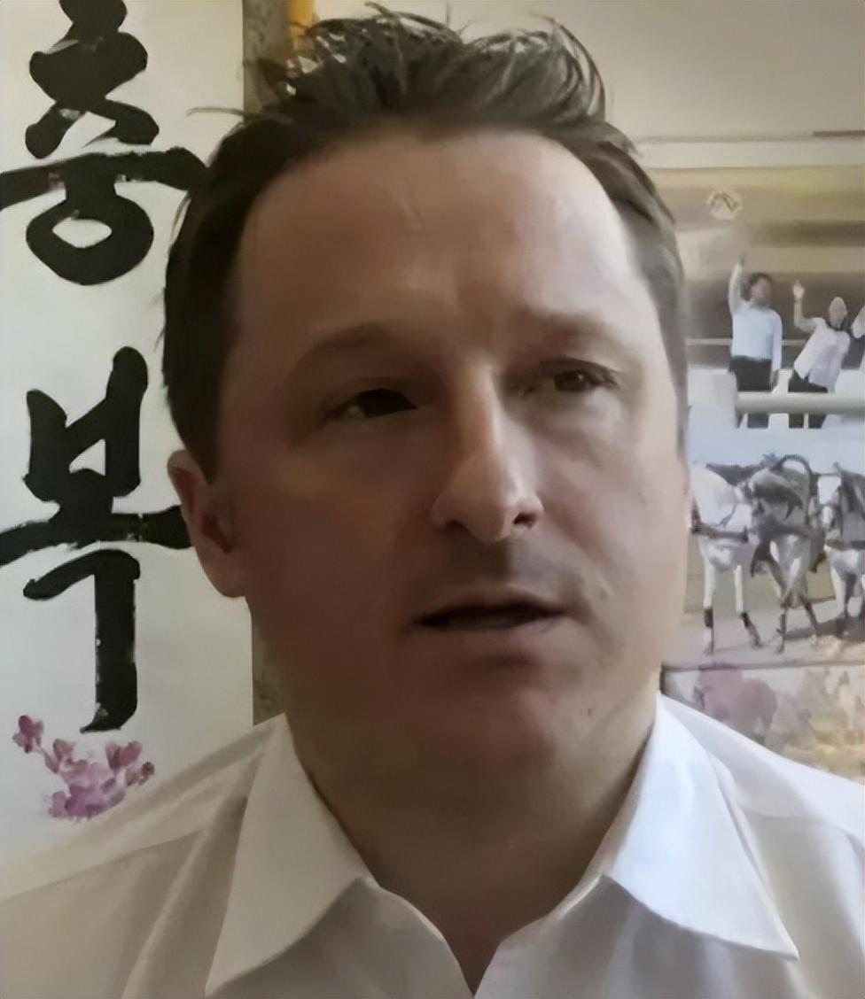
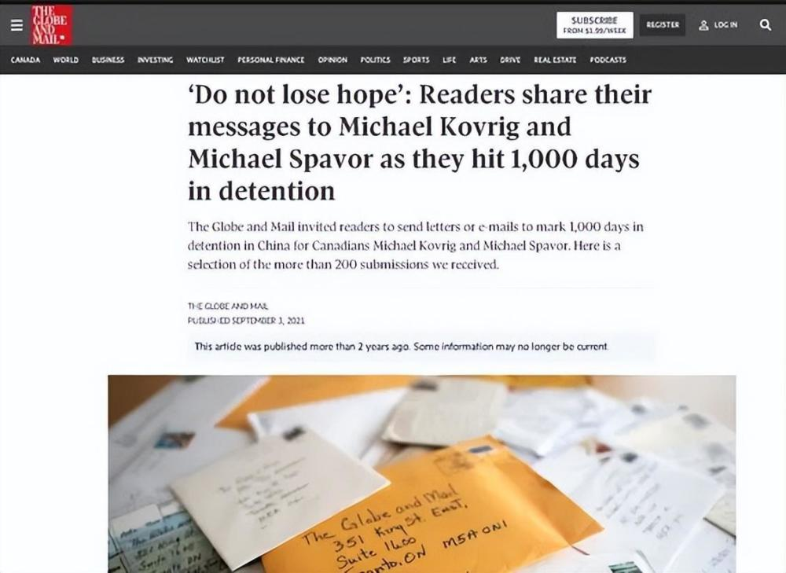
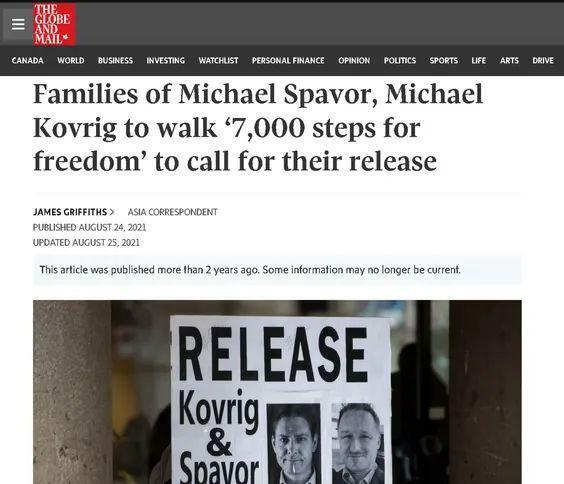
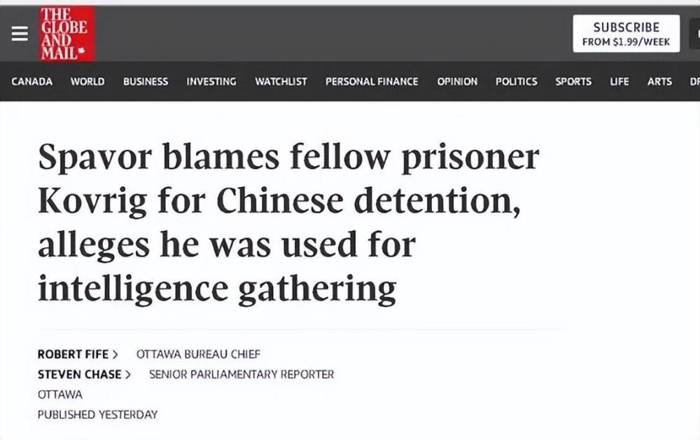
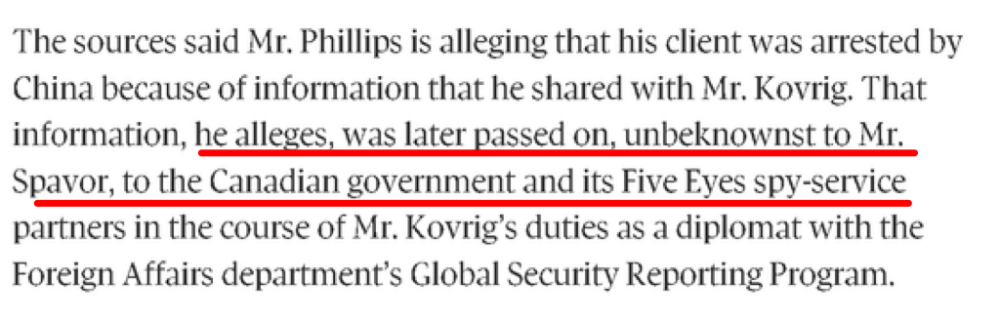
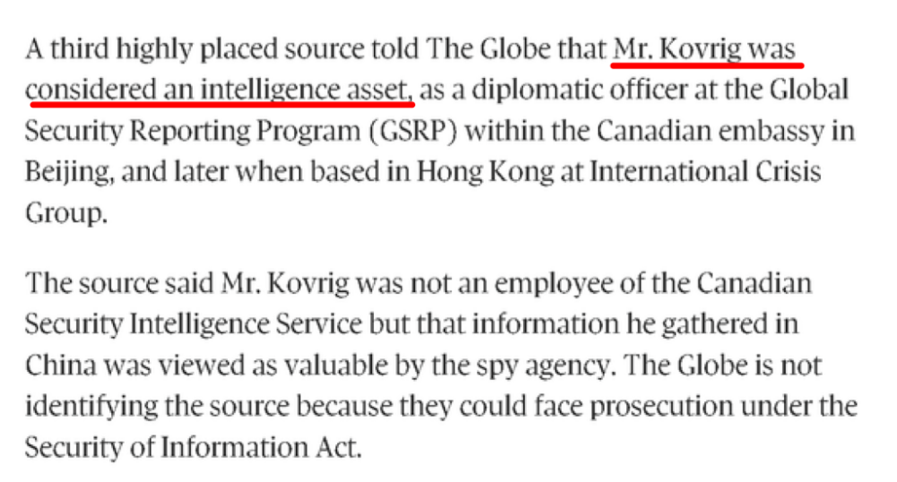
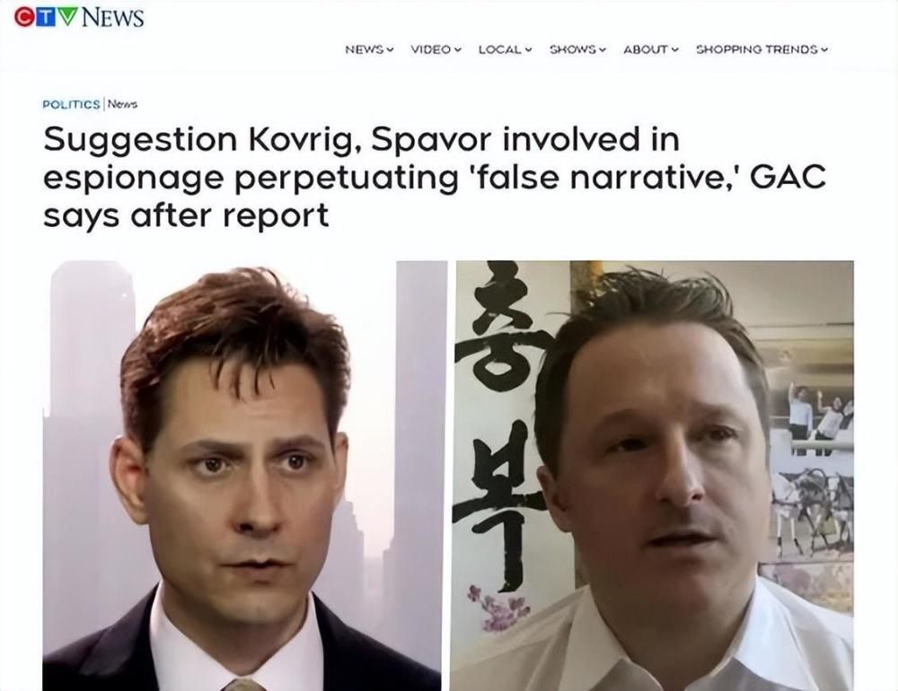
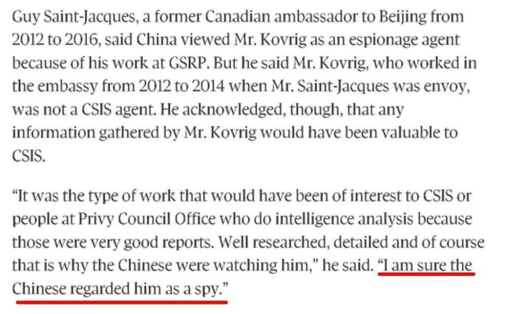
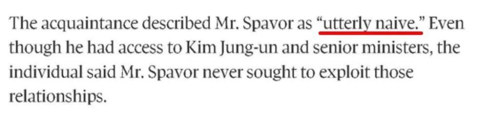

# 曾被中国逮捕的两个加拿大间谍闹内讧了！

曾被中国逮捕的两名加拿大间谍，在回国后居然闹内讧了！而且这一闹，不仅把大量两人涉及的案情曝光了出来，更把加拿大政府的脸都给抽肿了！

不知大家是否还记得，几年前，在华为公司的高管孟晚舟遭加拿大政府非法扣押的那段时间，我国的执法部门曾逮捕了两名涉嫌在中国从事间谍活动的加拿大人，一个叫康明凯，一个叫迈克尔。

_康明凯_

_迈克尔_

然而，尽管两人很快就对我方认罪悔罪，可加拿大从政府到媒体，乃至两人的家人，还有其他美西方媒体，却都坚称两人不是间谍，是被“冤枉”的。加拿大的《环球邮报》甚至还在两人被我方羁押满1000天的时候，煽动加拿大民众通过加拿大驻华大使馆给两人写信去支持他们。

但恰恰是这家《环球邮报》，如今却曝出了一个势必会让加拿大政府、舆论以及西方极为尴尬的大猛料：这俩人确实曾在中国从事过会被认为是间谍行为的活动——而且这个大猛料，还是因为两人起了内讧，那个迈克尔把康明凯以及他背后的加拿大外交部给告了，才被披露出来的。

到底怎么回事呢？原来，根据《环球邮报》的报道，迈克尔在诉状中控诉说，他当年之所以会被中国政府逮捕，是因为他被康明凯以及加拿大外交部给坑骗了。当时，他曾经把他在中国期间了解到的朝鲜方面的一些情报，分享给了曾经供职于加拿大外交部，但当时自称已经离职并在一家国际关系智库就职的康明凯。可他万万没想到的是，康明凯居然不仅和加拿大外交部仍然有联系，而且加拿大驻华大使馆一个专门从事情报工作的部门也将他视作“情报资产”，结果迈克尔给康明凯的信息，就这样被康明凯通过加拿大政府这个渠道，最终传递给了那个加拿大所属、由美国控制、臭名昭著的“五眼联盟”情报网络。

_截图来自加拿大《环球邮报》的报道_

_截图来自加拿大《环球邮报》的报道_

然而，即便面对这一重大猛料，加拿大政府目前仍然在拼命否认，称康明凯是加拿大间谍的说法是“谣言”，但这种否认恐怕只会令加拿大政府进一步自取其辱。

因为一名曾经在加拿大驻华大使馆工作过的前外交官就直言不讳地对《环球邮报》透露，尽管加拿大驻华大使馆那个从事情报工作的部门并不属于加拿大安全情报局这个加拿大的正牌间谍机构，但这个部门搜集的情报对后者而言一直是“很有价值”的。所以——这名前外交官说——也难怪中国方面会将康明凯视作间谍。

_截图来自加拿大《环球邮报》的报道_

而另一名同时认识迈克尔和康明凯的人士更表示，他认为迈克尔在面对专门找上门来套取他情报的康明凯时，确实“太过天真”了。

 _截图来自加拿大《环球邮报》的报道_

那么说到这里，我们再回过头来看当年我方对迈克尔和康明凯指控的罪名，前者是为境外刺探国家秘密、情报罪，后者是为境外刺探、非法提供国家秘密罪，可以说是非常准确了——并且，这也再一次证明咱们中国的办案机关，有多么可靠！

