# 欧预赛：法国14-0直布罗陀，姆巴佩戴帽+世界波，埃梅里首秀破门

北京时间11月19日凌晨，欧预赛B组第9轮开打，法国主场对阵直布罗陀。上半场，科曼迫使詹姆斯·桑托斯自摆乌龙，马库斯·图拉姆补射建功。随后，17岁的埃梅里在进球后伤退，姆巴佩点球再下一城。克劳斯、科曼、福法纳先后破门。下半场易边再战，拉比奥在乱战中捡漏得手，科曼、登贝莱先后进球，吉鲁梅开二度，姆巴佩上演帽子戏法。最终全场战罢，法国队14-0击败直布罗陀。

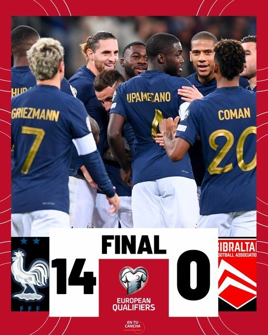

**比赛焦点**

1、姆巴佩3球2助攻。

2、科曼2球1助攻。

3、17岁的埃梅里首秀即破门，但因伤提前离场。

4、法国队创造队史最大分差胜利。

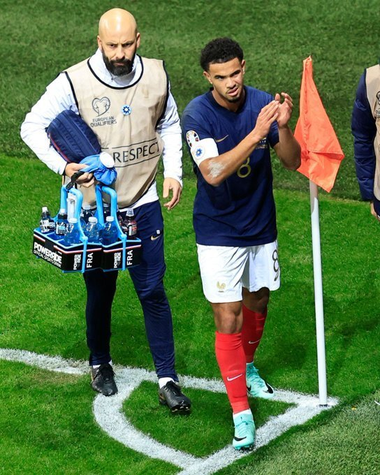

**精彩回顾**

第3分钟，科曼直传禁区右路，克洛斯横传门前，詹姆斯·桑托斯不慎自摆乌龙。

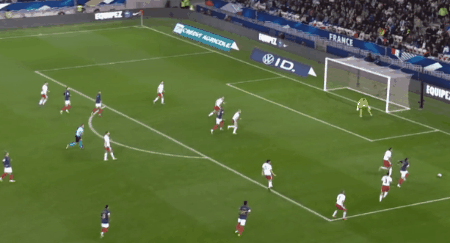

第4分钟，格列兹曼突入禁区射门，科尔因倒地封出，马库斯·图拉姆补射破网。

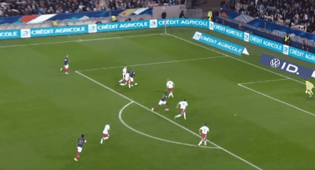

第16分钟，埃梅里断球分边，科曼横扫门前，埃梅里顺势抽射破网。

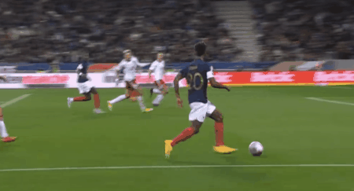

随后，VAR介入比赛，詹姆斯·桑托斯因对埃梅里恶意犯规，被直接红牌罚下。刚刚打进1球的埃梅里则因伤提前离场。

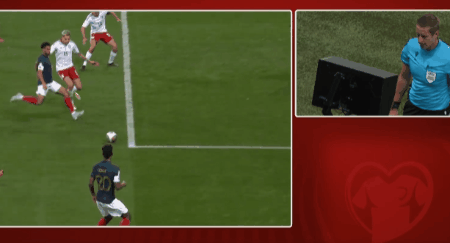

第30分钟，卡夏罗在禁区内手球犯规，主裁判罚点球，姆巴佩一蹴而就，法国队4-0领先。

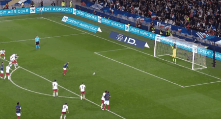

第34分钟，法国队开出战术角球，姆巴佩横传门前，克洛斯大力远射得分。

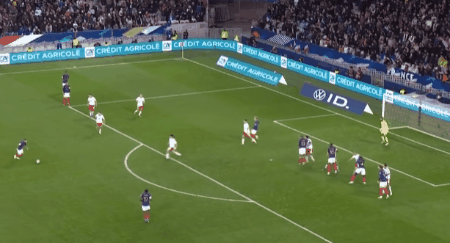

第36分钟，特奥吊入禁区，穆勒希解围不远，科曼推入死角。

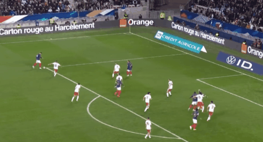

第37分钟，姆巴佩横传，替补登场的优素福·福法纳远射得手。

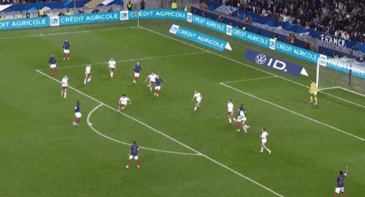

第63分钟，格列兹曼开出右侧角球，拉比奥在乱战中捡漏得手，法国队8-0领先。

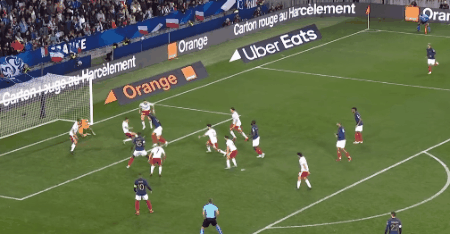

第65分钟，姆巴佩妙传禁区，科曼扣过奇波利纳，顺势挑射破网。

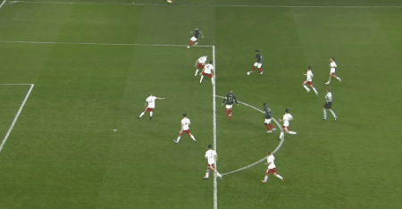

第73分钟，克洛斯做球，登贝莱在禁区右侧低射破网。

第74分钟，特奥横扫门前，姆巴佩推进死角。

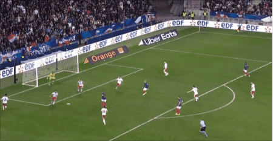

第82分钟，姆巴佩精彩吊射破网。

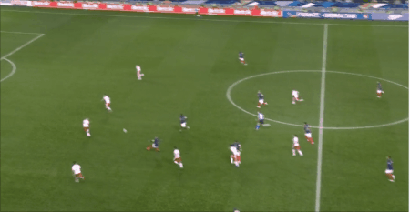

第89分钟，格列兹曼胸部做球，吉鲁左脚抽射破网。

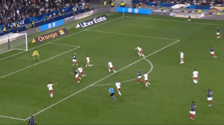

伤停补时阶段，吉鲁在禁区内倒钩破网，将比分定格为14-0。

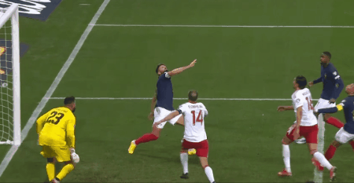

**球员评分**

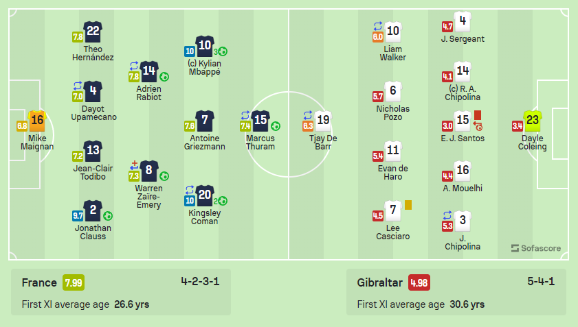

法国出场阵容（4-2-3-1）

门将：16-迈尼昂

后卫：2-克洛斯、13-托迪博、4-于帕梅卡诺（81’17-萨利巴）、22-特奥

后腰：14-拉比奥（67’18-布巴卡尔·卡马拉）、8-扎伊尔-埃梅里（20' 19-优素福·福法纳）

中场：20-科曼（67’11-登贝莱）、7-格列兹曼、10-姆巴佩

前锋：15-马库斯·图拉姆（67’9-吉鲁）

未登场替补：1-桑巴、23-阿雷奥拉、3-迪萨西、5-孔德、6-凯夫伦·图拉姆、12-穆阿尼、21-卢卡斯

直布罗陀出场阵容（5-4-1）

门将：23-科尔因

后卫：4-萨金特、14-奇波利纳、16-穆勒希、15-桑托斯、3-奇波利纳（62’12-奥利维拉）

中场：6-波佐、11-德阿罗、10-沃克（62’2-乔利）、7-卡西亚罗

前锋：19-德巴尔（81’21-库姆斯）

未登场替补：1-班达、13-洛佩斯、5-隆科、8-巴德尔、9-赫米迪、17-鲁伊斯、18-安东尼-埃尔南德斯、20-巴兰坦、22-皮科克

