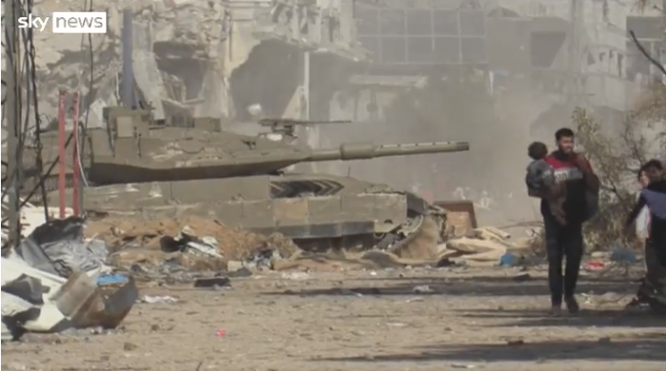
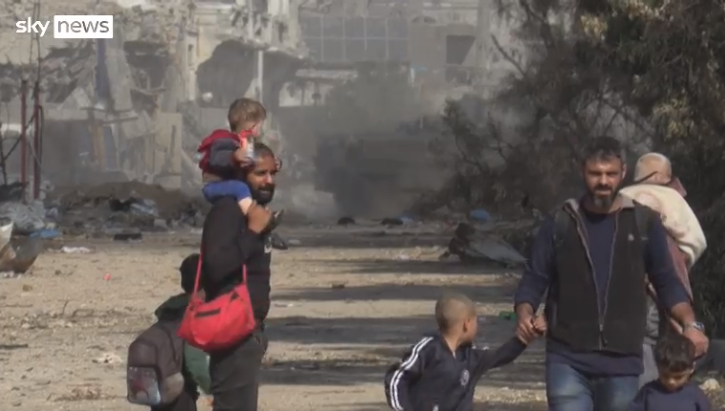

# 英媒发布视频：以军坦克轰鸣，数百人在枪声中徒步逃离希法医院

【环球网报道】巴以新一轮冲突仍在持续，加沙地带最大医院希法医院及其周边人道主义局势成为关注焦点。英国天空新闻网19日发布一段视频，显示在以军坦克和重型车辆穿越该地区发出隆隆轰鸣之际，数百人在枪声中徒步逃离希法医院。

_视频截图显示，随着以军坦克轰鸣，数百人徒步逃离希法医院 图源：英国天空新闻网_

关于目前希法医院现状，英国《卫报》介绍，世界卫生组织当地时间周六（18日）访问该医院后，把这家曾经是加沙最大、最先进的转诊医院描述为“死亡区域”。天空新闻网称，据世卫组织了解，希法医院入口处有一个“乱葬坑”，医院内部情况“令人绝望”。

巴以冲突11月19日进入第44天，以色列对加沙地带的军事行动仍在继续。自本月15日起，希法医院就成为以色列在加沙北部的行动焦点，以方此前坚称，加沙地带最大医院希法医院存在“巴勒斯坦伊斯兰抵抗运动（哈马斯）的指挥中心”，但遭到哈马斯否认。以色列16日继续放出“证据”，并称地面行动将扩展到加沙其他地区。与此同时，由于持续的围困导致加沙地带无法获得燃料供应，加沙粮食系统崩溃，联合国方面警告称，当地居民正面临严重的生存危机。

