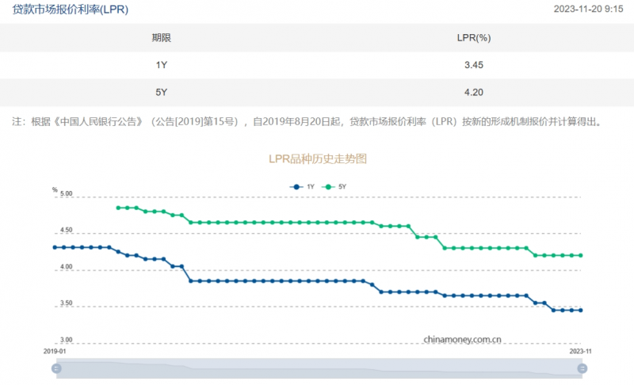

# 11月LPR仍“原地踏步” 专家认为还有降息空间

11月20日，中国人民银行授权全国银行间同业拆借中心公布，2023年11月20日贷款市场报价利率（LPR）为：1年期LPR为3.45%，5年期以上LPR为4.2%，均与上月持平。

LPR已连续第三个月保持不变。

11月15日，人民银行开展4950亿元公开市场逆回购操作和14500亿元中期借贷便利（MLF）操作，利率均与上期持平，分别为1.8%、2.5%。央行表示，该操作是为了维护银行体系流动性合理充裕，对冲税期高峰、政府债券发行缴款等短期因素的影响，同时适当供应中长期基础货币。

业内人士认为，央行本次大规模超额平价续作MLF有助于缓解银行体系流动性压力。

由于贷款市场报价利率（LPR）是以MLF利率为基础，不少市场人士认为，11月的LPR也将维持不变。

光大银行金融市场部宏观研究员周茂华此前表示，在信贷保持平稳适度增长、银行部分净息差压力未明显缓解的背景下，预计本月LPR保持稳定。

他认为，金融机构将挖掘利率市场化改革红利，进一步降低实体经济薄弱环节、重点领域的融资成本。

2019年8月中国人民银行改革完善LPR报价形成机制，LPR成为金融机构贷款利率定价的参考基准。

改革以来，1年期LPR和5年期以上LPR分别累计降低0.8个和0.65个百分点，其中今年以来，1年期和5年期以上LPR已分别下降20个基点、10个基点。LPR的持续下行带动企业贷款加权平均利率从2019年7月的5.32%降至2023年9月的3.82%，创有统计以来最低水平。

也有不少专家认为，降息空间依然存在，未来还有降息可能。

央行货币政策司近日发文称，将推动存贷款利率进一步市场化，坚持用改革的办法，引导融资成本持续下降。持续释放LPR改革效能，督促LPR报价行继续健全报价机制、提高报价质量，增强LPR对实际贷款利率定价的指导性，巩固企业融资和居民信贷成本下降的成效。

东方金诚首席宏观分析师王青则认为，未来不排除进一步下调政策利率，进而引导宏观利率水平与推动经济增速向潜在水平回归的要求相匹配。10月CPI（消费者价格指数）再现同比负增长，PPI（生产价格指数）同比下降幅度较上月扩大，意味着当前以名义贷款利率减去通胀率后的实际贷款利率较高，不能排除未来降息的可能。

央行行长潘功胜近日在金融街论坛的讲话中表示，“我们将继续以我为主实施好利率调控，按照经济规律和逆周期宏观调控需要，引导和把握宏观利率水平，保持利率水平与实现潜在经济增速的要求相匹配。”

中信证券首席经济学家明明指出，这一表态是继数量层面“保持货币供应量和社会融资规模增速同名义经济增速基本匹配”，央行再次提出价格层面的“保持利率水平与实现潜在经济增速的要求相匹配”。

明明认为，当前经济处于曲折修复阶段，若经济增速回落至潜在增速以下，则央行将视情况降息，后续央行仍然有降息的空间。

招联首席研究员董希淼表示，四季度应继续加大货币政策实施力度，推动政策利率下行，实施全面降准或定向降准，适度降低存款利率，压降银行资金成本，推动市场主体融资成本稳中有降，进一步巩固宏观经济恢复向好态势。如果年底前，5年期以上LPR非对称下降10个基点，将更好地降低居民存量和新增房贷利息支出，提振居民住房消费意愿和能力。“这将进一步降低企业中长期贷款利率，激发企业有效融资需求，为实现2024年经济良好开局创造条件。”

文/北京青年报记者 程婕

编辑/田野

