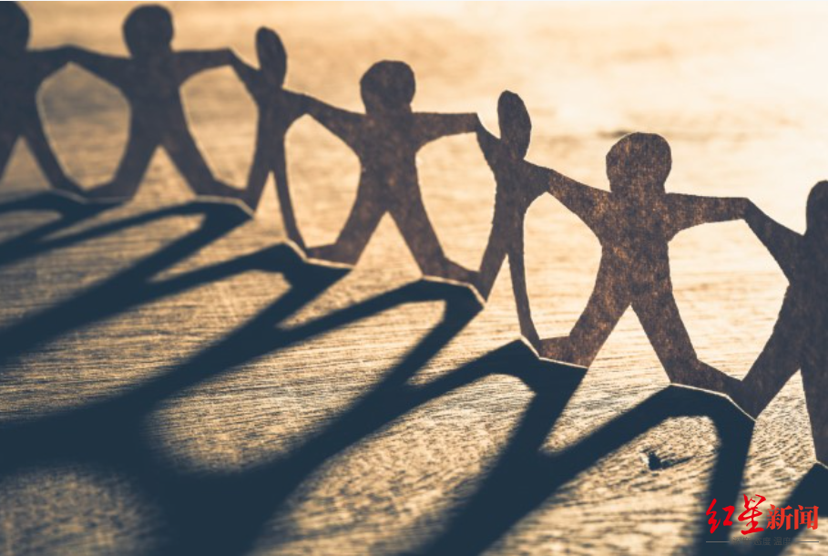
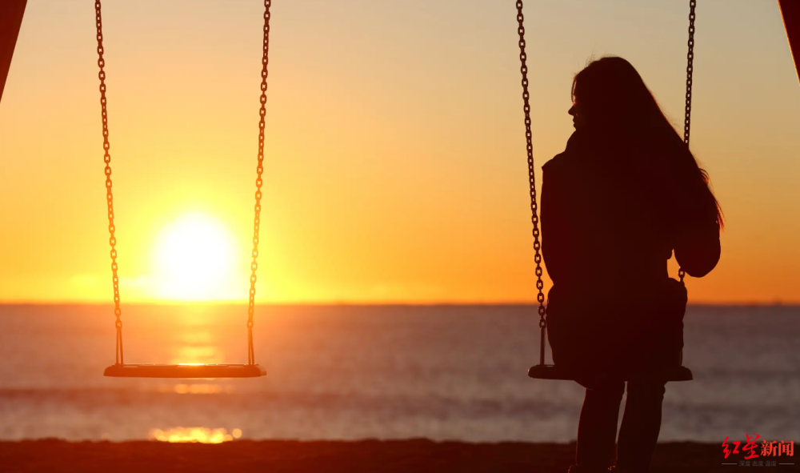

# 世卫警告：“孤独”成全球健康杀手，危害相当于每天抽15根烟

世界卫生组织近日宣布，将成立一个新的“社交连接委员会”，以联合国际社会的力量对抗孤独症在全球的蔓延。

拜登政府的医疗卫生总监、美国前公共卫生局局长维韦克·穆尔蒂博士是这个委员会的主要成员之一。穆尔蒂表示，研究表明孤独对人体健康的影响相当于“每天吸15根烟”。

世卫组织在通告中还指出，孤独影响健康并非发达国家老年人的“专利”，全球各国不分贫富都受到“孤独症”蔓延的冲击，并且年轻人受到的影响并不一定小于老年人。

**世卫成立新机构**

**在全球重建“社交连接”**

世界卫生组织11月16日宣布，孤独已经成为一种“紧迫的全球性健康威胁”。为了应对孤独带来的挑战，
世卫将成立一个新的社交连接委员会，将社交连接作为优先事项，并加速在各个收入水平的国家推广解决方案。

该委员会由穆尔蒂博士和非洲联盟青年特使奇多·姆蓬巴共同主持，共有11位政策制定者和健康生活倡导者参加。该委员会将持续运行三年，分析社交生活在改善各个年龄段人群健康方面的核心作用，并提出在全球重新建立大规模社交连接的解决方案。该委员会将考虑“如何利用新的社交连接增强社区和社会的福祉，促进经济进步、社会发展和创新”。

世卫组织总干事谭德塞博士表示：“全球范围内高比例的社交中断和孤独对健康和福祉产生严重后果。缺乏足够强大的社交联系的人面临中风、焦虑、痴呆、抑郁、自杀等方面更高的风险。这个新的委员会将有助于将社交连接确立为全球健康优先事项，并分享最有前途的心理健康干预措施。”

穆尔蒂引用美国新汉普郡大学的一项研究称，孤独对人体健康的影响相当于每天吸15根烟，孤独的负面作用与肥胖、酗酒、药品成瘾、空气污染等风险因素相差不大。而在美国，有高达56%的中老年人报告自己时常感觉孤独。穆尔蒂表示，“我很高兴与杰出的委员会成员密切合作，推动建立社交连接，这是人类福祉的重要组成部分。我们可以共同建立一个更少孤独、更健康、更有韧性的世界。鉴于孤独的深远影响和负面后果，我们有责任在重建社会纽带方面进行投资，就像我们在应对其他全球健康问题（如吸烟、肥胖和毒品危机）时所做的一样”。

根据世卫组织的一份报告，长期的社交孤立甚至会将一个人的寿命缩短15年。总是自感孤独的人更有可能被送入养老院和急诊室。根据美国卫生资源和服务管理局的数据，孤独的人可能睡眠不好，这会将中风的概率增加32%、心脏病风险增加29%、心理障碍和疾病的风险增加26%。

此外加利福尼亚大学旧金山分校的研究发现，长时间独处可能导致完成日常任务的能力下降。59%的社交孤立的人发现日常任务（如爬楼梯或行走）完成起来更加困难。

社交孤立对大脑健康也有不良影响，将使痴呆的风险增加50%，尤其是将提升患上阿尔茨海默症的风险。与抑郁等心理障碍不同，社交孤立通常不会被医生诊断出来，然而它们仍然会对大脑认知功能和身体健康产生负面影响。

**研究报告：**

**孤独让早逝风险大增39%**

世卫组织称，与“孤独主要影响高收入国家的老年人”的传统观念相反，它们影响着全球各个年龄段人群的健康和福祉。根据研究结果，有四分之一的老年人经历过社交孤立，这个比率在全球各个地区大致相似。在青少年中，有大约5%至15%的人经历过类似的感受，不过由于青少年与医生深入交流的机会比老年人更少，这些官方统计数据可能被低估了
。

非洲联盟青年特使奇多·姆蓬巴在声明中表示，非洲地区的经验证实，孤独将使青少年接受教育的效果大打折扣，在高中时期感到孤独的年轻人更有可能辍学；并且孤独还会影响经济发展成果：员工在工作中感到脱节和缺乏支持会导致工作满意度和绩效较差。

姆蓬巴对此称，“年轻人并不能免于孤独。社交孤立可以影响任何人，不论年龄，不论地域。在整个非洲地区，我们必须重新定义关于孤独的叙事。对社交连接的投资对于创造富有成效、有韧性和稳定的经济，促进当前和未来世代的福祉至关重要”。

此外,世界卫生组织特别提到了英国格拉斯哥大学的一个研究团队受委托发布的研究报告。这份报告追踪访问了45.8万名受访者，平均年龄为57岁。格拉斯哥大学健康与福祉学院的临床研究员哈米什·福斯特博士表示，孤独会让早逝风险增加39%。

福斯特认为，不管是客观上的社交隔离（包括与家人好友几乎从不联系等情况）还是主观上的孤独感觉（包括有联系但自己感觉不被人理解等情况）都会对人的健康造成打击，而两者叠加的效果几乎是致命的。因此各国政府有必要组织投入资金，帮助社会中最孤独的个体尽量参与社会公共活动，减少死亡风险。

红星新闻记者 郑直 综合参考消息 新民周刊

编辑 潘莉 责编 冯玲玲

