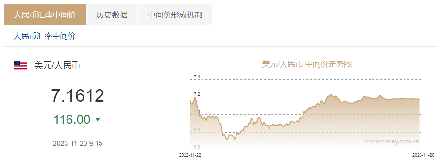
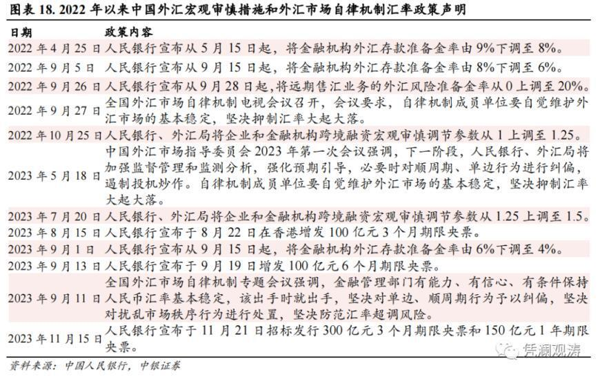

# 人民币对美元中间价大涨116点，“变盘”开始？

金融界11月20日消息 中国外汇交易中心显示，20日，人民币对美元中间价报7.1612，调升116个基点。

1月17日晚间，人民币大反弹。具体来看，离岸人民币兑美元盘中一度升破7.22，最高报7.21，日内一度涨超300点。
在岸人民币兑美元日内涨超500点，一度升破7.2，报7.1911，创8月初以来新高。

消息面上，11月17日，中国人民银行、金融监管总局、中国证监会联合召开金融机构座谈会，研究近期房地产金融、信贷投放、融资平台债务风险化解等重点工作。

会议指出，下一步，要继续加大政策落实和工作推进力度，持之以恒营造良好的货币金融环境。要落实好跨周期和逆周期调节的要求，着力加强信贷均衡投放，统筹考虑今年后两个月和明年开年的信贷投放，以信贷增长的稳定性促进我国经济稳定增长。要优化资金供给结构，盘活存量金融资源，加大对重大战略、重点领域和薄弱环节的金融支持，增强金融支持实体经济的可持续性。

会议强调，各金融机构要一视同仁满足不同所有制房地产企业合理融资需求，对正常经营的房地产企业不惜贷、抽贷、断贷。继续用好“第二支箭”支持民营房地产企业发债融资。支持房地产企业通过资本市场合理股权融资。要继续配合地方政府和相关部门，坚持市场化、法治化原则，加大保交楼金融支持，推动行业并购重组。要积极服务保障性住房等“三大工程”建设，加快房地产金融供给侧改革，推动构建房地产发展新模式。

**人民币汇率“变盘”的开始？**

国金宏观指出， **美元的快速走弱是人民币汇率升值的直接推手，**
而美债利率的快速回落则是美元走弱的主因。11月1日以来，在岸、离岸人民币分别升值1.4%、1.6%，而同期美元指数大幅走弱2.7%，是人民币汇率升值背后的重要推手。

国金宏观分析， **远期汇率的走强、风险逆转因子的走低，均释放了人民币延续升值的信号。**
远期市场上，即远期动态相关性的大幅走低、往往意味着“变盘”的开始；9月以来，在人民币即期汇率仍在7.3关口波动时、远期汇率已提前“转向”。期权市场上，隐含波动率走低多指示汇率拐点临近；近期，隐含波动率于10月13日跌破5%，风险逆转因子也快速走低。

**人民币汇率“变盘”底气何在？国金宏观指出，向后看，美国经济基本面或将继续走弱，而国内经济企稳向好的信号已愈发明确。**
10月美国制造业PMI由49.0回落至46.7；就业市场也现松动，新增非农仅15万人、失业率也走高至3.9%。而国内库存正处绝对低位，叠加实际利率下行，经济企稳向上信号愈加明确；10月以来万亿国债增发、广义财政支出加速，将为经济进一步注入上行“动能”。

国君国际宏观也指出，离岸人民币的融资成本开始明显走低，这意味着做空人民币的成本也同步下滑，但离岸人民币并没有出现部分投资者担忧的贬值，反而借着近期的美元走弱出现了一波强力的升值。

国君国际宏观分析，中间价扮演了“稳定器”的作用，由于人民币兑美元的中间价一直相对稳定，空头仍然对政策意图较为忌惮，没有轻易在这一区域下注，而是希望等待更加清晰的信号。

**国金宏观分析，人民币汇率走强，有利于国内市场资金风险偏好的提高。**
历史回溯来看，北上资金的流向往往会受到人民币汇率升贬值预期的影响。今年8月以来，贬值压力下，北上资金累计外流1820亿元，对A股市场造成了明显的拖累。随着汇率的转向，北上资金有望企稳回流；其中北上资金相对青睐、且8月以来减持幅度较大的行业值得关注。

**理解汇率政策的底层逻辑：汇率水平不重要，外汇市场运行状况更重要**

中银证券全球首席经济学家管涛指出，本轮人民币汇率加速调整行情始于5月中旬再度跌破7。5、6月份，有关部门只是在5月19日发布了一个新闻稿，警告将遏制投机炒作，抑制汇率大起大落，之后并未出实招。然而，自7月中下旬开始出台稳汇率政策，尤其是8月中旬人民币汇率跌破7.30后外汇政策频频加码。

管涛认为，将人民币汇率稳定在7.30附近或不是有关方面汇率调控加码的主要考虑。因为去年11月初，境内外人民币交易价曾短暂跌破过7.30，但当月银行即远期（含期权）结售汇顺差39亿美元。同时，去年人民币汇率大起大落，但全年只有4个月份出现结售汇逆差，平均逆差也仅有42亿美元。今年5、6月份人民币再度破7的时候，有关方面“只说不做”，也是因为同期结售汇分别顺差217亿、82亿美元，且企业总体“逢高结汇”。而7月份以来，银行结售汇连续四个月逆差，各月逆差分别为262亿、176亿、306亿和188亿美元，月均逆差233亿美元，其中9月份逆差规模为2017年2月以来新高。7至10月份，收汇结汇率和付汇购汇率分别较2022年11月至2023年4月上升0.6和4.1个百分点，也反映市场购汇动机总体趋于增强。此外，同期银行代客涉外人民币收付款持续净流出，累计净流出1181亿美元，而上半年仅有60亿美元，这加大了CNH的调整压力。

鉴于前述境内外汇供求和跨境资金流动的新变化，导致有关部门在离岸和在岸市场采用多项措施稳汇率。这符合此前IMF在2022年秋季年会上的提法，即建议各国应该保持汇率的灵活性，但如果汇率变动阻碍了央行货币政策的传导或者产生了更加广泛的金融稳定风险，则可以使用外汇干预措施。换言之，央行应该对汇率的日常波动善意忽视，只有当汇率波动已经影响到国内的物价稳定或金融稳定时，央行才有必要采取外汇干预措施。

