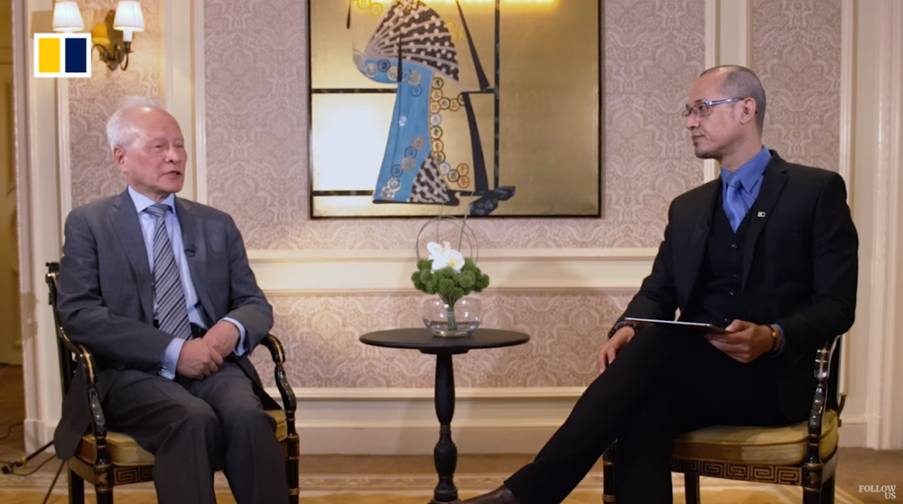
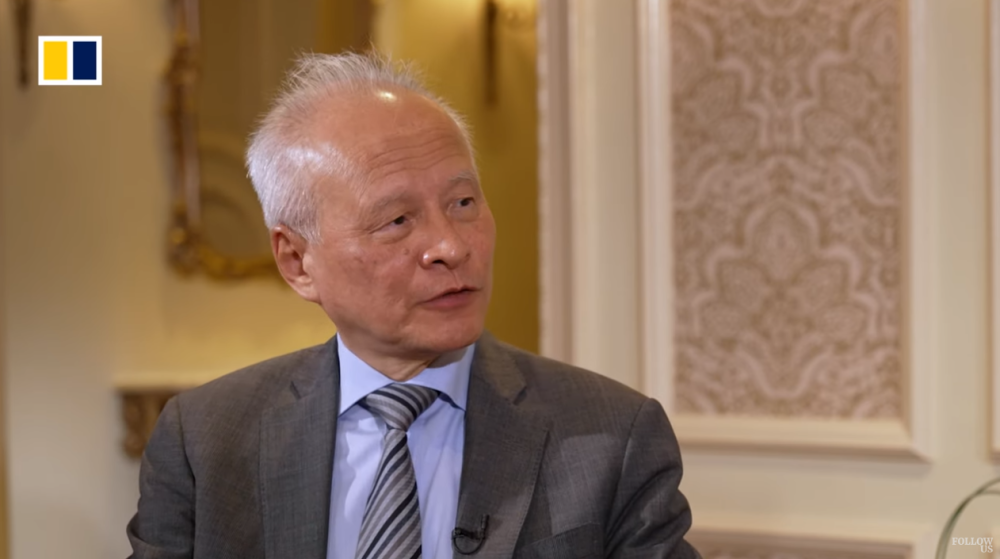

# 前驻美大使：台湾问题是中国人生死攸关的问题，没有后退让步的余地

【文/观察者网
熊超然】全球瞩目的中美元首会晤刚刚在美国旧金山举行，对于中美关系这一世界上最重要的双边关系，中国资深外交官、前驻美国大使崔天凯也分享了自己的看法。

据香港《南华早报》11月20日独家报道，在近日接受该报资深编辑云丹·拉图（Yonden
Lhatoo，印度裔）的对谈采访时，崔天凯表示，中美关系“过于复杂”，不可能只通过两国元首的一次会晤就能重启，必须首先承认台湾问题是一个“对于中国人而言生死攸关的问题”，“没有退让余地”，只有这样才能取得真正的进展。

 _崔天凯与云丹·拉图对谈 《南华早报》视频截图_

据报道，崔天凯接受采访的时间点，是在中美元首旧金山会晤之前。他告诉云丹·拉图：“台湾问题是事关国家主权、领土完整和国家统一的问题，所以这对中国人来说是一个生死攸关的问题……没有后退让步的余地。”

“这关系到所有中国人的生死，所以我们必须做好准备，不惜一切代价捍卫我们的国家主权。”

崔天凯表示，大陆方面将继续寻求以和平方式完成祖国统一，只要一个中国原则得到尊重，“其他都可以谈”。不过，他也警告说，在这个问题上，大陆方面能忍受被激怒的程度是“有限的”。

“对于如此复杂的关系，也许我们需要一些时间来做这件事……这种关系的真正优势在于，两国迟早总能找到克服困难的方法，推动两国关系向前发展。”他说道。

对于美国滥用所谓“国家安全”的说辞来打压遏制中国经济崛起的做法，崔天凯也提出了严厉批评，并敦促美国消除阻碍双方商业利益的贸易壁垒。在谈到中国与除美国以外的全世界的关系时，他对于“全球南方”充满信心，认为这是一股“变革与和平的力量”，可以对抗占主导地位的西方叙事。

在地区热点局势上，崔天凯指出，南海地区的紧张局势是由美国造成的，华盛顿方面在该地区的军事存在使得中国同其他亚洲邻国的争端变得更加“难解”。而反观中国，从巴尔干地区纷争和伊拉克战争，再到如今的乌克兰危机和加沙危机，面对严重的地区冲突，中国始终都是和平的坚定倡导者。

_中国资深外交官、前驻美国大使崔天凯 《南华早报》视频截图_

《南华早报》介绍称，上周，崔天凯十年来首次来到香港参加企业界峰会，他对于香港的持续繁荣和投资吸引力充满信心，他说香港是世界上最安全、最繁荣的城市之一，他在许多年前就对香港的未来持乐观态度。

“我认为香港仍有它所有的优势，有非常好的经济基础设施，金融市场非常发达，你们的所有机构是如此的开放，香港与内地的关系也是一个加分项。”崔天凯指出，人们应该意识到这一点，因为香港得到了支持，成为大中华市场的一部分，这是一个不断增长的市场，而其他很多经济体没有这种特殊的优势。

现年71岁的崔天凯曾于2013年至2021年期间担任中国驻美国大使，也是驻美时间最长的大使，现已退休的他，仍积极参与中美非官方交流。对于外界广泛认为他是“退而不休”（retired
but not tired）的说法，他也开玩笑地反驳了这一说法。“我想我应该好好享受退休生活。”崔天凯表示。

对于此次在旧金山举行的中美元首会晤，中共中央政治局委员、外交部长王毅表示，今年年初以来，由于众所周知的原因，中美关系经历不少曲折，面临困难局面，这不符合两国人民利益和意愿。在双方共同努力下，中美关系近期出现止跌企稳势头。在坦诚和相互尊重的气氛里，两国元首就事关中美关系的战略性、全局性、方向性问题以及事关世界和平和发展的重大问题坦诚深入地交换了意见。

王毅表示，中方重点就台湾问题和科技经贸问题阐明中方严正立场，强调美方应当将不支持“台独”的表态体现在具体行动上，停止武装台湾，支持中国和平统一；掷地有声地指出，打压中国科技就是剥夺中国人民的发展权利，中方不会答应，希望美方严肃对待中方关切，取消单边制裁，为中方企业提供公正非歧视的环境。

王毅指出，经过双方共同努力，这次会晤取得20多项重要成果。国际舆论高度关注、积极评价，普遍认为元首之间面对面沟通至关重要，对稳定中美关系的作用无可替代，此次会晤展现了双方的积极意愿，取得重要成果，具有非凡意义，对于历经起伏的中美关系发挥了关键引领作用。

王毅强调，中美关系能否巩固向好态势，关键在于美方能否遵信守诺，同中方相向而行，把两国元首达成的重要共识真正落到实处。明年是中美建交45周年。双方应当从旧金山再出发，推动中美关系持续改善发展，这符合两国人民利益愿望，也符合世界期待。

**本文系观察者网独家稿件，未经授权，不得转载。**

