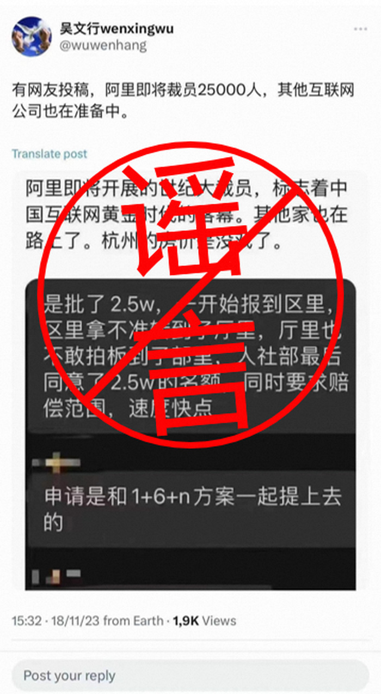
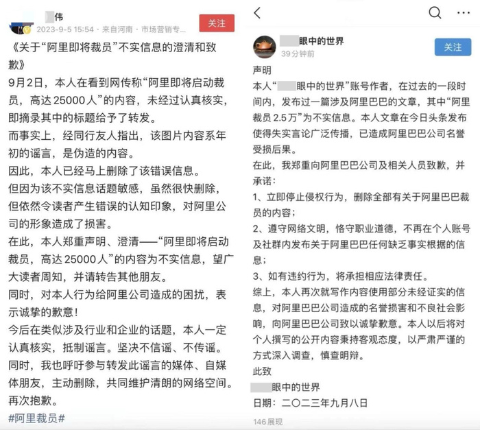

# 即将裁员25000人？阿里巴巴辟谣：裁员谣言接二连三，但假的就是假的

11月19日晚，阿里巴巴方面澄清了一则“阿里即将裁员25000人”的谣言，“裁员谣言接二连三，但假的就是假的”。据了解，阿里方面针对此次谣言已报警。

今年以来，所谓阿里及旗下各业务“即将大裁员”的谣言接二连三，内容极其夸张。虽然随着时间的推移，谣言不攻自破，但每每谣言流出，总有人有意无意传递恐慌。

5月底，阿里巴巴集团就对裁员谣言进行过辟谣。近两个月，一些曾在社交媒体上制造或转发“大裁员”谣言的博主都正式发文澄清和致歉，呼吁其他转发的媒体、自媒体主动删除，共同维护清朗网络空间。

阿里巴巴集团11月16日发布2024财年第二季度（即2023年9月30日为止的三个月）业绩公告。

**财报数据显示，该季度实现营收2247.9亿元，同比增长9%；经营利润335.84亿元，同比增长34%；调整后EBITDA
492.4亿元人民币，同比增长14%；调整后净利润401.9亿元，同比增长19%。**

来源：证券时报

