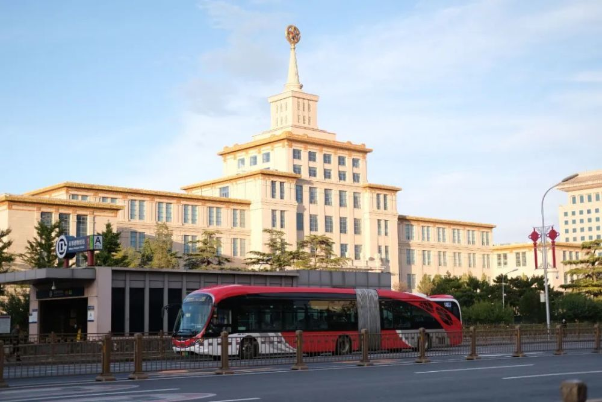
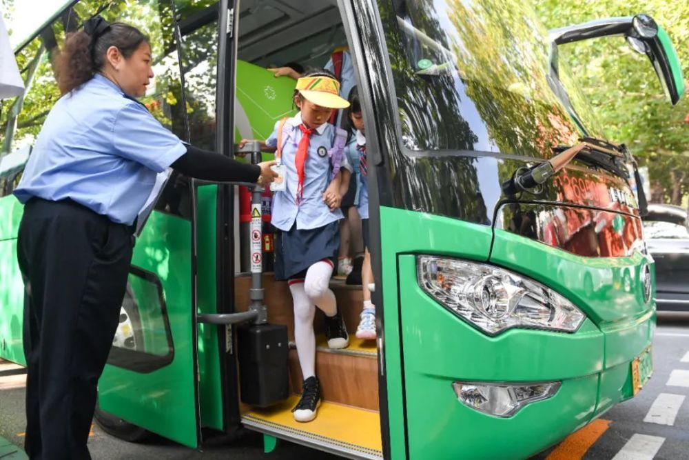

# 坐公交的人越来越少了，“公交优先”还要不要坚持

*本文为《半月谈》2023年第21期内容

想要了解一座城市，坐公交可能是最便捷的选择。然而，这一与城市发展息息相关的交通方式，似乎逐渐淡出了很多人的日常生活。今年以来，受困于客运量持续下滑、亏损巨大等原因，一些公交公司出现停运风波。近期，交通运输部等九部门印发《关于推进城市公共交通健康可持续发展的若干意见》（下称《意见》），针对目前公交行业困境提出15项具体举措，政策效力令人期待。

**由来已久的运营困境**

“许多城市公交客运量只占到历史最高年份的一半左右。”国家发改委综合运输研究所城市交通室主任程世东告诉半月谈记者，根据交通运输部数据，2022年全国常规公交客运量只有2014年的45.2%，今年上半年公交客运量同比去年小幅增长4.6%，仍远不及疫情前水平。

实际上，公交运营困境是一个长期现象。有数据显示，2014-2019年，坐公交的人每年都在减少，客运量平均每年自然流失2.41%，而公交票价基本没有上涨，普遍维持在1-3元的标准。在收入减少的背景下，新能源公交车购置、信息化改造、工资上涨等推动公交公司成本增长，使公交运营更显困难。

2020年以来，原本平缓下降的公交客流量开始大幅下降。去年以来，从广东博罗、湖南耒阳等县城开始，公交线路停运、公车司机工资遭拖欠等问题逐渐扩大到甘肃兰州、河南平顶山等城市，引发社会关注。

_北京市1路新能源公交车从中国人民革命军事博物馆前驶过_

为什么老百姓不愿意坐公交了？程世东认为，除之前受新冠疫情因素影响外，一个直接原因就是公交等待时间长、行驶速度慢、不准时，其本身的吸引力下降。从外部因素来看，公众出行习惯发生深刻变化，共享单车、网约车、自驾出行受到欢迎。与此同时，近年来我国电动自行车产量高速增长，统计显示，我国电动自行车保有量已超过3.5亿辆，连续多年保持两位数增长，这也对公交出行形成了直接替代。

近年来，面对乘客越来越少的情况，部分城市采用压线网、减车辆的办法降低成本。交通运输部推动城市公共交通优先发展专家库组长陈小钢认为，这使得公交运营陷入等车越来越难，乘客越来越少的恶性循环。

**一辆公交车，牵动九部门**

程世东直言，公交运营困难的问题是全国性的，因此相关政策需从国家层面布局安排。城市公交投入大、回报周期长，是一项基本公共服务，具有较强的公益性，需要通过政府财政予以保障。2020年以后，中央鉴于新能源公交车推广应用工作已达到预期，新能源公交车运营补助不再发放。2022年6月，财政部在相关文件中明确提出，城市公交属于地方事权，宜由地方承担相关支出责任。

业内人士调研发现，除部分大中城市外，许多中小城市过去长期依赖中央补贴，对公交的亏损补贴很少甚至没有，缺少相关财政预算，对中央补贴变化没有充分准备，导致近期公交运营问题集中显现。

九部门印发的《意见》第一条就强调“落实运营补贴补偿政策”，提出“压紧压实城市公共交通的地方主体责任，落实好城市公共交通作为市县级财政事权的支出责任”。程世东认为，这一政策意在给部分地方政府“提个醒”，敦促其落实好相关的事权责任。

随着老龄化趋势加快，老年人等免费乘车群体比例越来越大。数据显示，目前大部分城市免费和优惠乘车人群占客流量四成以上，部分中小城市甚至达到80%。《意见》提出，“各地要合理界定城市公共交通价格补偿和财政补偿范围”，完善相应价格机制。专家分析指出，政策引导地方政府量力而行，对优惠人群、比例作出调整优化，与财政水平相协调。

综览文件，《意见》还提出“保障公交优先通行”“支持开通定制公交”“落实城市公共交通用地综合开发”等多项具体措施。清华大学交通研究所副所长杨新苗等专家认为，政策出台十分及时，要积极保障城市公交运营主体正常运转，因地制宜为其提供更多发展条件。

**公交车寻找新角色**

车窗上贴着大红色的“囍”字、车厢内装饰着各色鲜花和气球……在湖北鄂州的街头，一辆公交婚车的接亲一幕吸引不少市民驻足。最近、湖北、广东、山东、安徽多个城市的公交集团推出租赁公交婚车的业务。新创意催生新服务，价格适中、气氛热烈的公交婚车吸引不少新人选择。

包括婚车租赁在内，公交多元化经营在多地蔚然兴起。如武汉公交集团推出机动车检测服务；北京在朝阳、海淀、丰台、西城等4个城区试点运营通学公交；浙江台州在公交场站建设模式上，推出公交停车、换乘枢纽、社会停车、商贸物流、居住办公等多功能一体开发；浙江宁波公交集团开通“地铁一到，公交即发”模式的接驳线。

_北京试点推出通学公交车服务 鞠焕宗 摄_

《意见》明确，支持开通通勤、通学、就医等定制公交线路，发展“公交+旅游”服务模式，优化定制公交管理流程，提高办理效率。

杨新苗等专家认为，公交资源尚待结构性优化，一些公交线路的客流量减少，但部分通学、通勤、新建社区的交通需求尚未能得到充分满足。而目前公交企业自主权还较为有限，各地应给予企业更多运营权限，优化开通不同的公交线路，选择适宜市民需求的车型，探索适合当地地情民情的发展路径。

部分舆论认为，在公交客流量大幅减少的当下，各地倡导“公交优先”的发展理念已经过时。程世东对此持不同意见，他认为公交是绿色低碳、集约出行的一种交通方式，“公交优先”理念要一直提、坚持提，通过优化公交的设施服务形成稳定的客流。同时，要承认公交在部分地区已不占交通主体地位的现实，公交系统应积极寻找新定位、新角色，在识变应变中积极求变，针对不同客群、不同区域需求实现差异化发展。

半月谈记者：孙文豪

责编：褚孝鹏 / 校对：秦黛新

