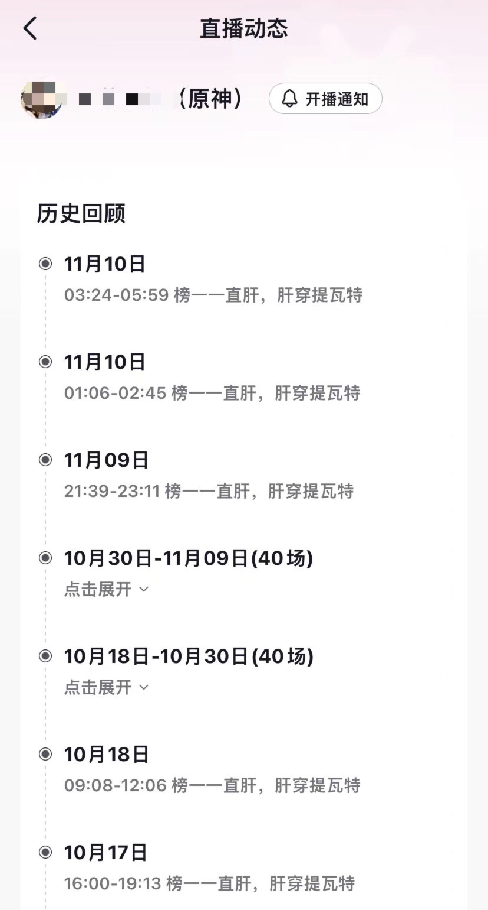
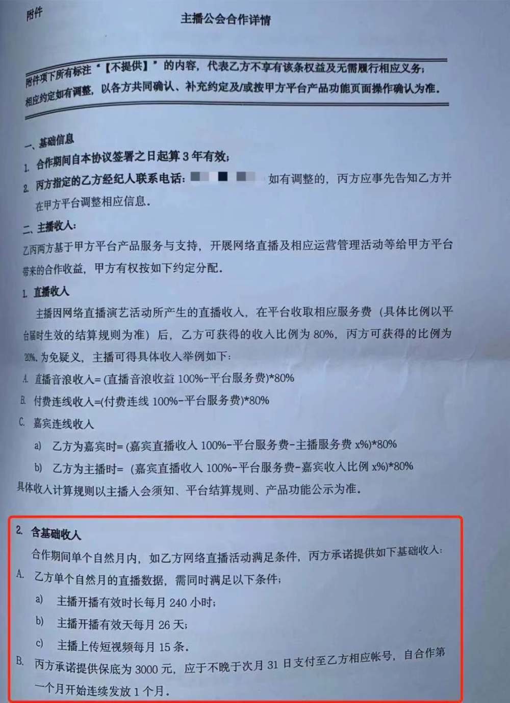
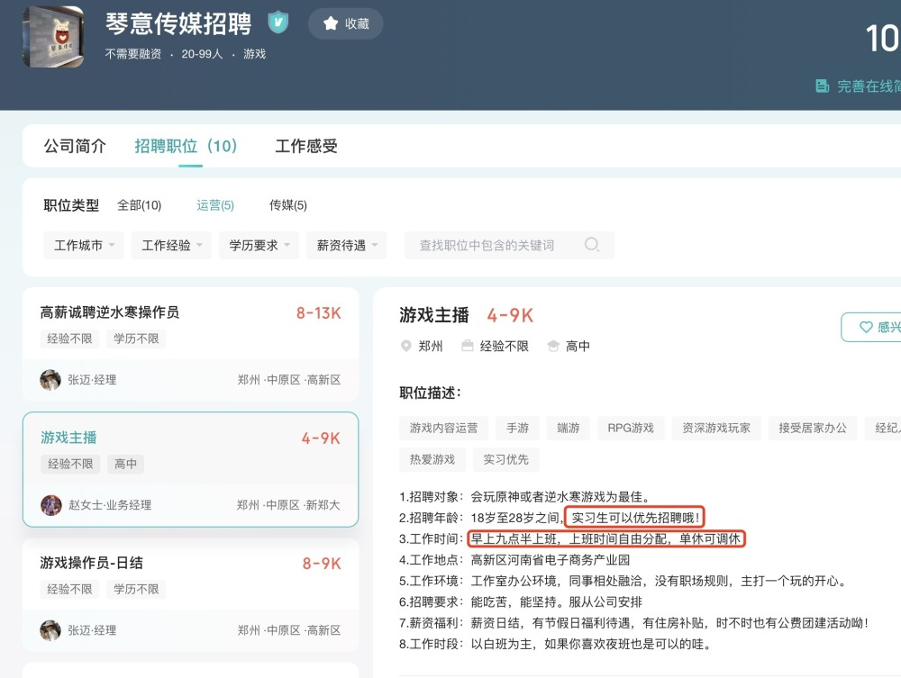

# 大学生实习连续五晚通宵直播后猝死，涉事公司称无雇佣或实习关系

11月10日，河南平顶山大三学生李昊（化名），在公司通宵游戏直播近9小时后，回到校外出租屋休息时猝死。

“学校要求他们有6个月的实习，在网上求职的时候，找到了这家游戏直播公司。”李昊的父亲李永成（化名）告诉澎湃新闻，公司与孩子签署的协议要求每个月直播时长不得少于240个小时，孩子原本是在白天直播，但11月5日后他开始夜间直播，猝死前曾连续五晚通宵直播。

对此，涉事公司河南琴意文化传媒有限公司表示，公司与李昊签署的是《主播及公会合作协议》，双方没有雇佣关系或实习关系，李昊是结束工作后在自己租住的出租屋内死亡，与公司并没有关系。此外，该公司表示，对于李昊夜间直播不知情，也不会强制要求主播在夜间进行直播。

_直播记录显示李昊猝死前曾通宵直播_

**大三学生入职直播公司，通宵直播后猝死**

李昊就读于河南平顶山职业技术学院计算机科学与应用系，预计明年6月就可以毕业。9月份开学后，是他在学校里的最后一个学年。

“大三没有课程了，主要就是实习，学校要求学生有6个月实习经历，他也很听话，从暑假就开始找实习了。”李永成长期在广州工作，今年暑假，李昊曾到他的单位实习两个月，但由于无法办理实习手续，9月开学后，李昊又返回了河南，准备重新找实习单位。

10月14日，李昊告诉爸妈，自己在郑州找到了一家直播公司做游戏主播，保底能拿到3000元的底薪，“我也不懂是什么样的公司，他说他们宿舍4个人，其余3个都在这家公司当主播，我觉得有同学一起照应，问题应该也不大。”

李永成没想到，孩子入职工作不足一个月，再次得知消息，竟然是死讯。

11月10日晚上7点多，李永成接到了孩子所在学校的电话，被告知孩子在合租的出租屋内死亡，没有抢救过来。

当天李永成就赶回了郑州，见到了与李昊合租的同学，才得知孩子死亡前的情况，“孩子是10号下午5点半左右开始出现问题的，他当时还在睡觉，同学听到他呼吸非常急促、叫不醒，就赶紧拨打了120急救电话，在医生的指导下给他进行了心肺复苏，后来救护车到了也在现场进行抢救，但没抢救回来，就报警了。”

事后，派出所出具的《死亡证明》显示，李昊属于非正常死亡，死因为“猝死”。

 _《协议》要求每月开播有效时长不少于240小时_

“为什么会猝死？”这个结果让李永成很难接受。他告诉澎湃新闻，李昊的身体一向很健康，也没有心脏病既往史，去年体检显示各项指标都很正常。

在了解李昊生前的具体行程时，李永成从合租同学处得知，在猝死前，李昊刚刚“通了一个大宵”，进行了长达9个小时的彻夜直播。“同学说孩子刚入职的时候是上的白班，但从11月5日开始，公司要求他上夜班，让他夜里进行直播，孩子不愿意，公司主管就进行规劝和诱导，说夜里直播打赏的人更多，能挣的钱也更多，同学说孩子一直都不情愿。”

点开李昊的抖音账号，里面记录了他从10月15日至11月10日的直播动态，短短25天里，他进行了89场直播。

动态显示，在11月5日之前，李昊的直播时间大多集中在上午10点到晚上7点。11月5日后，直播开始“跨夜”，大多数从晚上9点左右开始，一直到早上6点左右结束。

李永成说，猝死前一天，李昊也是晚上8点多前往公司，9点16分上机直播，中间休息了两次，持续直播到了早上5点59分，总直播时长近9个小时。这已经是李昊连续第五晚通宵直播。

为什么孩子会那么拼命直播？从李昊和公司签署的《主播及公会合作协议》（以下简称《协议》）上，李永成看出了端倪。《协议》规定，主播每月保底收入3000元，但要求开播有效时长需达到每月240小时、开播有效天数达到每月26天、主播上传短视频每月15条。

“主播的收入主要是靠打赏，但我孩子的粉丝才200多个（11月11日数据），不可能有打赏的，他就要去赚这个底薪，每天至少直播8个小时，而且还要求在夜里直播。”李永成说。

让李永成气愤的是，出事后，李昊所就职的公司没有进行任何沟通、慰问，“完全是置之不理，我去到公司，他们直接派了一个法务出面，说只能给5000元的抚慰金，如果有其他要求，让我去法院起诉他们，态度非常强硬。”

_琴意传媒的“游戏主播”招聘信息_

**涉事公司：没有强迫熬夜直播**

澎湃新闻记者通过《主播及公会合作协议》看到，与李昊签署协议的是河南琴意文化传媒有限公司，该公司负责主播的运营管理服务，同时可以获得主播20%的直播收入。工商信息显示，该公司成立于2019年10月9日。

在网上搜索该公司，可以看到不少招聘信息。在BOSS直聘网站上，该公司发布了10条招聘信息。其中招聘“游戏主播”的信息显示，薪资4000-9000元、经验不限，要求会玩原神或者逆水寒游戏为最佳，招聘年龄上还注明“实习生可以优先招聘”。在工作时间上，该公司称“早上九点半上班，上班时间自由分配，以白班为主……”

除了“游戏主播”外，该公司还在大量招聘“游戏操作员、代练搬砖”等，薪资从4000元到13000元不等。招聘平台的公司介绍显示，公司从事游戏领域、深耕多年，规模为150-500人。

针对上述情况，11月17日，澎湃新闻记者联系了该公司的法务代表张某。他表示，李昊猝死与公司并没有关系，“我们签的是合作协议，双方没有任何雇佣关系或者劳动合同，再加上他是在自己租住的出租屋出事的，但凡他是在公司出事，我们都会承担责任，但现在我们没有什么责任。”

他告诉澎湃新闻，公司知道李昊是在校大学生，但和李昊并没有实习关系，也不可能给他开实习证明，“我们招聘要求就是18岁以上、会打游戏，我们提供场地，有人给主播打赏，我们就从里面抽成，就是这种简单的合作关系，相当于是一个兼职。”

对于李昊在猝死前连续多天熬夜直播的事情，张某表示公司并不知情，“他本来是白天直播的，按照协议，他自己想播多久就播多久，但他什么时候改成晚上直播的，我们也不清楚。”他表示，不存在公司强迫李昊晚上直播的情况，直播时间和时长都是由主播自己决定，公司只是提供场地。

但他表示，游戏直播行业确实存在过劳的隐患，“一般这一行招的都是爱打游戏的人，一边玩游戏一边还能挣钱，很多主播这个度就容易把握不好。”他称，对于李昊的情况，公司出于人道主义，只能给家属5000元的抚慰金。同时，公司将会对主播进行培训，提醒主播注意劳逸结合、不要熬夜。

同日，澎湃新闻记者也曾多次致电李昊就读的平顶山职业技术学院，但一直未接通。李永成告诉澎湃新闻，事发后学校一直在积极处理，给他提供了法律援助，并在通过学校此前购买的团体保险，为家属申请赔偿。

**律师：涉事公司应对死亡结果承担一定责任**

对于李昊的死亡，河南琴意文化传媒有限公司是否真的不用承担任何责任？11月19日，澎湃新闻记者就此事咨询了北京拙朴律师事务所律师谢燕平。

谢燕平认为，琴意公司和李昊签署的《主播及公会合作协议》能很大程度上减轻雇主责任，“很多主播与公司签订的都是合作类协议，但现实中也有很多合作协议，实则为劳动关系。”谢燕平说，李昊和公司是否构成事实上的劳动关系，可以参照劳动和社会保障部发布的《关于确立劳动关系有关是想的通知》，其中规定具备下列情形的，劳动关系成立：一、用人单位和劳动者符合法律、法规规定的主体资格；二、用人单位依法制定的各项劳动规章制度适用于劳动者，劳动者受用人单位的劳动管理，从事用人单位安排的有报酬的劳动；三、劳动者提供的劳动是用人单位业务的组成部分。

根据该规定，谢燕平认为，李昊虽然与琴意公司签订的是《合作协议》，但实际上游戏公司对其工作时间、工作内容都有诸多规定，李昊实际与公司存在不平等的合同关系，更多的是接受公司的管理，家属可以主张存在事实劳动关系。如果是在劳务过程中受到的伤害，作为雇主的游戏公司也应当承担雇主责任，该责任需考虑主体双方的过错程度、损害后果以及过错行为和损害后果之间的因果关系。

对于公司称李昊夜间直播不知情的说法，谢燕平认为并不符合常理，很难成立。“通过李昊的直播动态可以看出，他的直播时间比较规律，11月5日之前都是白天直播，之后才开始夜间直播，连续进行了5天，这显然是有安排的，不是主播自己自由安排。”

谢燕平指出，连续通宵工作势必造成人体的损害和不适，李昊的直接死亡原因是“猝死”，其死亡诱因可能就是连续长时间通宵工作。游戏公司给李昊保底收入的前提是需完成公司规定的直播时长，是付出了劳务而获取的对价。同时，游戏公司也将在账号打赏中提取收入，即是从李昊的劳动中获取利益。因此，无论是账号的潜在和将来预期收益，还是李昊付出劳动所获得的现实收益，游戏公司都是最终获益方，是依托了李昊付出的劳动而获利。“如今李昊因连续工作猝死，公司作为获利一方，无论从雇主责任还是从合同的公平责任来讲，我认为都应承担一定比例的赔偿，才符合公平正义和社会主义核心价值观。”

谢燕平告诉澎湃新闻，虽然李昊死亡结果发生地不是在公司，但如果死亡诱因与连续通宵工作有关，游戏公司也应该对死亡结果承担一定责任。

此外，谢燕平认为，规定主播在夜间连续通宵工作，本身就是对身体的摧残，是对他人生命健康的极其不尊重。主播赚钱应建立在保证充分休息和身体健康基础上，而不是以牺牲身体健康甚至生命为代价，严重违背人的正常身体承受能力而安排的工作不具有合法合理性，公司对主播的死亡结果承担相应法律责任符合公平正义。

