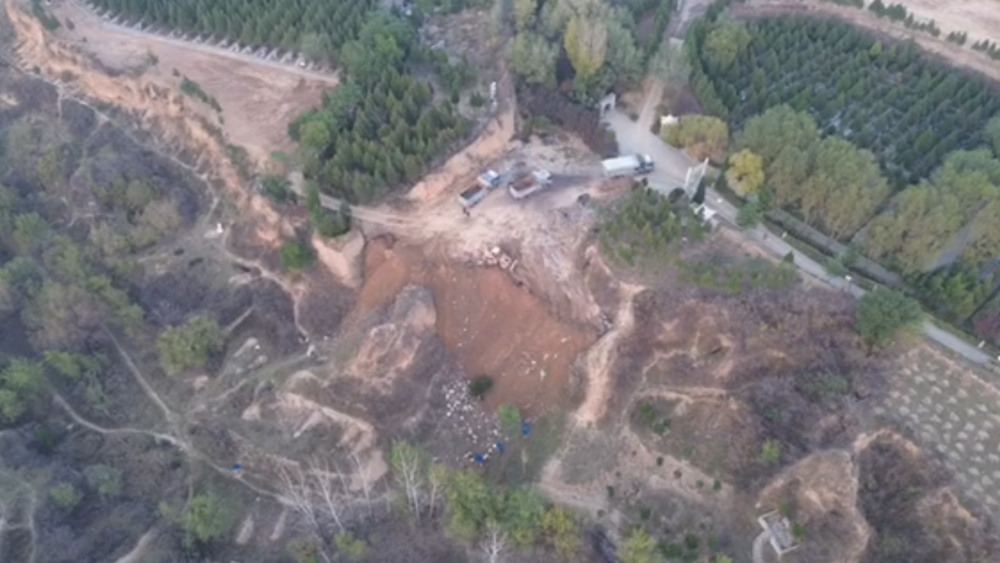
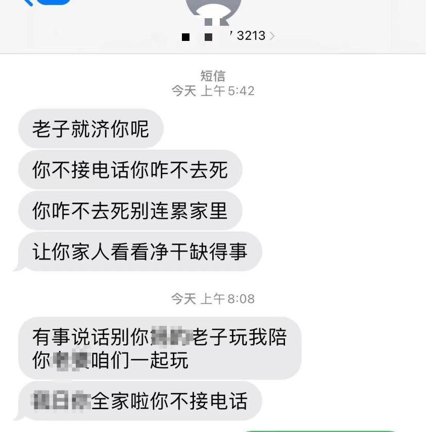

# 女记者采访山西一倾倒建筑垃圾事件后，遭电话轰炸和辱骂威胁

11月14日，潇湘晨报记者曾就一条山西临汾侯马市西里村有人违规倾倒建筑垃圾的线索，多次联系侯马市城管队、张村街道办事处等部门进行求证。后因详情尚未明确，记者暂未发布相关报道。

11月20日凌晨，记者却突然接到临汾陌生号码持续电话轰炸，并收到多条辱骂短信。对方自称因记者采访建筑垃圾一事导致其被罚好几万，并表示“你管我怎么知道（你电话）。”

_记者收到归属地为临汾的骚扰电话_

11月14日，潇湘晨报记者曾就此事向爆料人了解，其称自己不是当地人，只是飞无人机时看到有人在西里村一公墓区内倾倒建筑垃圾，既没有做防渗处理，也没有任何防尘措施，而据其了解，该倾倒地点疑不具有堆放建筑垃圾的相关资质，认为可能会污染到附近农田及汾河流域。

_爆料人所拍视频_

张村街道办事处工作人员曾于14日回复记者称，西里村没有可以倾倒建筑垃圾的场地。并记录了记者电话及所属媒体，表示领导应该会就此事给予记者回电。后记者并未收到回电。

20日凌晨4时46分许，记者突然连续收到5个归属地为临汾的陌生号码来电，并发来带有辱骂、诅咒内容的短信。记者将该号码拉黑后，于5时30分又收到另一归属地为临汾的陌生号码来电，相继发来的短信辱骂、诅咒内容更甚。

 _记者收到的辱骂威胁短信_

20日中午12时25分，该号码再次来电。接通后，对方立即用脏话辱骂：“你们这些记者***”。

记者询问对方来意。对方表示：“（侯马）西里村公墓你不知道？”

记者：“西里村公墓怎么了，您是哪一方？”

对方：“我是哪一方，我***，我弄辆车干活了你罚我好几万……我做错了啥，***别人乱扔垃圾你也罚我……”

记者：“你是怎么知道我电话的呢？”

对方：“你管我咋知道你电话了。老子昨天晚上骚扰你，今天还骚扰你。你**报警啊，你不报警你是畜生。”

记者：“你是不是那个倒建筑垃圾的？”

对方：“老子倒的土，你非得说老子倒垃圾，人倒土要罚钱，倒垃圾也要罚钱。”

20日下午，潇湘晨报记者就此前采访一事致电张村街道办事处询问调查进展，值班人员表示不清楚，将进行反馈，记者可以稍后来电。记者再次致电，另一位值班人员仍表示不清楚，只能反馈。

记者随后致电临汾侯马市委宣传部，询问西里村公墓疑有人违规倾倒建筑垃圾一事调查进展，及记者隐私信息遭泄露并被辱骂威胁一事，工作人员称将进行反馈。

潇湘晨报记者吴陈幸子

