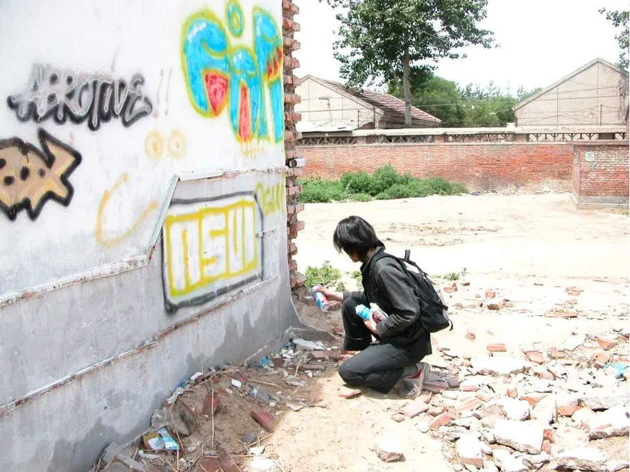
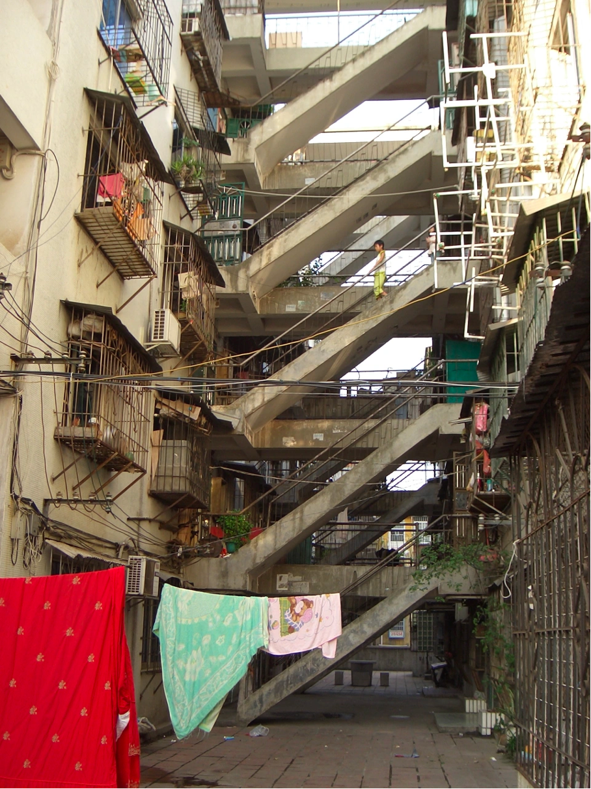
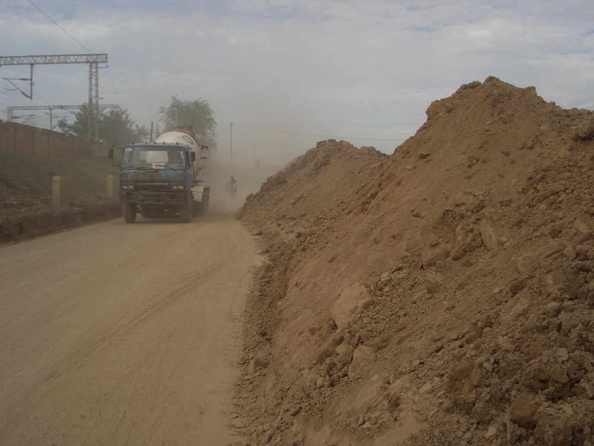
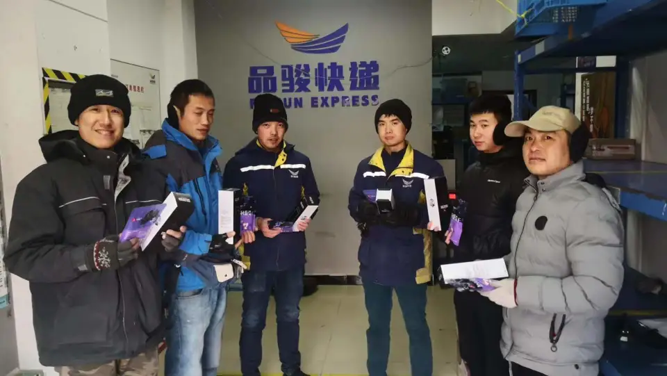
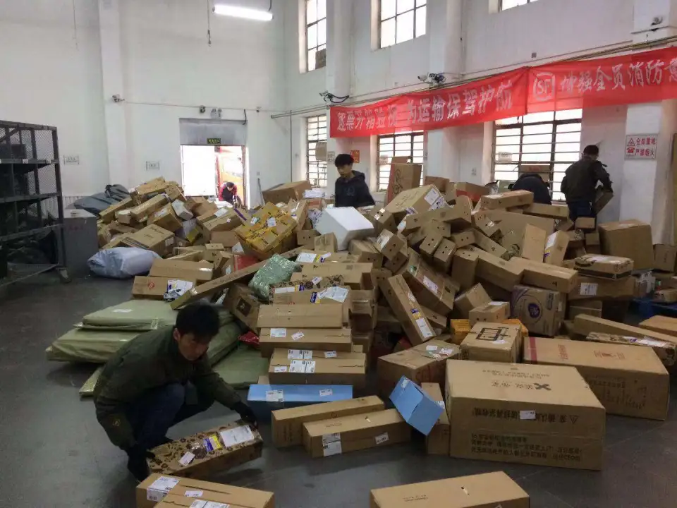
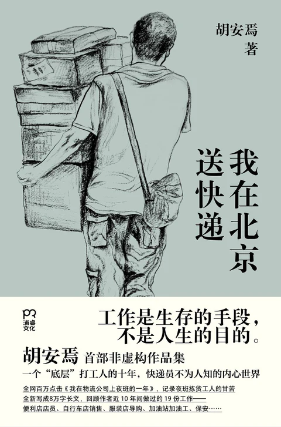

# 对话《我在北京送快递》作者：摆地摊、卖女装，工作为何让人不自由？

对话《我在北京送快递》作者胡安焉，我们如何从局促的现实里寻找个人的自由意志？

 _腾讯新闻《陌生的身边》栏目，关注社会洪流及身处其中的个体体验。通过社科学者的长期洞察与观点碰撞，带我们重新发现身边、理解身边。_

胡安焉，1979年出生在秋天的穗城。和土生土长的老广州家庭不一样，“我们家是以一种僵硬的、教条式的方式看待是非对错的。”

1999年，20岁的他踏入社会、开始工作。“我也希望能够被这个社会接纳，为自己找到一个安稳的位置，但是并不太成功。”

2003年，他加入一家漫画社，接触到一些真正的文艺爱好者。“我意识到社会上居然还有这样一群人，他们不是被社会边缘化，而是主动把自己边缘化，并将这种边缘化看作是自己的个性。”

2007年，希望“追求财务方面更广阔的空间”的他去南宁做女装生意，但是两年经商中的竞争、抹黑让他“痛恨物质方面的追求，希望将写作作为自己的纯粹精神满足。”

2009年，离开南宁，他开始写作。他说：“写作让我找到了一种自我确立感，能够缓解纷繁社会带给你的碾压性恐慌。”

与此同时，他也因为生计辗转在云南、上海、广东、北京等地，开过网店，做过小贩、自行车销售、快递员、夜班拣工作是我们不得不做的事情，是我们对个人意愿的让渡，与此相对的生活的另外部分，就是那些忠于我们意愿的、我们想做的事情和追求——无论其内容为何，我在这里暂且先称之为自由吧。”

2020年，他讲述自己在德邦上夜班的经历获得关注；2023年，他的《我在北京送快递》出版。

回看自己过去的经历，胡安焉坦言自己确实走上了一条正确的路。“但是正确与否不能以我出版了一本书、得到了社会关注、上了腾讯新闻的节目来界定。”他认为问题的关键是“我成为一个怎样的人，而不是获得了什么东西。”

底层作家、拿起笔的快递员、中年打工人……有着众多标签的胡安焉是一个怎样的人？用“胡”、“安”、“焉”三个疑问词表示内心困惑的他如今安焉？我们又如何从局促的现实里寻找个人的自由意志？

一、“我们家是以一种僵硬的、教条式的方式看待是非对错的”

**刘颂杰（中山大学新闻传播学院副教授）：**
很高兴能与非虚构写作者胡安焉一起交流。胡安焉的作品《我在北京送快递》，是大家今年最为关注的非虚构作品之一。我想知道，你选择写作有受到家庭影响吗
**，您的父母是知识分子阶层吗？**

**胡安焉（《我在北京送快递》作者）** ：
**我爸妈不是知识分子阶层。我妈读完高中后遭遇文革，她就再没读过书了，她的学历就是高中；我爸是贫农出身，初中没有毕业就去当兵了。**
不过，他们都在广州的机关事业单位工作。我妈小时候就移民到广州了，我爸在我出生前一年才调到广州的。后来他们在海上救助打捞局工作，我妈是会计；我爸一开始在饭堂里工作，后来到办公室里从事一些政工类的工作，算是个军转干部吧，但实际上没有实质的职务内容，主要从事类似保管文具、采购文具这类工作。

**刘颂杰** ：您出生在广州这样一个大都市，父母也都在机关事业单位里工作。 **从这个意义上讲，很难说您来自一个底层的家庭，对吧？**

**胡安焉** ：看怎么理解“底层”这个词， **我算是广义的底层，但我肯定不是狭义的底层。**

不过，有些人觉得我父母都是体制内的，我的家庭条件应该不错，但其实我父母的单位还是很穷的，我妈在2000年初退休，她最后一个月拿到的工资还没有第一个月的退休金高，因为退休后的退休金是按照国家统一的标准规定的，但是在国企的收益和单位效益相关，单位效益差工资就低。我姐是高中毕业后（1993年）开始工作的，过了试用期之后就在一家港资公司做校对员，她第一个月的工资就比我父母当月的工资高。

虽然大家现在都说要考公，要有编制，那是因为中国的经济起飞了，国家变得有钱了。但是在八九十年代时，国家也没有钱，而且面临公有制改革，要从计划经济过渡到市场经济，当时社会喊的口号是“打破铁饭碗”，我父亲就面临着这样的下岗风险，他没有职务能力和专业技术能力，只是靠着自己的出身在单位里谋了一个差事。但是在90年代，他单位的性质即将从事业性调整为企业性，开始实行自负盈亏，很多闲差都面临下岗风险。我爸因为生病，就提前申请了病退，不过就算他不申请病退也会被提前下岗。
**我父母虽然是事业单位，但是不像大家所认为的经济条件很好，最起码在广州是这样的。**

**刘颂杰** ：
我关注到早年时期帮您出过书的一位编辑，他评价您在为人处事方面有所克制，对人对事都有着惊人的宽容之心，唯独对自己要求严格，这有点苦行僧的味道。我了解到您的父亲是粤东的客家人，母亲是从上海“移民”到广州的，您本人成长在广州。
**小时候的家庭环境以及这种不同甚至多元的文化背景对您的成长和性格塑造有什么样的影响？**

**胡安焉** ： **我觉得主要的影响还是家庭教育，家庭环境对每个人的塑造都相当重要。**

我简单说一下我家的具体情况。我妈妈是我外公外婆的养女，她没有任何兄弟姐妹。她在6岁那一年（1953年）跟着外公外婆从上海移居到广州，初来乍到的他们在当地没有任何亲戚朋友。当时广州的外地移民还不像今天这么多，移民对本地人来说还是有点“稀罕”的。我妈妈因为语言不通、生活习惯等问题被大家取笑、排挤和孤立，比如上海冬天时大家并不是每天都洗澡，但在广州人看来这样就是不讲卫生。小孩子都是软弱的，天然地害怕被孤立，于是她发展出一些讨好型人格的特质，希望通过迎合身边的人以换取接纳。

另外，我外公在1937年日军侵华时加入过国民党，在当时的上海这是爱国行为。但是因为加入过国民党，文革的时候，这件事就被当做一个黑历史揪了出来，我外公被批斗，关到了石榴岗一个卫校的牛棚里，我妈也就因此变成黑五类的子女了。其实在同学里边，我妈还是相对安全的，因为她不是地主的后代，没有被抄家，但是她也目睹了很多被抄家的事件。

所以她当时严重缺乏安全感。首先，她恐慌自己没有亲戚，在广州是单门独户；其次，她缺少外部支持，家庭唯一的支柱被关到了牛棚。这些情况强化了她的讨好型人格、因为她活在恐慌和不安中，于是她变得毫无保留地信服外部权威。她的心理机制是这样的：
**只要我比你们所有人更信服这个最高指示，那我就是安全的，因为我比你们更忠心，更全身心地投入** 。

然而，广州作为一个千年港口，曾经唯一的通商口岸，实利主义和市井文化是源远流长的。在广州本地人的观念里，官方所说的为了全人类的理想去奋斗可以认同，但是如果这些理想和奋斗需要牺牲个人利益，那就万万使不得了。所以，我的家庭融不进广州本地的实利主义文化，因为我妈对意识形态毫无保留地信服。

我父亲是陆河县人，陆河县直到2012年才摘除了国家级贫困县的称号，是广东最后的三个国家级贫困县之一。
**他是贫农出身，十几岁就去当兵了，在那个年代，他是根正苗红、最纯洁、最可爱的人。**
所以我母亲跟他结合之后就不用再担心各种风险了。因为她成为了军嫂，嫁给了一个军人，她比所有人都更忠心于红色的思想。

我父亲是一个副连级军官，我1979年出生，正赶上他退伍复员。他到了广州之后在职业方面没有任何竞争力，唯一的竞争力就是他的身份——贫农出身和复员军人。

我爸和我妈在广州属于比较异类的存在，他们自己平时说话、和我的沟通，都感觉在打官腔。因为对官方思想的信服，所以他们对我的教育从来不鼓励我去追求个人的自我实现和自我利益。比如20世纪90年代时很多人下海从商，在他们看来这是有风险的，因为这是在追求私利。从商、炒股在他们看来也都是投机倒把，他们总是以一种迂腐的观念去看待这些事。他们实际上对改革开放也持有一种不乐观的态度，认为这是一种堕落和倒退。他们对我的影响就是这样的，我跟同龄的同学、同事间的差异非常明显。

我的家庭文化和土生土长的老广州人差别很大，我跟他们相处会显得我非常幼稚。
**他们大多数人关心的是事情的利害关系，而我们家是以一种僵硬的、教条式的方式看待是非对错的。**

**刘颂杰** ： 听你描述， **你的父母不是那么世俗主义的人，他们为人会相对淡薄。这是不是对您不追求功名利禄有一些影响？**

**胡安焉** ：
是的，他们没有给我什么压力，因为我也没有亲戚，没有同辈的来让他们比较。我们家从不比较，他们不会通过比较来激励我，说“你看你的表哥怎么”，因为我没有表哥、堂哥。他们也不对我的学习或者前途寄予很高的期望，因为他们不需要我来提供物质回报，“我养育你这么辛苦，你以后要挣钱买车买房来孝顺我、报答我”这种话他们一次都没有说过。

**他们对我完全就是自由的，因为他们对我没有什么预期，也不需要我为他们提供任何回报。**

但是他们也没有给我任何指引，说你的人生应该怎么过、怎么规划、怎么走。因为他们也不知道该怎么做，也是懵懵懂懂。他们觉得我毕业了就是把我培养出来了，这个社会需要什么我就应该去干什么，这是社会的事情，而不是他们的事情。
**至于个人前途，在他们看来根本不存在个人前途，因为就只有社会的共同目标，没有个人前途。**

二、“不是被社会边缘化，而是主动把自己边缘化”

**刘颂杰** ：
**您的父母其实都是比较强调稳定和安全感的人，但您后来的人生道路却充满了变化和变动，和父母辈有比较大的差异。您是什么时候萌动了主动追求自由的意识呢？**

**胡安焉** ： 我们产生差异主要是因为他们一辈子在事业单位，接触不到90年代社会整体观念的巨大变动。
**而我踏入社会已经是90年代末期了，我1999年开始工作，我在社会里经历的种种都是他们闻所未闻的，所以我没法像他们那样假装这个社会没有发生任何改变。**

但是我一开始也是认识不到这些的， **20出头的时候我也希望能够被这个社会接纳，为自己找到一个安稳的位置，但是并不太成功。**
在跟人打交道的时候，我因为内向、笨拙、害羞，很多想法都不成熟，总是碰到各种各样的钉子。我那时候不敢跟人沟通协商，逃避成了惯性。

**2003年，我选择加入漫画社可以说是我人生中的一个分水岭，在观念和精神方面给了我一个新的启发，让我接触到那之前我没有接触过的文艺方面的东西。**
我之前的工作，比如加油站、酒店、服装专卖店都没有接触过类似东西，大家都是比较世俗化的人。我父母也没有文艺方面的积淀，不会在这方面影响我。我之前看的日本漫画实际上也是很商业的，我觉得很难算作文化或者艺术的一部分，或者说它不是那种大写的艺术，而是一种商业的艺术。

在漫画社，我接触到一些真正的文艺爱好者，他们的兴趣爱好不仅仅是在漫画方面，还包括音乐、电影、小说，甚至是一些简单的哲学。他们涉猎比较广，是真的文艺青年，我觉得他们对我的影响是最初的起点。

_2004年，胡安焉初赴北京，和朋友每天游荡、偶尔画画（图源：胡安焉）_

**刘颂杰** ： 2003年，您进入广州的漫画社工作可以看作是您首次进入文化艺术类行业，这样看的话我们算作是传媒同行了。
**您后续在杂志社工作，进入到文艺行业是不是也都和您在夜大读了广告设计专业有关？您当时希望能够找到专业对口的行业从事相关工作吗？**

**胡安焉** ：
我能加入漫画社，包括后期从事动漫资讯刊物的美编都是因为我在夜大的经历。漫画社并不招募零基础的学员，它要我们先寄作品过去，达到要求才会录用。我在夜校的时候上过两个学期的素描班，大概30多个课时，有了一定的绘画基础，所以我才能被漫画社录取。后来我去动漫资讯杂志社是因为它的应聘要求大专文凭，我读过成人夜大也算有了这个文凭，所以才能够被录用。
**但是我当时并不是为了从事上述工作才去读夜大的，我那时是想要躲避工作中的一些不愉快**

我选择读夜大时，我在北京路的一家服装专卖店里做店员。当时大家都是靠提成来提高收入的，所以人和人的竞争很激烈，我不适应。如果在服装店里有人跟我抢客人，我就会把客人让给他，所以我的销售额在店里倒数。虽然我们店的店长挺喜欢我的，但是我的业绩总上不去她也会给我压力。后来店长就把我调到仓库做仓管，不在店里面接客了。这件事成了我的一个心结，我没有办法克服和别人竞争的焦虑；但如果我不去竞争的话，店长又会对我有意见，我没办法两头讨好我的同事和店长。但是我希望我能够两头都讨好，去迎合所有人，让大家都觉得我好。
**我当时认为我之所以面临这种处境是因为我的学历太低了。我只是中专学历，如果我能去读一个夜大我就能获得大专学历，去做更好的工作。这样的话人与人的相处能够更加体面，大家能够做到相互尊重而不是像现在这样赤裸裸的、丑陋地抢来抢去。**

但实际上我的这种想法是很幼稚的，就算到了一个更高的平台这样的处境也并没有什么改变。我在读完大专出来之后找工作也需要面对相同的情况，因为人和人的竞争和冲突体现在所有层面，无论处在何种经济水平、文化水平这些问题都是存在的。
**所以其实人与人之间的危机同学历和文化水平没有任何必然的联系，但是我当时确实是抱着这样一种逃避的心态去读大专的。**
我后来去漫画社、动漫资讯杂志做美编也是得益于我在大专的这段经历，但是我当时并不觉得这是文化艺术圈，因为我们当时画的漫画很商业、很幼稚，就是热血漫画和少年漫画。

**刘颂杰** ：
**您曾说过您在漫画社的经历，虽然不能说是脱胎换骨，但也是塑造您的最初起点。您提到过这个时期您开始听一些摇滚乐，然后去参加一些摇滚音乐节。所以您当时在北京这个阶段是受到了文艺方面的一些影响吗？**

**胡安焉** ： 是的。
**2003年之前，也就是我24岁之前，我的整体思想是比较扁平的。我没有什么个人意识，大家追求什么我就追求什么，我很从众也很盲目。**

加入漫画社之后我接触到里面的一些朋友，他们大多都处在20几岁的年纪，比较叛逆，对自己对个性非常重视。当时我们国内的漫画产业相较于日本要落后得多，我们本土的原创漫画比盗版的日本漫画贵，但水平却远远不及，所以大家都看盗版日漫。这个行业于是变得像亚文化似的，它未来的经济前景很渺茫，投入其中的大多是一些边缘人群。

因为我之前没有接触过这样的文化环境，所以我仿佛打开了新世界的大门。
**我意识到社会上居然还有这样一群人，他们不是被社会边缘化，而是主动把自己边缘化，并将这种边缘化看作是自己的个性，他们去强调这种个性、强调自我的追求和自我的实现。**
他们不像大多数人一样走一条世俗的路，想办法挣更多的钱。这种年轻叛逆无忧无虑的状态或许幼稚，但我认为他们是有精神、有灵魂的。我之前在加油站和专卖店里遇到的人都是经济上趋利避害的动物，感觉不到他们有什么个人追求和精神内涵。所以这对我来说是一个触动，我第一次对文艺产生了兴趣，并且尊重和重视这种对待人生的态度。
**同时，我的自我意识也是在这一时期觉醒的，我明白社会对我的规训并不是全然正确的，还有很多人在追求主流价值之外的事物。**

我在漫画社结交的朋友对我的接纳程度也很高，我在社会中看似笨拙、幼稚的表现在他们看来是一个人有灵魂的体现。我不是一个世故圆滑、过度社会化的人，他们并不觉得这是我的缺陷，反而觉得这是我的优点，而且给予我肯定和安慰。我之前已经换过六份工作了，危机感很重而且对未来感到迷茫，他们不仅给了我慰藉，还现身说法告诉我他们自己也有着同样的经历。后来，因为我们都太年轻，这种不安定的状态没有办法持续下去，所以我们也各散东西。
**但是这段回忆在精神上带给了我启蒙和塑造，也在我心里埋下了一颗种子，虽然这颗种子没有立刻发芽，但是它为我2009年开始写作埋下了伏笔。**

在我离开这些朋友之后我还是一心想着挣钱成家，我为动漫资讯杂志做过美编，又去动漫公司画无聊的幽默漫画，但是我每次都没有成功，全部都失败了，最后一无所有。到了2009年的时候我被外部环境触动，想要重新去追求当时那些朋友带给我的精神启发。所以说我在动漫社的这些朋友于我而言还是意义重大的。

_2004年，胡安焉在迷笛音乐节现场（图源：胡安焉）_

三、“我坐在南宁市裕丰商场里，正为自己庸碌的人生自怜自艾”

**刘颂杰** ：某种程度上，漫画社和美编不是纯体力的劳动，而是带有一定创造性的工作。
**但是您选择2007年去在南宁开女装店，是因为生活所迫还是基于其他的考虑呢？**

**胡安焉** ：
主要还是因为我女友给了我一些压力。我们已经到了成家的年龄，我虽然是在办公室做美编，但是我们当时做的书刊很低端，在二渠道（民营图书批发市场）经销，内容很多是从网络或者境外书刊上照搬过来，和盗版几乎只有一线之隔。我们所做的工作算不上是文化传媒产业，其实也是一种体力劳动，是搬运内容的搬运工，对技术并没有什么要求，报酬也很低。我在2005年的时候工资只有2000多元，2007年去漫画公司工资也只有3000多元，这在当年是非常低的，我靠这个收入没办法成家。
**我女友那边的压力也越来越大，我们实在没办法了只能选择去做生意，希望能够彻底地解决经济方面的困难，追求财务方面更广阔的空间。**

_2007年，胡安焉在南宁永新城楼上住处（图源：胡安焉）_

**刘颂杰** ： **我看到过您在采访中说过的一句话“2009年初的时候，我坐在南宁市裕丰商场里，正为自己庸碌的人生自怜自艾”**
受到很大的触动，我想这可能就是我们常说的“文字的力量”吧。我会想起我自己2003年刚毕业时在上市公司做财务分析，我经常会问自己“我的意义是什么呢？”。
**您那时的自怜自艾也是因为在现实生活中的碰壁、精神上的压抑和不自由所导致的吗？**

**胡安焉** ：
可能这两方面的原因都是有的，但是最重要的原因还是生活上的碰壁和各种不顺利、不成功。还有就是人际交往方面带给我的伤害，让我看到了这个社会的负面。

**我觉得我2007年-2009年在商场经营女装生意的经历对我来说是一段创伤，我每天在商场里很难受。**

首先是工作时间很长，每天要在商场里待十几个小时，下班之后还要去银行存款、给合伙人打电话商量补货，工作时长至少达到了14、5个小时，一年到头可能只有春节那几天才能休息。

其次是商场环境过于封闭，店铺像蜂窝一样密集，道路也很狭窄，待在里面一整天都不见天日，给人很强的压抑感；店主和店主、经营户和经营户之间的关系更是灾难，因为规则的不完善，大家的竞争常常表现得非常丑陋。
**而我是一个很在乎别人评价的人，我喜欢迎合、讨好别人，但那样我就无法在商场生存。比如说，**
我从不抹黑别人，但经常有竞争对手抹黑我，攻击我的货品和为人，于是就会有一些客人在听过我的坏话之后来到我面前，对我表达敌意和鄙视。这对我来讲具有极强的精神创伤性，比打我一拳更让我难受。

**所以我在经商的这两年多时间里产生了应激反应，我见到人就想回避，因为我不知道他是否听过我的坏话、是否带着敌意和偏见走进了我的店。**
后来我看到顾客进门，首先的反应不是欢欣雀跃，而是觉得头疼和麻烦又来了。

我这样的状态确实没办法再干下去了，我想通过这种方式来改善经济条件的目的也失败了。成家就更不必说了，这个行当挣不来钱，我的女友听了她母亲的劝告移民出国了，我彻底没有机会了。

南宁这段经历留给我的几乎只有创伤，最后我选择了离开。

_2018年，胡安焉经营的女装店（图源：胡安焉）_

**刘颂杰** ： **您回到广州之后就没再出去上班，而是开始学习写作了吗？**

**胡安焉** ： **回广州之后我先进行了一趟骑行，从广州骑到了北京，大概在国庆节前后结束了这趟旅程。**
2009年10月我回到广州之后就开始了写作，这应该是我写作的真正起点。

**我这次骑行是怀着对自己在南宁经商的日子的憎恨开始的，我痛恨自己的无能、痛恨我的生活、痛恨我遭遇的所有人和事、痛恨在生意场上自己为了生存而做的一些事。**
所以我有一种强烈的发泄冲动，但是我找不到发泄对象，毕竟我之前遭遇的一切都是我的选择，怪不得别人，所以我产生了一种自我惩罚的心理，在这趟骑行前没有做任何准备。

我骑的是我爸骑了近十年的一辆24寸买菜用的自行车，车架大小不适合我的身高，而且坐垫锈死了不能调高。这种车不是为长途骑行设计的，假如高强度地骑行会对身体造成损伤。而我在旅途中每天骑行十个小时左右，车就经常坏。那辆车已经没办法找到便携的维修工具了，而且因为过于老旧每坏一次都要换新的部件。

_2009年，胡安焉骑行广州至北京（图源：胡安焉）_

我是八月底出发的，第一天就从广州骑到了佛冈市的一个镇上，当时天气还挺热的，我当天就中暑了。而且我出发第一天车的脚踏就卡住，我发着烧、脸上因为出汗太多结了一层白色的盐。我当时不知道怎么去补充盐分，后来知道以后就不断地吃榨菜来补盐，好在后来恢复过来了。另外，那辆车全程都保持着两天坏三次的频率，我经常要推着车走路找地方修，导致我的行程被耽误。有时候到了晚上我就不得不拼命赶路，我膝盖的半月板因此撕裂，留下了一辈子的伤。

还有一次很难忘的经历是在离韶关很近的丹霞山，我晚上走在没有路灯的山道上，山路蹒跚不断地绕弯，前面开过来的车都开着远光灯晃得我看不清路。车开过来的时候你会有一种本能的恐惧想要往路边靠，但是那条路的路边有一条大概一米深一米宽的排水沟。我当时就失足摔到里面去了，虽然没有半月板撕裂那么严重，但是也留下了一些伤，恢复之后在大腿皮肤上留下了一些痕迹——至今有一块皮肤颜色比其余地方略深。

_2009年，胡安焉骑行广州至北京（图源：胡安焉）_

此外那辆车的车把套是硬塑材质，没有缓冲力，只增加一点摩擦力，像铁一样硬。那趟骑行结束后，我的虎口疼了半年左右，一度我以为它会疼一辈子，好在后来不疼了。半月板撕裂也在慢慢恢复，大概花了两年左右疼痛感慢慢减弱。但是我后来要跑步锻炼，它又加重了，我就只好停下来，等好了之后我又去做别的运动，它又会受伤，这些年一直反反复复。

还有一次是在郑州到新乡这两个城市中间的国道，因为它是封闭式的准高速，车子骑上去之后就下不来了，我的车在郑州往北一二十公里的位置爆胎了，所以我只能推着车走到新乡，一直走到了晚上。

**总而言之这趟骑行算不上是旅行，更像是在受苦，也留下了一些一辈子都抹不去的伤。**
但是我觉得这是一件很爽的事，我需要这样的一趟行程来消化掉我在南宁经商时的负面情绪。就像我被蚊子咬了去抓痒，不痒的时候去抓痒会感到疼，但是痒的时候去抓痛感会压过痒感。
**实质上这趟行程也是如此，我需要一种痛感来克服对之前生活的憎恶。**

_2009年，胡安焉骑行广州至北京（图源：胡安焉）_

**刘颂杰** ： **这趟骑行全程都是一个人吗？有没有在路上碰到一些同伴或者是和其他人联络呢？胡安焉** ：
**是的我全程都是一个人，我不习惯和人结伴，也不会主动去接触人，如果是被动地和人接近我也会躲避。**
京广线不像川藏线有那么多人骑行，沿途更多的是为了省高速路费而走国道的大货车，很少有骑行的人。我记得湖南的很多国道都是盘山公路，我当时在骑行的时候正赶上有一段在修路，封了一半的路，先放行一边再放另一边。我在等待的过程中看到了前面施工车上的几个工人坐在后车厢，他们和我说话，我也同他们说话。他们告诉我说在这条路上施工了几个月从来没见过自行车，所以我也很难遇到同方向骑行的人。

**刘颂杰** ： **回到家里之后，父母对于您当时的选择和生活状态是不是有一些不同意见呢？**

**胡安焉** ： **他们非常担忧我。但是我父母和我很像，也是很克制的人。**
他们虽然会担忧但是也不会干预，甚至他们向我表达他们的担忧时都很节制，有时候把我姐作为一个缓冲对象，不直接向我表达。我刚从南宁回来的时候他们对我还是很包容的，毕竟之前的两年多我一直在辛苦做生意，除了春节休息之外，一年365天至少有350天都在工作；而且我写作也不是违法乱纪的事，并不过分。但是后来时间久了，他们的担忧就渐渐压过了包容，经常愁眉苦脸地面对我，我在家里呆不住就搬出来自己住，还开了一家网店。

**刘颂杰** ： **您在书中写道，您在2012年，大概三十三岁时去了云南大理，这以后跟父母的交流就比较少了，这是出于什么原因？**

**胡安焉** ：
我觉得是因为那时他们对我的人生方向产生了很严重的忧虑，所以他们希望在跟我沟通时为我提些建议。但是因为他们本身已经和社会脱节，所以很多建议也并不现实。

在我离开广州之后，我们打电话时也会谈到对社会现状的一些认识，但是爆发了很强烈的冲突，彼此之间非常不认同。我们的关系因此恶化，逐渐疏远了。

**从2012年至今我做过的所有工作我父母都不知情，包括送快递、在上海的自行车店打工。他们只知道我在哪个城市，但是不知道我做什么工作，即便我现在出版了一本书他们也不知道。**
书里包括我过往经历的内容，我觉得没必要和他们主动去分享，但如果他们通过其他渠道看到了也没关系。

_2014年，胡安焉在云南下关摆地摊（图源：胡安焉）_

我们的关系缓和是在2016年，我妈因为卵巢癌做手术和化疗，她发现时已经是三期，即使切除子宫和化疗也早晚会复发。我父亲的身体一直有问题，他之前就是病退的，去年国庆那天去世了。最近几年他们的身体陆陆续续出现情况让我很难过，看到他们受苦我也改变了对他们的态度和沟通方式。

我不跟他们分享我的生活，也不想听他们对我的人生发表看法，哪怕我知道他们的看法完全是出于善意，因为这些看法会让我崩溃。我不希望他们参与我的人生，但是我愿意和他们分享开心的事，去关心和照顾他们。父亲去世后我陪我妈旅行了两趟，分别去了西安、兰州、西宁和乌鲁木齐，她很高兴。

**刘颂杰** ： **您的父母曾经看过您的作品吗？他们知道您的作品已经出版了吗？**

**胡安焉** ： 我的小说他们应该是一篇都没有看过。我刚开始写小说的时候他们是知道的，但是并没有看过我的作品，我后来离开广州之后他们就更没机会看了。

四、“每个人都需要把自己的差异性抹除，才能够得到经济回报和社会认可“

**刘颂杰** ： **您早年就已经频繁更换工作了，您是怎样看待这种变化的？很多媒体报道会把您频繁更换工作视为一种主动逃离，视为对变化的寻求。**
但实际上我想可能没有那么简单，很多时候我们做决定还是会有一些现实考虑，就像您刚刚提到自己工作早期的职业规划还是渴望去融入主流社会、融入这个自己所在的工作岗位，去追求一种相对体面或者是稳定的生活。

**胡安焉**
：2009年之前，我希望能够在这个社会上有一个稳定的位置，我害怕自己被边缘化。但所谓主动寻求改变，我觉得其实很难区分主动和被动。比如说我的手碰触电后收回来，很难界定这是主动还是被动。

**我在20几岁时频繁换工作是因为我碰到了一些克服不了的障碍，所以我选择了逃避。**
但是那些障碍也确实是因为我当时处于一个比较幼稚的状态。我只举一个例子，比如说我在加油站工作时，加油站没有征求我的意见就把我调到了芳村区的一个示范站——大花园站，这个站离我家和我的夜校都很远，我其实可以跟领导去协商沟通、说明情况，说我在读夜校，能不能把我调回原来的加油站。但是，当年我是一个害怕跟领导沟通，见到领导就想躲着走的人；而且我的同事每天也在接受加油站的“准军事化“管理，我觉得去沟通调岗是在提特殊要求，这对我来说是一种克服不了的心理障碍。我不敢去协商，所以我就选择换工作。
**其实很多次情况都是类似的，既是主动也是被动地选择逃避，不是去尝试解决问题，而是逃避问题。**

**刘颂杰** ： **其实，当我们回过头去看或者谈论自己人生经历时，很多时候会容易去美化过去的经历。**

我个人的经历跟您有点像，也经历过很多次的工作转换。坦率来说，我今天回过头去看时似乎会有意无意地去美化我的工作选择，包括外界可能会帮助你去美化。我本科和研究生读的都是经济学，毕业之后首先是在上海的一家国有上市公司做金融投资，工作了两三年之后我决定要换工作，于是转投媒体，进了一家外资媒体机构。
**今天来看，我可能会将这次职业转变解读为追寻新闻理想，但其实坦率而言，这里面是有很多现实的考量。**
例如当时外企的工资要比国有企业高，所以我在转换职业的过程中薪水是有上涨的，不仅仅是为了新闻理想而转投媒体。
**总之，我觉得在我们的选择当中，会有一些理想的成分，但同时也会有一些现实的考虑，您怎么看？**

**胡安焉** ：
是的，我一直都是很现实的，举例来说，假如把我早年做图书编辑的收入增加一倍，那就是工作内容再恶心，我可能也会找到办法咽下去；我在南宁开女装店时，如果营收是实际的两倍，那我面对同行对手的恶意时，可能更容易消化，也更愿意去解决自己的心理问题。但我没有那样的本事，我挣不到那么多钱，我不是一个能力出众的人，我必须承认这点。

**刘颂杰** ：
**我觉得不管是主动还是被动选择的逃避，我们怎样去考量这些“逃避”的意义很重要。在我看来，您在逃避时其实也在坚守一个非常恒定的精神内核，即对自由和文字表达的坚持，正是因为这种长期坚持和经验积累才让一项持久的工作更有意义。我想到乔布斯所说的“connecting
the dots”，人生的经历像是一个一个连接起来的点，相互效力。我觉得您的恒定坚守是经验得以相互累加的前提，您怎么看？**

**胡安焉** ：我觉得这是一个慢慢发展的过程。如果你问我二十几岁时在坚守什么，我觉得答案肯定是没有。
**我二十几岁时就是随波逐流，任自己的性格摆布；30岁之后，才渐渐地看清楚自己的可能性和喜恶。**

2009年是我人生中最重要分水岭，我之前说2003年参加漫画社是一个重要节点，其实2009年也是。
**2009年之前我和大多数人一样，起码在行动上，希望能够多挣钱，希望生活上不要被边缘化，但是2009年之后我就放弃了。**

放弃意味着我不再追求世俗的生活内容，比如成家立业、生儿育女、拥有财富和过上体面的生活、得到普遍的社会承认和尊重等。之所以放弃，首先是因为以我当时的能力很难追求到这些，其次就是即便我追求到这些也并不能带给我真正的满足和充实。

在南宁商场做女装生意的经历带给我比较大的刺激，让我明白这一点。当时，我受到刺激之后变得很偏激，完全否定世俗的功利，希望去追求纯粹的精神价值和意义。当然，我现在不会这样想了，我觉得这两者不是完全对立的。

**刘颂杰** ： **人们常说“三十而立”，您在2009年，也就是30岁时想清楚要做一个舍弃，而这个舍弃对您后来的发展是非常关键的决定，可以这么说吗？**

**胡安焉** ：今天来看这样说是可以的，我确实觉得自己走上了一条正确的路。
**但是正确与否不能以我出版了一本书、得到了社会关注、上了腾讯新闻的节目来界定。**
我觉得我之所以能取得这些是机缘和运气加持的结果，不是我当时的选择会带来的必然结果。我当时选择默默无闻地写东西，最可能的结果就是不会有人知道我在写，也不会有公众的肯定。

实际上我40岁时还在做快递工作，如果不是因为出版了一本书，大多数人都不会尊重和认可我。如果我没有出版这本书，我去和别人说我的遭遇、经历和生平您觉得有人会愿意听吗？这是一个失败案例，我是一个反面教材，谁会想听这样的人生呢？但是我觉得没关系，因为这是我对自我的一个确立过程。我不妄评别人的人生，至于我的人生，他们怎么评价对我来说也没有任何价值和意义，因为这是我的人生。
**我觉得问题的关键是我成为一个怎样的人，而不是获得了什么东西。**

_2019年，胡安焉（左一）在品骏快递工作（图源：胡安焉）_

**刘颂杰** ： 您在书中讲述过您所从事的工作，无论是理货员还是快递员，这类体力劳动似乎都是很残酷的。
**这类体力行业，乃至在社会中的任何一个组织和机构中，我们似乎都能看到权力组织对于个体自由的规训，比如您在做理货员的时候连思考的时间都没有，就更不用说去追求自由了。这样看来，似乎社会对个体的规训是一种人生常态。**

**胡安焉**
：我觉得最初的时候我们整体社会作为一个经济体和社会实体，需要和其他的社会实体进行竞争，在这个阶段我们是需要效率才能取胜的。但是当这种效率至上的思维发展扩张到一个临界点时，我们每个人的个体诉求都被吞噬掉了。我们变成了社会竞争的牺牲品、一颗螺丝钉、一粒炮灰。
**但是毕竟人只活一次，我们归根结底还是应当为自己而活，而不是为了一个社会主张或者社会共同体而活。**

_2018年，胡安焉在顺丰临河里站点卸货分拣（图源：胡安焉）_

**刘颂杰** ： 我在您的书中读到过对工作和自由的探讨，您说，“
**工作是我们不得不做的事情，是我们对个人意愿的让渡，与此相对的生活的另外部分，就是那些忠于我们意愿的、我们想做的事情和追求——无论其内容为何，我在这里暂且先称之为自由吧。**
” **您怎样看待工作和自由的关系？怎样在这种看似被逼无奈的工作状态下去寻找内心的安宁和自由？**

**胡安焉** ：
我觉得自己这句话说得太狂妄，因为肯定会有一些杰出的人能够在工作中实现自我价值，他们可能是各自行业中的佼佼者，是规则或审美或观念等的开创者和制定者，而不是服从者，但人群中可能只有千分之一的人能达到这样顶尖的位置。

**对于普罗大众来说，绝大多数人都是社会化生产里的一个工具**
，比如富士康的流水线工人，换一个人来做依然能够达到同样的效果。社会没办法依靠每个人的独特性来推动生产，因为这并不能够实现生产的扩大化、规模化。
**因此每个人都需要把自己的差异性抹除，变得工具化、兼容化、同质化才能够得到经济回报和社会认可。这对于个体而言是可悲的，因为个体丧失了自我存在的价值，个人的意义感也流失了。**

我觉得我只是一个比较特殊的个例，因为于我而言我可以放弃一般人放不下的一些东西；其次是我的父母不需要我来赡养，他们在经济上的自给自足降低了我的负担，所以我可以很任性。但大多数人和我的情况不同，他们可能背负了很多的家庭压力。

**所以如果你问我在普遍意义上如何追求这种自由价值和个人价值，我是没有答案的，我同样也对这个问题感到困惑。**
我觉得自己现在能够得到关注和倾听，获得经济回报和奖项都是有运气因素加持的。如果没有《我在德邦上夜班的一年》那篇文章作为起点，这一切都不会发生。如此说来我的问题相较于大多数人可能更复杂一些，因为我需要在一种默默无闻的孤独写作状态中自处，这会是一个更缓慢、更沉默、更不为人知的过程，是一种对于自我内在的塑造。我很幸运，得到了一些外在机缘的帮助。

我的妻子现在仍然在创作中寻找自我确认。但是我很幸运地得到了一些外在机缘的帮助。

**刘颂杰** ： **您用四川话“巴适”来形容您现在在成都的生活状态，心境和生活态度似乎和过去有了很大不同。在您看来这种变化源自何处？**

**胡安焉** ： 我都忘记是什么时候说过这句话了，应该是在开玩笑。

**我现在的精神状态确实比较好，一方面是因为我没有上班，这能让我的负面情绪降低百分之八九十，我大多数的负面情绪都来自于工作，所以不上班的话压力会很轻。**

其次，我和我妻子的相互扶持也很重要；另外，我的作品得到关注，能够以出版兑现为经济回报也是一个不可忽视的原因，如果没有大家近两三年来的关注和书的出版，我很难达到这种“巴适”的心境，还需要花更长时间到写作中才能笃定自己的成绩。

五、“我在生活中遭遇困难逃到写作中，后来又因在写作中遭遇困难而逃回到生活里”

**刘颂杰** ： **坦率来说，您认为表达自己的最好方式是文字吗？用文字表达自我对您来讲意味着什么呢？**

**胡安焉** ： 其实也不是，因为我真正开始写作已经是2009年了。我比较晚熟，二十几岁的时候也没有想过用漫画或者文字表达自己。
**我刚开始画漫画时其实也没有怀着要表达自我的心态，而是因为看到日本的商业漫画之后很喜欢，所以想画出来这样精彩的东西来打动别人。本质上来说，它不是一种自我表达，而是在模仿商业文化。**

**文字对我来说有一个缓冲。** 比如说现在这个对话会让我感到紧张，因为它需要我马上对您的提问作出口头回答。
**我在口头表达的时候会由于害怕、紧张或者冷场的尴尬而导致表达先行于思维，事后我会因此感到懊恼。**
这种情绪往往会伤害我，打破我平静的心情。有时候我在睡觉前都会反复想我当时说错的话，其实我不是真的那样想，但是我已经说出来了，这会让我很难过。

**如果是文字的话，我就有时间深思熟虑，从而使我的表达更完整、更准确、更流畅。**
在我看来，口头表述可能只能达到文字表达的百分之五十、六十，没法像文字表达得那么全面，所以我肯定是更倾向于文字表达。

**刘颂杰** ：
**文字表达对于很多工作紧张、面临生存困境的人来说还是挺奢侈的。毕竟抽出足够的时间来思考、落笔是一件困难的事。您在写作过程中有这样的困扰吗？**

**胡安焉**
：这是肯定的，因为我写东西需要时间进入状态。比如我在上海的自行车店打工时很难在996工作制和额外加班的情况下完成长篇文章，因为每天下班之后我首先要花时间消化工作中的负面情绪；我在德邦时长期值夜班，每天工作12个小时，还要应付日夜颠倒的睡眠困扰。这时我没法同时保持写作，只好停下来不写。

虽然说我是从2009年开始写作的，但是我并不是从2009到现在的每一年都在写。在我有工作的年份，我都专心投入到工作中攒钱，我做不到同时兼顾。

那时候我已经三十多岁了，我的年龄、学历、履历等都没法为我找到朝九晚五的工作，只能找到每周工作七八十个小时以上的工作。除非我去做每月薪水两三千块的工作，比如服务员、保安这类，但我觉得那种工作实在浪费时间，它的报酬确实太低了。
**所以一定程度上我的写作和工作是交替进行的、是分开的，因为我很难兼顾。**
我写作的那些年份实际上并没有去工作，就算是有工作也是像摆地摊这种自由但收入很低、很不稳定的工作。

**刘颂杰** ：您写过那时曾读过塞林格、卡佛、海明威等人的著作，除了他们作品内容本身影响到您之外，
**您是怎样想到“我是不是也能像这样写出来一些东西”的？**

**胡安焉** ：
我其实没有想过这个问题，在开始时我并没有预期自己能够写好，但我觉得只要肯写就一定能写出来。我最早喜欢的作家是塞林格，他对我触动很大，我想模仿他写短篇小说。但是一开始肯定是写不好的，因为我缺乏技巧和方法。

**刘颂杰** ： **您在此之前有尝试过自己写东西吗？**

**胡安焉** ：
有的，我在2006年左右大概写过四五个月。当时我还在上班，没有萌生做生意的想法，工作上需要写一些影视器材测评的刊物，偶尔也会有乐评和影评，但是大多都是几百字的小豆腐块文章。当时主要是因为我们公司人少，分工变得越来越模糊，文编忙不过来的时候我就去帮忙写。老板知道我本来不是做这方面工作的，所以对我也没什么要求，只要我能帮忙凑一个内容就行。后来写多了我就觉得既然我可以写这个，那我也可以通过写别的东西来谋生，而不是去上一个报酬低、耗时长的班。

**我后续也写了几个月，但并没有把它看作是我写作的开始，因为我当时没有想要通过文字来表达自己的冲动，完全是冲着稿费才拿起笔。**
我买了《故事会》和许多套用《故事会》模版的山寨刊物回来，去研究上面的栏目和文章题材，看看什么类型的文章容易发表，然后自己照着去写。写了四五个月只在一本叫《今古传奇》的32开小刊上发表了一篇文章，拿到了八九百块钱稿费，我就知道这条路肯定是走不通了，所以我后面就放弃了这个方向，但也算是积累的一些经验吧。这段经历过后我就去动漫公司上班了，然后去了南宁做女装生意，直到2009年又开始写作。

**刘颂杰** ：
说到您的作品，绝大多数人都会提到您2020年在网上发表的《我在德邦上夜班的一年》。其实，您是2009年的时候就开始写作了，2010年在黑篮文学社区发表了《南瓜布丁》这篇小说，后来这篇小说又在2014年被收录到《“黑蓝”-中国小说艺术的高度》这本书中，这是您发表的第一篇小说吗？

我读过《南瓜布丁》这篇小说，在我看来您似乎是在残酷的现实面前描写了一种爱情的冲动。在坚硬的现实面前，柔软的爱情变得无比脆弱，一下子就被击碎了。此外，我在小说中看到了您对爱情和现实、个体自由和残酷现实之间关系的思考，也能够感受到来自于现实的巨大压力和您对现实的反抗，不知道我这种理解对不对？另外我看到《“黑蓝”-中国小说艺术的高度》这本小说集的编者说，阿穗写的小说很朴实，很注意细节，有时稍微显得絮叨，偶尔又开起玩笑。
**他的小说，就是他为人处事有所克制之后的结果。您是否同意他对您的这种判断呢？**

**胡安焉** ：
《南瓜布丁》确实是我发表的第一篇小说，但不是在2014年的《“黑蓝”-中国小说艺术的高度》上，而是在2010或2011年的某本文学期刊上。《“黑蓝”-中国小说艺术的高度》是拿书号出的，不是刊物。我那几年在期刊上还发表过一些别的作品，最开始时用的笔名是阿穗，而不是胡安焉。

**我觉得对小说的理解没有对错之分，只有好坏之别，您对《南瓜布丁》的理解是很好的。**

后面那句话大概是陈树泳说的，我在线下和他见过面，他对我的观察不仅是通过作品，还包括私下的交往和论坛上的大量回帖等，他对我的评价我基本上同意的。

**刘颂杰** ： **我觉得您为人处世本身就是“有所克制”的。您在写小说、非虚构文章的时候也会有意选择平实的文字去克制情感吗？**

**胡安焉** ：
是的，我觉得这不光是我自身的原因，也是我早期借鉴的一些对象——海明威、卡佛等人对文字的一种要求。他们首先希望作者尝试不使用任何形容词，因为形容词带有比较重的感情色彩，应当将叙述建立在事实基础上，不要掺杂个人的主观情感，从而给读者更大的体验空间，这有点类似于新闻叙事。
**文学其实并不是作者向读者传递某些内容，而是触动读者去重新发现和认识自身的经验。**

类似于您刚刚说过的，在听歌的时候泪流满面，让你感动的并不是这首歌，而是你的生平过往，艺术的作用就在于触动你，让你重新去认识、去体验自己过往的那些经历。在事情发生的时候，你可能没法做到即时地深入审视它，但是文艺作品有时能够让你在事情过去之后，以一种审美的形式重新进入到那些经验中。海明威和卡佛提倡作者克制自己的主观感情，是因为作者表达得越多，限定性就越大，这会缩小读者产生共鸣的空间。只去讲述事实，讲述最平实的东西反而更容易打动读者，使读者同创作者产生精神上的联结。这是我写作之初的两三年获得的启发，它是一种写作的基础意识，但不是艺术的诀窍或真理，在艺术创作中没有不可推翻的定理，后来我在实践中也获得了其他方面的一些认识。

**刘颂杰** ：您刚刚提到的这种在小说创作中的写实风格同非虚构写作有一定的类似性，您后期主要是凭借非虚构作品得到了大家的广泛认可，
**您怎样看待虚构小说和非虚构写作二者之间的关系？**

**胡安焉**
：对我来说非虚构要比小说更容易写，不过非虚构其实涵盖了很多种体裁，比如游记、访谈和深度报道等等，都属于非虚构的范畴。更准确来说，我是一个自传写作者，我写的是个人的回忆录，我的兴趣和能力都仅限于写自己的经历，其实用自传写作者来形容我会更准确一些。自传写作的内容是相对固定的，基本上已经没有想象空间了，我遭遇过什么就写什么。

**而小说写作是一门手艺，在我看来更注重形式而不是内容，小说这门艺术是不断在发展的，不同时期的小说作者面对各自所处的小说发展阶段，作出独特的有力的回应，这应该是小说写作的核心追求。写小说的根本意义不是分享经验、传达信息、表达思想或观念等，因为那就相当于把小说当作工具，而工具都是可以替代的。比如说，仅仅为了分享经验，你可以平铺直叙地讲述出来，不必借助小说形式，甚至不必通过文字去表达。小说的核心价值，必定建立在小说不能被其他手段形式替代的那部分特质上。所以，小说写作和自传写作有共通的方面，但差异的方面要比共通的方面更本质和重要。**

**刘颂杰** ：您早年曾加入过网络论坛“黑蓝文学社区”，那时候您开始跟网上的同好、编辑有了互动。 **您当时的文学初体验是怎样的？**

**胡安焉** ：
其实黑蓝是个很先锋的文学社群，我是2010年1月份注册账号的，当时我已经31岁了。我写作起步比较晚，观念、意识和实践水平都相对落后，和人交流时常常受到自卑感的困扰。
**现在回想起来，我刚开始写作时，写得还算比较快，因为无知者无畏，没有什么讲究和方法，想到什么素材就简单地写出来。**
但在不断地和其他写作者交流后，尤其是看到其他写作者之间交流的内容，我意识到自己和别人都不是在同一个层面上回应小说这门艺术，而我的年龄还要比他们大。

**于是我变得焦虑，沉迷于和人交流，把精力都放在研究别人的小说，而不是写自己的。我的眼界确实很快提高了，但与此相对的，我的实践水平却严重落后，也就是人们常说的眼高手低。**
这时我对写作产生了畏难心理，无论怎么写自己都不满意，挫折感非常强，写出一个小说后，首先感到的是羞耻，而不是满足。
**于是我又开始去逃避，原本我是在生活中遭遇克服不了的困难，才逃到写作中的，这时我又因为在写作中遭遇克服不了的困难而逃回到生活里。**

从2012年开始，我停止了写作，也远离了网络，几乎不上论坛了。我去工作，攒钱，把全部精力投入到生活里，直到2014年才恢复写作。

六、“写作让我找到了一种自我确立感，能够缓解纷繁社会带给你的碾压性恐慌“

**刘颂杰** ： **作品发表出来之后，获得的比较重要的认可是来自哪方面？是编者、读者，还是同行的认可更能增强您在写作方面的自信呢？**

**胡安焉**
：主要来自一批我重视的读者，比如我在豆瓣上关注的一些学者、作家和媒体人等，还有早年我在网上认识的一些精英作者。除此以外，普通读者的反馈也很有意义，他们未必能对我的写作提出恰当的意见，但他们会就我讲述的内容发表感想，从这些反馈中我发现和我有相似特质和感受的人并不少，这带给我勇气和鼓舞。

**刘颂杰** ： **您离开南宁后，对写作是否能养活自己这一问题有着怎样的判断？**

**胡安焉** ：
2009年我离开南宁后，身上有几万块积蓄，这让我得以脱产地写了一段时期。当时我不在乎写作能否养活自己，因为之前尝试过专门投稿都没有成功，更不用说既满足个人表达，又获得经济回报了。

**我在南宁的那段经历让我很痛恨物质方面的追求，尽管这种痛恨是幼稚和软弱的，我从头到尾都承认自己的幼稚和软弱，但这就是当时的我真实的精神状况，我视写作为纯粹的精神追求，是我人生的意义和支点所在，所以它的经济回报根本不重要。**

**刘颂杰** ： 我记得刚刚提到的编辑陈树勇曾评价您说：“他的总体精神状态是乐观的，我感到他的乐观，恰好是建立在他对悲观的认知上的。”他的这句话很打动我，
**我感觉您在2009年开始学习写作之前对于生活是有一种压抑和怨恨在里面的，但是您开始写作之后这种情绪就慢慢减少了。您为什么会发生这种转变呢？和文学有关系吗？**

**胡安焉** ：
很多方面我是个清高的人，我很少抱怨，压抑肯定有，但谈不上怨恨，可能用憎恨来形容更贴切。后来的转变是多方面因素的共同作用，文学肯定是其中重要的因素。我的压抑是自小养成的，主要受家庭教育的塑造，而憎恨心理则是因为我在社会里屡屡求而不获。我能力不出众，性格又内向和懦弱，加上方方面面都比同龄人迟钝和笨拙，在不断吃亏和出丑的经历里，渐渐产生了憎恨的负面情绪。但是这些情绪更多还是指向自己，因为是我让自己一步步变成这样的，我是主要的责任人，社会和家庭不应该为我的“失败”买单（后来我不再认为这是失败，甚至不再从成功和失败这个角度去看待人生，我觉得从丰富和贫瘠、开放和封闭、包容和狭隘等角度审视人生更有意义）。

2009年我通过放弃一部分对于外部认可和经济回报的追求获得了久违的轻松自由，这是我最初感到乐观的根源所在。一般人可能会因为搞砸了一件事情而忧虑、沮丧，但是我觉得无所谓，因为我本来就不是个有执念的人，我可以放下了很多东西，只要对得起自己的良心，自己觉得充实和满足就够了。

在我看来，写作是一种复杂的精神活动，它不只包括写作本身，还包含阅读、思考、交流等形式。它能够在整体上拓展我的认知，让我的思想更加丰富、开阔和深入，从而在外部世界的权威面前渐渐确立起自我认同。
**自我认同感是很重要的，它能够缓解纷繁社会带给你的碾压性恐慌，写作就让我找到了这样一种自我确立感。**

其实不只是写作，在任何一个领域达到精湛的水平都能够使人产生这种对自身存在的笃定感，这就像是一个人确立了自己存在的价值，能够使人产生自信。

**今天有很多人对我的写作存有误解，因为我从事过一些简单的体力劳动，并且通过讲述自己的这些经历出版了一本书，所以大家默认我是个草根作者。实际上我对写作的态度是非常精英的，这个“精英”不关乎我写作水平的高低，而只关乎我对待写作的态度和自我要求。**
我希望自己对写作的追求是纯粹的，即将写作本身视为目的，忠于个人的真实表达，而非将写作作为获得钱和名声等外在事物的工具。我不敢说我已经完全做到，但这是我对自己的要求。如果将来我有必要为生计去写作，我希望区分工作性质的写作和个人性质的写作。毫无疑问，个人性质的写作对我更重要。

**刘颂杰** ：
您所说的“精英”态度很有意思，其实自从您的文章在网络上流传、出版了非虚拟写作的作品之后，很多读者包括出版者都会为您贴上一个“底层作家”的标签。但您本人似乎不是很认同这个概念，
**刚刚您提到自己精英主义取向的写作追求其实也是想表达自己在创作上的专注，所以您这样做的诉求是什么呢？**

**胡安焉**
：很多人提到“底层作家”时，默认了他们的写作题材只限于其阶层身份和经验，甚至觉得他们应该为自己的阶层和群体代言，我不想背负这些包袱。我反复澄清的点在于，我是一个个人写作者，而不是某阶层写作者，我的写作在大多数时候，并不带有阶层的意识，也不会从阶层这个视角去组织内容。自传写作是我处理自身经验和深入自我的过程，虽然在关注自身经验的写作中，肯定会反映到社会的某些方面，因为我时时刻刻都活在社会里，但反映社会不是我的写作目的。至于我在自传写作以外的写作，就更不符合“底层作家”的定义了。举例来说的话，比如一个信教的作家，和宗教作家，两者不是一回事。信教是作者本人的属性，但不是他写作的属性，他本人信教，但他的写作内容可能和他的信仰无关。但如果说一个人是宗教作家，则意味着他是一个宗教题材的作家。

**刘颂杰** ：
我认真思考了一下“底层作家”这个概念，觉得还是挺吊诡的。什么叫做“底层作家”？难道还有“中层作家”和“高层作家”之分？所以我觉得用“底层”这个概念来给文学创作者贴标签是不太合适的。而且您是出生在大都市的，父母也不算是城市中的底层，您本人也接受了中专和大专教育，并不属于“底层”的范畴。另外，我们改革开放这么多年，社会经历了剧烈的变迁，我们再用体力劳动和精神劳动，用劳力者和劳心者的概念去划分阶层属性是不是已经过时了呢？
**但是很多人还是喜欢用“底层”或者“边缘”这样的概念去给某个社会群体贴标签，您如何看待这一概念？**

**胡安焉** ：
至今为止，我做过的收入最高的工作是送快递的工作，税后工资到手大概是平均每月7000块左右，比我早年工作的薪资高很多，但我也发现许多从事文化工作的人收入其实达不到每月7000块的标准。例如我最近参加了一个活动，其中一位嘉宾是《朝不保夕的人》的译者徐偲骕，他说自己在上海的院校里每月到手的工资比我送快递还低。
**或许部分同情我的读者也要认真想清楚，自己是不是真的过得比我好。**

不过， **“底层”这个标签虽然不严谨，但它作为一个弱分类，也的确带给我很多好处**
。它能够帮助一些不了解情况的读者快速形成一个笼统的兴趣判断，这对提高书的销量是有正面影响的。我不能一边占着标签带给我的红利，一边又去抨击它，这太虚伪了，我作出澄清，但不厌恶它。《我在北京送快递》这本书的书腰上也印了“底层”这两个字，但编辑在这两个字上加了双引号，并非是想说我属于底层，而是想表达多数人眼中的快递工作者属于社会底层，这的确是很多人关注这本书的一个兴趣点。

 _《我在北京送快递》（图源：网络）_

我自己在接触陌生的事物时，为了快速建立一个大致判断，也会本能地去寻找类比，这其实就是给对象贴上了标签。但假如我主动迎合自己身上的标签，并从中获利，我就要负起相应的责任。但我不会始终从“底层”的角度去写作，或代表“底层”发声，那对我是一种局限。
**我不想专门带着一种底层意识去写作，也没办法真正反映“底层”的面貌，假如占取这个标签带给我不属于自己的利益，更像是一个“假冒”的“底层作家”。**
所以每次我都尽可能地去澄清，因为我负不起代表这一人群、这一职业发声的责任，这同样也不是我想做的事。

**刘颂杰** ：据我观察，我们的社会对体力劳动者的态度主要有两种倾向。
**首先是阶层上的歧视。我们必须要承认劳心者对劳力者有一种自上而下的歧视态度，认为处于底层的人是边缘人群。另外，很多人对于劳力者有一种浪漫化的想象。**
城市办公室里的许多白领会认为自己的工作很无聊，转而认为农村的体力劳动是美好、充实、充满吸引力的。他们会认为待在城市中没有意义，要去乡村寻找生存的意义和价值。

我想上述阶层歧视和浪漫化想象两个方面是很多人理解你作品的维度，他们认为“底层”概念可以满足自己的浪漫想象和好奇心，带领他们探索自己不熟知的全新领域。毕竟城市中的内卷和精神内耗很严重，您的文字一反常态，呈现出了勇于改变和放弃的一面，能够为都市中的人们带来不一样的启发。
**您怎样看待读者这种多元化的反馈？**

**胡安焉** ：
读者希望通过我的作品了解物流行业、了解从业者的生存状态，这是成立的。我在从事快递工作时确实是其中的一份子，尽管我自身在属性上比较特殊和复杂一些，并不像一个典型的快递员，但我当时的处境和他们是非常接近的，我们都在讨生活。

**假如把我的写作比喻为造菜刀，我只能尽力把菜刀造好，至于买家是要用菜刀来做菜还是抢劫，我无法控制。很多读者都对我的作品有误解，但是我觉得他们能在误解中得到启发、感动，获得温暖、力量和勇气也挺好的。**

我觉得大多数的阅读都会存在或多或少的误解，正如哈罗德·布鲁姆这位美国文学评论家提出的概念——“创造性误读”。他认为作品只是触动人去思考的一个媒介，并不能直接把思考的结果交给读者。所以误读其实是一个创造的过程，读者的阅读就是价值创造的过程。作者占有一半功劳，因为是作品本身触动读者进行思考，让读者重新检视自己的经验；但读者的反思力和感受力也是必要的条件，所以有一些读者对我的误解我不会去澄清。

《我在德邦上夜班的一年》刚开始在豆瓣上被大量关注的时候，很多人认为我只是一个简单的体力劳动者，没有接受过什么教育，那时候我会澄清自己读过夜校大专，因为觉得自己隐瞒这些并不体面。但是有些误解我认为没有澄清的必要，因为会抹除读者的感动和启发，毕竟那些启发是他们参与其中创造出来的，有益于他们的人生。

我认为写作和出版是性质完全不同的两件事，你可以像艾米莉·狄金森一样纯粹，她一辈子写诗，锁在柜子里不给别人看，在临终前做成自选集留下来，不在乎后人怎样去看待这些作品。但是出版是另一回事，它意味着要引发人与人之间的思考和交流。就像乔布斯说的那种连接不断的点，但不是在个人经历中形成联结，而是要在人群和社会中形成相互的触发和感动，产生一些新的思考和观念。

所以我理解和接受误读。

**刘颂杰** ： **您的作品在网络上发表传播，再到后来慢慢出版，对您来说是一个意外还是早有预期？您会觉得自己得到大众的认可只是时间长短的问题吗？**

**胡安焉** ：
在我看来这些更多是意外。我在写作之初肯定也想过有朝一日自己会成为大作家，像塞林格、卡佛这些我喜欢的作家一样被人喜欢和阅读，但是我知道那种可能性是很低的。在我看来，
**2020年《我在德邦上夜班的一年》受到关注是百分百的意外，我没想到会有这么大的反响。**
在这之后，我对接下来的约稿有了一定预期，因为我通过这篇文章知道原来有些人会被我的经历所感动，从中受到鼓舞，但是我的预期也没有很高。

**刘颂杰** ：
**您曾谈到塞林格的小说中，霍尔顿看透了人生的无意义。在看透人生无意义的前提下怎样同自己达成内在的妥协、寻找继续努力的理由是每个人都要面临的挑战。**

**胡安焉** ：
是的，这的确是一个很大的挑战。不过霍尔顿并没有那么透彻，他只是处于叛逆期，又看到成人世界的种种虚伪，每个人做的事都并非出于本心，而更像是在演戏，饰演社会交给他们的那个角色，所以他就以一种吊儿郎当的方式对待生活，不断地逃跑和搞破坏，但他本质上是个很温柔的人。

今天的我觉得，自己可以尽可能专注于一件事，只要我足够专注和投入，就能够超脱现实中的一些无意义感。这件事可以是写作，也可以是别的。

**刘颂杰** ：
我看到您在描述体力劳动行业的工作以及裁员时提到过自己也曾面临这样的问题，即怎样在这种重复的、看似无意义的劳动中找寻到意义。这的确是一个很大的挑战，很多普通人的应对方式是放弃思考，接受其作为既定存在方式的可能，从而放弃反抗，以获得收入作为工作的目的。更多人在面对这一问题时会聚焦于自身，选择接受现实或是专注于某一事物，很少有人会将思考拔高到社会结构的层面。就像社会学家赖特·米尔斯在《社会学的想象力》中提到过的，人们通常不会从历史的变迁和制度的矛盾中出发去界定个体所经历的这种困扰，他们不会把个体的命运归因于所在社会结构的大起大落，只会去享受一种安乐的生活。相较于普通人的这种解决方式，您个人是通过写作这种表达方式摆脱了生活困境。
**那么您在这个过程中有没有思考过您的个体命运与生活同当下社会结构的关系是什么？您在文学创作中会不会也有意在个体命运与社会结构之间建立关联呢？**

**胡安焉** ： **我应该是没有的，我不会专门去思考社会层面的问题，同样这也不是我写作表达的初衷。**

我对于个人与社会、个人与时代关系的思考都非常具体，而且局限于自身经历和经验。我没有社科方面的知识背景和理论工具，也不是一个脑筋特别聪明的人，对于社会科学我缺少兴趣，所以在今后的写作中，应该不太会涉及到这方面的内容。

有趣的是，我因为出版了《我在北京送快递》，才得以在今天和颂杰老师对谈，而我出版的书一般被归在社会纪实类别。可是我本人几乎不读社会纪实或社会科学方面的书。我的阅读主要集中在文学方向，以西方经典为主，以及少量理论著作，少量哲学，少量作家传记等。

**刘颂杰** ：您的笔名“胡安焉”是三个疑问词组合在一起，我看到这个名字之后就想到了“无处安放的灵魂”这句话。
**您如今经历过这么多变化了，我们能不能说现在的您已经找到了一个安身立命之处了呢？**

**胡安焉** ：
我觉得这个问题很难回答，我并不觉得自己真正达到了安身立命的状态。不过我现在的状态确实比我早年的窘迫更接近于我的理想状态，我和我妻子在一起有对于写作共同的认识和追求，彼此之间也会相互肯定。尽管我过往的经历和我身上的特质很多都属于社会公认的缺陷和不足，但是我的妻子会给予我肯定和支持，我也是这样对待我的妻子的。而且我对写作还有一些并不务实的追求，毕竟通过写作谋生是困难的，它的收入甚至不如送快递，大多数写作者都无法通过写作养活自己。但是我和我妻子有这个共识，我们都觉得写作是我们喜欢的、有意义的事情。另外，从2020年我在网上受到关注到后续出版了书，外部条件也使我能够更加坚定自己的人生追求，让我在心态和观念上都更加成熟了。而且我现在的经济条件也改善了，不会像早年时那么容易焦虑和惶恐了。

**总体上来讲，我觉得安身立命主要是两方面，一是身体和物质上的满足，二是精神上的充实。**
在经济条件上，我现在和妻子两个人的经济条件比我之前一个人的时候好多了。《我在北京送快递》出版之后又签了两本书，有了相对持续的经济收入，压力减轻了很多。精神方面，我现在得到了一些来自外部的肯定，这是我早年得不到的，虽然外部的肯定不是建立自我认同的根基，但它确实有推动的作用，如今我的心境也变得更加平和了。
**我可能永远没办法做到百分百接受自己，但是我在不断向这个方向靠拢。**

**我觉得**
安身立命这个问题没有一个普遍的答案，因为每个人的情况都不同，观念和追求也不一样。从今天的情况来看，我可能是幸运的，但我毕竟已过了不惑之年，回到二十几、三十几岁的时候，我的人生也是苦闷且看不到出路的。最近几个月我也在琢磨这个问题，假如我没有遇到现在的妻子，也没有在网上受到最初的关注，那今天的我会是怎样一种状态、我对人生会有什么看法和期待？我倾向于认为自己最终还是能抵达类似今天的平和心境，但肯定要花更多的时间，可能是五年甚至十年。但这毕竟只是个揣测，而我也只是无数不同情况的人中的个例。

**刘颂杰** ： **每个人都会在人生的不同阶段面临不同的挑战，通过您的个人故事我们也看到了您曾经历过的局促现实。**
追求自由是我们每个人在人生的各个阶段中都要面对的命题，无论是安焉老师的故事还是其他人的故事都没办法为处于不同境遇的个体提供普遍性的意义和借鉴。或许我们会在安焉老师的作品中看到一些超越一般个体的意义，从中发掘到普适性的价值，我想这正是文学的魅力所在。

**版权声明：本文系腾讯新闻《陌生的身边》独家稿件，未经授权禁止媒体转载，但欢迎转发至个人朋友圈。**

