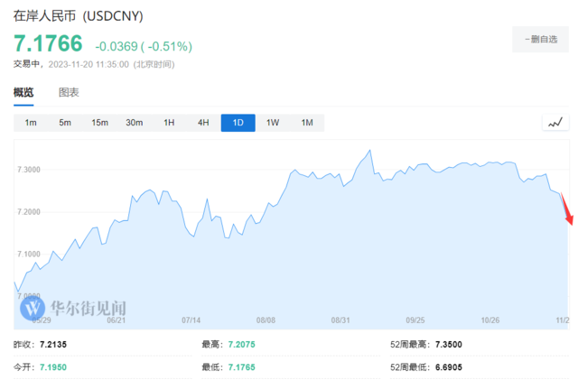
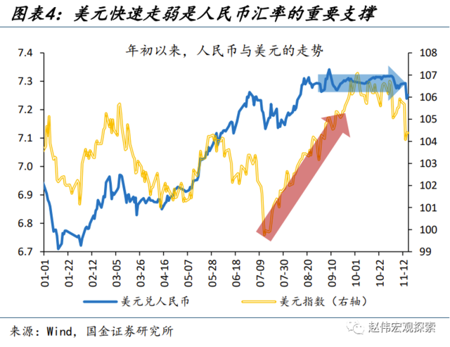

# 涨势如虹！离岸人民币大涨400点，升破7.18关口

11月20日周一，人民币突然掀起狂欢。

**离岸人民币兑美元持续走高，现已升破7.18关口，刷新8月份来高点，日内涨近400点。** 在岸人民币也在不断走高。

稍早前，中国外汇交易中心数据显示， **人民币兑美元中间价上调116点至7.1612，创8月以来最高纪录。**

**国金证券认为，美元的快速走弱是人民币汇率升值的直接推手。美元指数自10月下旬以来大幅回落，正在逼近100大关。**

而美元回落，是美债供给侧冲击边际缓和、经济数据走弱、投机扰动缓和三方面因素共同作用的结果。国金证券在报告中写道：

第一，美债供给侧冲击边际缓和；四季度再融资会议上，财政部预计净发债规模降至7760亿美元、较7月预期值下降760亿美元。

第二，经济数据走弱、美联储态度偏鸽；11月陆续公布的PMI、非农、CPI等数据均低于市场预期，市场对明年降息的预期逐步升温。

第三，投机扰动也有缓和，美债非商业空头持仓明显回落。

国君证券认为，人民币升值的背后，除了有美联储加息周期结束预期的外部因素支撑，还有有中间价的功劳，
**中间价作为汇市“稳定器”，在做空离岸人民币成本下降的背景下，对人民币形成强劲支撑。**

国君宏观周浩、孙英超在上周公布的研报中指出，

离岸人民币的融资成本开始明显走低，这意味着做空人民币的成本也同步下滑，但离岸人民币并没有出现部分投资者担忧的贬值，反而借着近期的美元走弱出现了一波强力的升值。

**中间价扮演了“稳定器”的作用，由于人民币兑美元的中间价一直相对稳定，空头仍然对政策意图较为忌惮，没有轻易在这一区域下注，而是希望等待更加清晰的信号。**

也有分析认为， **中间价调升或显示出监管层对近期弱势美元下人民币即期出现的反弹予以确认。**
截止上周五时，境内外人民币本月累计涨幅分别达约1.4%和1.7%。10月份时在岸人民币持续运行在日内波动区间2%的贬值下限附近，周一在岸较中间价最大偏弱幅度缩窄至仅约0.65%。

“央行可能乐见境内外即期与中间价在今年底之前、尤其是美元下一波反弹之前实现三价合一，”外汇与利率策略师赵志轩在媒体采访中说，中间价终于脱离9月以来在7.17附近的平台区域，明显是希望利用美国数据不达预期后美元走弱的时间窗口，
**在年底前推动人民币升至7元一线。**

**延伸阅读：**

[人民币汇率，“变盘”的开始？](https://news.qq.com/rain/a/20231119A049OV00)

