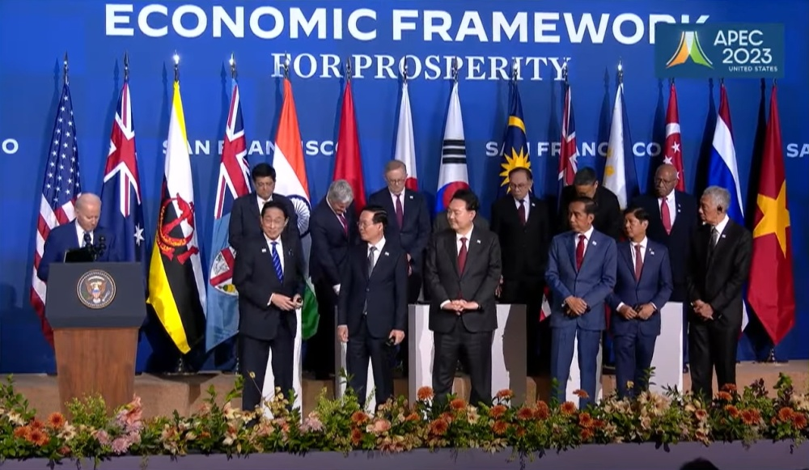

# 特朗普：若当选总统，将废除“印太经济框架”

（观察者网讯）据路透社11月19日报道，美国前总统特朗普18日在艾奥瓦州发表讲话时说，他反对拜登政府正在与另外13个国家谈判的地区贸易协议“印太经济框架”（IPEF），并且誓言一旦自己胜选，会在重掌白宫的第一天将其废除。

特朗普于2017年1月入主白宫后，退出了美国与多个亚太国家达成的“跨太平洋伙伴关系协定”（TPP）。拜登继任后开始推动IPEF谈判。在18日的讲话中，特朗普将IPEF称作“TPP二号”，他认为这份协议将掏空美国制造业并造成美国人失业，他将在上任后立即“废除”他所称的“TPP二号”。

“拜登的‘TPP二号’计划将在下一届政府上台的第一天就宣告死亡。”特朗普说，“这比第一个（TPP）更糟糕，堪称用另一个旨在推动向亚洲外包的大规模全球主义怪物来摧毁农民和制造商。”

IPEF由拜登政府主导，于去年5月正式成立，共有14个成员国，包括美国、韩国、日本、澳大利亚、印度、泰国、马来西亚、印度尼西亚、越南、菲律宾、新加坡、文莱、新西兰和斐济。

_IPEF领导人合照视频截图_

路透社分析，拜登政府原本希望在上周于旧金山召开的亚太经济合作组织（APEC）会议之前，及时完成IPEF贸易倡议的关键章节谈判，但各国并没有达成任何实质性协议。贸易专家和商业团体认为，虽然白宫誓言继续就这项雄心勃勃的协议进行磋商，不过考虑到选举年的压力以及其中的一些严格要求遭到部分国家抵制，各方达成协议的可能性渺茫。美国副贸易代表称，成员国明年将重新调整贸易谈判，同时承认美国2024年总统大选会令谈判更加复杂。

值得一提的是，美国贸易代表戴琪去年曾公开宣称IPEF将“有效反制”中国不断增长的影响力。美国商务部长雷蒙多谈及IPEF时也曾称，美国希望恢复在该地区的经济领导地位，“为印度洋—太平洋国家提供一种替代中国的选择”。此番表态又一次暴露IPEF的排他性、封闭性、对抗性等特点。

韩联社9月报道指出，对美国而言，IPEF的目标是在亚洲建立一个“可信赖的合作伙伴”网络，以减少对中国的依赖，然而美国智库彼得森国际经济研究所（PIIE）发布的一份报告显示，包括韩国在内的大多数IPEF成员国在近十多年间对华贸易依存度逐渐提升，美国试图疏远中国的做法预计将更难奏效。

针对IPEF相关问题，中国外交部发言人毛宁在5月26日主持例行记者会时表示，亚太经济的成功受益于开放合作、互利共赢。无论什么名目的区域合作框架，都应该保持开放包容，而不是歧视排他，搞保护主义。

“全球产业链供应链的形成和发展，是市场规律和企业选择共同作用的结果。美国为限制中国发展、维护自身霸权，将经贸问题政治化，胁迫诱拉一些国家限制对华出口，严重冲击全球半导体产供链稳定，中方对此坚决反对。”毛宁指出，各方应共同反对美国的经济胁迫和霸凌行径，共同维护多边贸易体制，共同确保全球产供链稳定畅通。

另一方面，因“国会山叛乱”“封口费”事件官司缠身的特朗普能否顺利参选引发关注。去年11月，特朗普正式提交文件加入2024年总统竞选，这是他第三次发起美国总统竞选活动。

当地时间11月14日，美国密歇根一名州法官驳回了取消特朗普在该州参加2024年总统初选资格的努力，裁定特朗普将继续留在该州共和党初选选举中。《纽约时报》称，这项裁决标志着，特朗普在全美范围内再次竞选总统资格的斗争中，取得了初步胜利。

**本文系观察者网独家稿件，未经授权，不得转载。**

