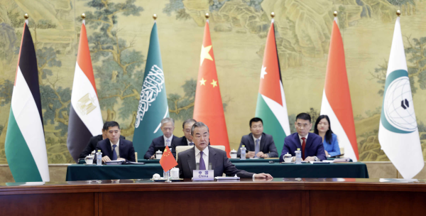
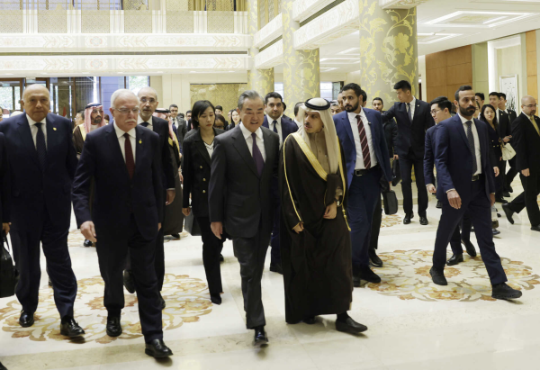

# 王毅同阿拉伯、伊斯兰国家外长联合代表团会谈

2023年11月20日，中共中央政治局委员、外交部长王毅在北京同沙特外交大臣费萨尔、约旦副首相兼外交大臣萨法迪、埃及外长舒克里、印度尼西亚外长蕾特诺、巴勒斯坦外长马立基、伊斯兰合作组织秘书长塔哈组成的阿拉伯、伊斯兰国家外长联合代表团举行会谈。

王毅表示，外长联合代表团将中国作为国际斡旋的第一站，表明对中国的高度信任，体现了双方相互理解、相互支持的优良传统。中国是广大阿拉伯、伊斯兰国家的好朋友、好兄弟。我们始终坚定维护阿拉伯、伊斯兰国家的正当权益，始终坚定支持巴勒斯坦人民恢复民族合法权益的正义事业。中国在这场冲突中坚定站在公道正义一边，一直在为推动冲突降温、保护平民而努力，为扩大人道救援、防止人道灾难而奔走，为重回“两国方案”、早日解决巴勒斯坦问题而疾呼。今天恰逢中国和巴勒斯坦建交35周年纪念日。中方赞赏广大阿拉伯、伊斯兰国家为和平积极穿梭斡旋，愿同阿拉伯、伊斯兰国家共同努力，为尽快平息加沙战火、缓解人道主义危机、释放被扣押人员、推动巴勒斯坦问题早日得到全面公正持久解决作出不懈努力。

与会阿拉伯和伊斯兰国家外长介绍了阿拉伯—伊斯兰国家联合特别峰会情况，表示当前加沙大量平民伤亡和人道主义灾难仍在继续，国际社会应尽快采取负责任行动，推动立刻实现停火止战，确保人道援助物资充分运送到加沙，保护巴无辜平民，阻止将加沙民众强制迁移。阿拉伯和伊斯兰国家高度评价中方在巴勒斯坦问题上长期秉持公正立场，赞赏中国作为联合国安理会轮值主席国推动出台本轮巴以冲突以来首份安理会决议。期待同中方开展更加密切的协调，防止危机蔓延，重启和谈进程，在“两国方案”基础上推动建立独立的巴勒斯坦国，避免再次陷入以暴易暴的恶性循环，实现中东地区长治久安。阿拉伯和伊斯兰国家期待中国为结束巴以冲突、解决巴以问题、实现公平正义发挥更大作用。

王毅表示，中方坚定支持阿拉伯和伊斯兰国家开展的外交努力。王毅就应对当前加沙危局、解决巴勒斯坦问题提出中方主张：

当务之急是全面执行联合国安理会和联大有关决议，立即停火止战。停火已不是外交辞令，而是攸关加沙民众生死存亡的关键。应将停火作为优先目标加以落实，这是当下加沙民众的需要，是绝大多数国家的愿望，也是全世界所有爱好和平人民的一致呼声。

要切实遵守国际法特别是国际人道法。中方反对任何针对巴平民的强迫流离失所和强制迁移。以色列应停止对加沙民众的集体惩罚，尽快开辟人道主义走廊，防止发生更大范围的人道主义灾难。

王毅强调，任何涉及巴勒斯坦前途命运的安排都必须征得巴勒斯坦人民的同意，也要照顾地区国家合理关切。任何针对当前形势的解决办法都不能背离“两国方案”，都应有利于地区和平稳定。

联合国安理会要倾听阿拉伯、伊斯兰国家的呼声，为推动局势降温采取负责任的行动。中方作为安理会轮值主席国，将继续同阿拉伯、伊斯兰国家加强协调，凝聚共识，推动安理会就加沙局势进一步采取有意义的行动。

王毅表示，巴以冲突循环往复，根本原因是巴勒斯坦人民的建国权、生存权、回归权长期遭到漠视，解决之道是落实“两国方案”，建立独立的巴勒斯坦国。中方呼吁尽快召开更具规模、更大范围、更有实效的国际和会，并为此制定时间表和路线图。巴勒斯坦问题是中东问题的核心。不实现巴勒斯坦问题的公正解决，中东就难有持久和平稳定。中方将继续坚定站在广大阿拉伯、伊斯兰国家一边，站在国际公平正义一边，继续为推动实现巴以和平及中东地区和平稳定作出积极努力。

来源：外交部网站

