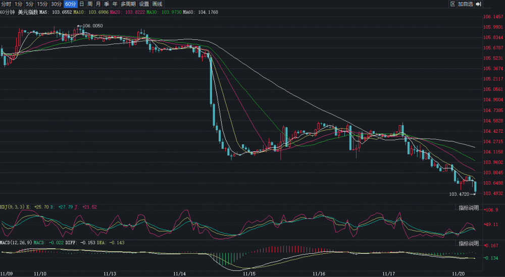
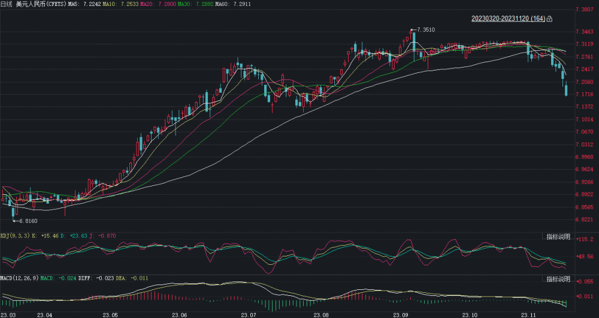
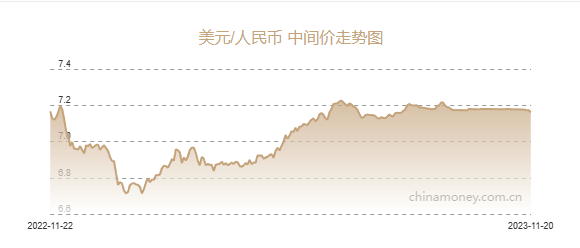

# 离岸人民币对美元汇率升破7.2关口，创下近三个月以来新高

每经记者：赵景致 每经编辑：马子卿

今日盘中，离岸人民币对美元表现强势，目前已经升破7.2关口，最高报7.16305，创下近三个月以来新高。从本月离岸人民币对美元汇率表现来看，截至目前已经升值超1700点。

 _美元/人民币（离）汇率走势图 图片来源：同花顺iFinD_

业内人士指出，近期人民币对美元回升动能强劲，主要受几个方面因素共振。 **一是** 美国通胀回落超预期，美元指数走弱； **二是** 国内经济基本面支撑；
**三是** 外汇市场供求变化，年底前后外贸企业结汇需求一般有所增加； **四是** 市场情绪逐步回暖，带动外资趋势流入，也对人民币汇率构成支撑。最后，
**中美关系回暖迹象与人民币国际化稳步推进，提振市场信心。**

值得注意的是，人民币对美元升值，能够降低进口企业成本，但出口企业则会面临一定压力。东方金诚首席宏观分析师王青指出，年底前后外贸企业结汇需求一般有所增加，对外贸企业而言，
**要奉行风险中性原则，切忌单边压注，在综合成本可控的条件下，可以考虑通过汇市金融衍生品对冲人民币波动，压缩外汇风险敞口。**

离岸人民币对美元汇率升破7.2关口，创下近三个月以来新高

在10月31日，离岸人民币对美元汇率到7.3441后，本月来离岸人民币对美元汇率不断回升。截至18时，离岸人民币对美元汇率最高报7.16305，突破7.2关口，月内升值超1700点，创下近三个月以来新高。

对于近期人民币走强，王青认为， **“有这段时间美元走低，带来的被动升值的可能。”**

_美元指数走势 图片来源：同花顺iFinD_

王青指出，“可以看到，最新数据也显示，11月17日CFETS等人民币一篮子货币汇率指数均较11月3日有不同程度的下行”

光大银行金融市场部宏观研究员周茂华指出，近期人民对美元回升动能强劲，主要受几方面因素共振。

**一是** 美国通胀回落超预期，引发市场对美联储明年降息押注，美债利率和美元重挫，中美利差持续收窄，利好人民币表现。 **二是**
国内经济基本面支撑，9月初以来，随着国内越来越多指标超预期，显示经济修复动能在增强，以及国内及时加强预期管理，人民币汇率预期已经发生变化。 **三是**
外汇市场供需变化，我国外贸展现出韧性，且年底前后外贸企业结汇需求一般有所增加。四是市场情绪逐步回暖，带动外资趋势流入，也对人民币汇率构成支撑。
**最后，中美关系回暖迹象与人民币国际化稳步推进，提振市场信心。**

_美元人民币（CFETS）汇率走势图 图片来源：同花顺iFinD_

此外，进入11月以来，美国十年期国债收益率也大幅下降。数据显示，截至11月20日，美国10年期国债收益率报4.47%，而在10月中下旬曾达到5.024%高点。

周茂华表示， **一方面，** 11月初的美联储政策会议，市场鸽派解读认为12月可能还是会暂停加息； **另一方面，**
来自美国的非农数据大幅不及预期，且美国通胀超预期降温。“这两个因素对市场冲击极大，导致了美债利率大幅下挫，美元走弱。”

人民币汇率中间价保持稳定

值得注意的是，尽管在岸、离岸人民币对美元升值幅度较大，但人民币汇率中间价自9月15日以来保持稳定，保持在7.17左右。银河期货一宏观研究员对记者表示，
**最近人民币升值的原因可能和中美关系改善有关，一旦汇率出现回升，很容易激发结汇拥挤效应。**

_美元/人民币 中间价走势图 图片来源：中国货币网_

王青表示， **除了美元走势变化外，当前决定人民币汇率强弱的关键仍是国内宏观经济及房地产行业走势。** 此外，汇市调控措施也会对人民币波动幅度有较大影响。

“伴随稳增长政策持续发力，国内宏观经济企稳，人民币内在贬值压力也在缓和。这是8月至10月美元持续升值，而人民币汇价反而走稳的主要原因。”王青指出。

王青认为，展望未来，伴随美联储加息过程进入尾声，美元指数易跌难涨，人民币被动贬值压力有缓和趋势，甚至不排除继续阶段性对美元升值的可能。另外，今年底明年初宏观政策将继续保持稳增长取向，房地产支持政策也将持续发力，国内经济有望延续回稳势头，这些都会对人民币汇率提供支撑。

“不过， **我们判断明年房地产行业出现‘V型’反弹的可能性比较小，经济增速仍将保持在5.0%左右，稳增长政策还需适度发力。**
由此，未来一段时间人民币脱离美元走势、出现较大幅度升值的可能性不大。”王青指出，总体上看，尽管未来伴随美元下行，人民币对美元有可能持续升值，但更能反映人民币汇率真实水平的CFETS等三大一篮子人民币汇率指数将以稳为主。

王青表示， **对消费者来说，** 人民币升值则意味着与海外留学、出口旅游费下降，人民币计价的海淘成本也会走低，总体上是有利的。

**对企业而言，** 人民币对美元升值，能够降低进口企业成本，但出口企业则会面临一定压力，这正与前段时间人民币贬值压力较大阶段相反。

不过，汇市走向是“测不准”的， **对外贸企业而言，**
要奉行风险中性原则，切忌单边压注，在综合成本可控的条件下，可以考虑通过汇市金融衍生品对冲人民币波动，压缩外汇风险敞口。

每日经济新闻

