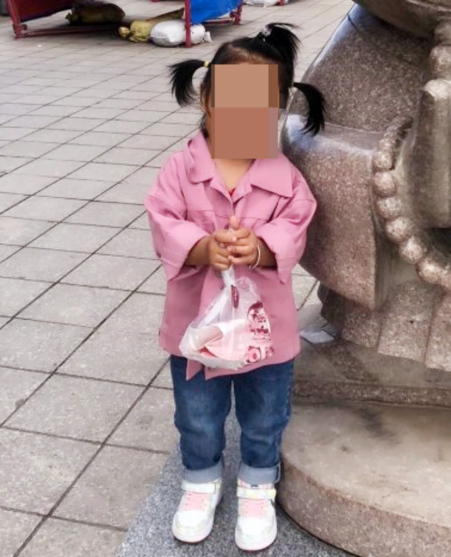
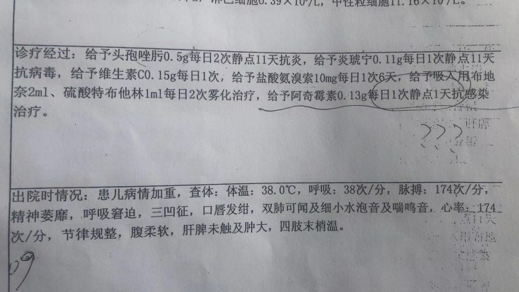

# 黑龙江2岁半女童疑注射阿奇霉素后死亡，卫健部门介入调查

近日，黑龙江省林口县一名仅32个月大的女童小含（化名）因细菌感染入院，在注射阿奇霉素后次日死亡，引发广泛关注。

11月20日，林口县卫生健康局接受上游新闻（报料邮箱：cnshangyou@163.com）记者采访时回应，目前已按照正规程序进行尸检，尚未有结论，涉事的主治医生已暂停工作。

_小含生前照片。图片来源/受访者供图_

“我孩子不是疑难杂症，竟然给治没了。”孩子的母亲丁女士哽咽着说：“我女儿才32个月，出事前体重只有20多斤。”

小含的妈妈丁女士说，10月29日，孩子有些发热，她便带着小含来到牡丹江市的一家三甲医院就医。检查结果显示，小含支原体检测为阴性，血常规显示白细胞增高，诊断为普通的细菌感染。由于症状较轻，并且是牡丹江市下辖的林口县居民，为了方便照顾，在医院的建议下，丁女士便带着小含回到老家县城医院治疗。

10月29日下午3时左右，丁女士带着小含来到林口县人民医院办理了入院手续。入院时，小含拍了胸片、彩超，结果未显示异常。

据丁女士反映，在连续第六天静点（静脉点滴）后，小含病情仍无好转，又出现了咳嗽症状。随后的几天内，反复发烧。

在静点第十天时，医生又增加了阿奇霉素。在注射阿奇霉素次日，小含出现精神萎靡、气喘憋闷症状，包括主治医生在内的多名医生察看后，仍未做出结论，答复说：“挺好的，没有问题。”

然而，小含的病情持续恶化，出现呼吸困难，脸色苍白。小含妈妈意识到不对劲，提出转院，此时院方告诉小含妈妈，孩子病情十分严重。转院途中，小含失去生命体征。

根据丁女士的描述，医生在未告知用药风险、未进行血液检测支原体及心电图的情况下，给小含注射了阿奇霉素。

_病历记载小含曾注射阿奇霉素。图片来源/受访者供图_

记者获得的小含病历显示，11月8日，在此前用药基础上，增加了阿奇霉素0.13克静点。11月9日上午10时15分，小含病情进一步加重，出现精神萎靡，体温：38℃，呼吸：36次/分，脉搏：190次/分，心率：190次/分，小含出现呼吸循环衰竭。

丁女士还认为，在住院期间，主治医生未按照规定查房，小含病情反复时，医生也未进一步检查。

同时，住院期间患者还需要自行前往静点室，与院外患者共同在静点室内静点。丁女士认为，此行为加大了孩子交叉感染的风险。

“事情过去6天，医院始终没有人露面，无奈之下我们才来讨要说法。”丁女士说。

11月20日，林口县卫生健康局有关负责人接受上游新闻记者采访时回应，目前已按照法律途径进行尸检，结果还没有出来。在等待结论期间，涉事的主治医生已经暂停工作。

针对家长怀疑医生违规使用阿奇霉素，该负责人介绍，事发后已经把小含用的药品包括同批号的阿奇霉素进行封存，经牡丹江市医调委协调，提供给第三方的鉴定机构进行医疗鉴定。

针对该起事件，当地已经对医疗行为、医患沟通等方面进行反思，将通过提高自身能力素质、医德医风方面的监管，以避免类似情况发生。

上游新闻记者 张莹

