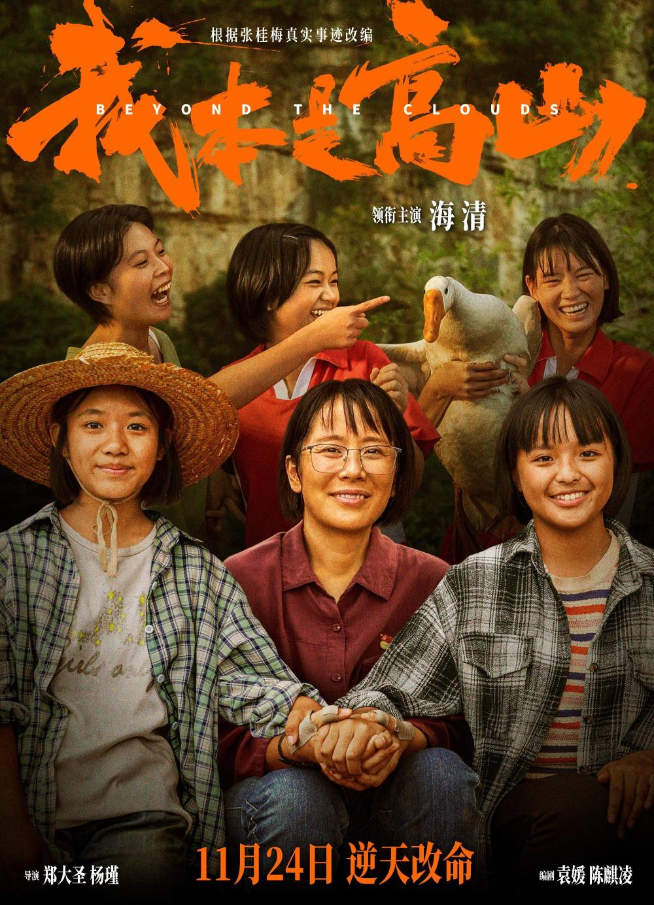

# 《我本是高山》导演回应“酗酒母亲”争议：实地的调研

连日来，围绕电影《我本是高山》的争议不断，其中一个争议的焦点就是——电影根据张桂梅真实事迹改编，然而张桂梅学生的父亲酗酒，到了影视作品里，就变成了母亲酗酒。很多网友认为这一情况有悖真实，让人无法信服。

昨（20）日，在《我本是高山》的路演现场，一位观众问到了关于“酗酒母亲”的问题。

导演回应称：“就我们在当地去走乡串寨，我们的实地的调研，我们看到的情况，在那样的一个山区，类似的情况很多，甚至有远比画面里呈现的更不堪的情况。”

编辑 李洁

