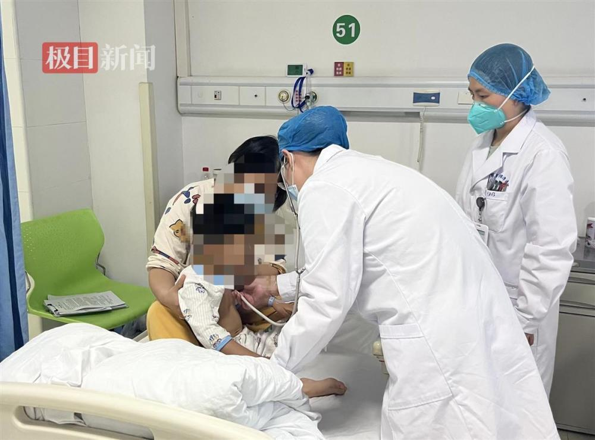

# 儿童支原体肺炎“洗肺”比例很低，专家表示：家长无需过分紧张

极目新闻记者 曹洋

通讯员 吴萍 徐颖异

近日，感染肺炎支原体发展至肺炎的儿童中，出现了一些做肺泡灌洗的案例，被家长形象地称之为“洗肺”。什么情况下才需要“洗肺”？需要进行“洗肺”的患儿比例多不多？11月21日，武汉市金银潭医院感染性疾病科主任文丹宁对这些问题做出解答。

 _文丹宁给患者检查（通讯员供图）_

专家介绍，支气管肺泡灌洗术是指通过支气管镜向支气管肺泡内注入规定量的无菌生理盐水，可以对肺炎局部进行冲洗，排出肺炎区域大量的炎性分泌物（痰液），达到对肺部疾病的诊断和治疗目的；同时也可以充分吸取合格的肺泡灌洗液后进行相关检测，寻找和锁定病原体。

“极少数的重症支原体肺炎患儿，病情重、反复发热，经抗感染甚至是激素治疗效果欠佳，气道内分泌物多且黏稠，容易形成痰栓甚至局部坏死，会堵塞支气管。这个时候我们才会去做支气管肺泡灌洗。”文丹宁表示，“虽然这是个很成熟的检查操作，但实际上这样的患儿比例很低，一般都不到这种程度，家长无需过分紧张。”

据了解，支气管镜检查属于临床常见的内窥镜检查。目前该院已开展了数例支气管肺泡灌洗，患儿恢复情况良好。

文丹宁提醒，秋冬季节又进入流感流行期，呼吸道疾病门诊患者增多，市民平时可根据需要佩戴口罩，少去人员密集的密闭公共场所、屋内勤通风换气。一旦出现持续发热、咳嗽等症状，要及时就医。不要随意根据网络信息自行购药服用，以免贻误病情。

（来源：极目新闻）

