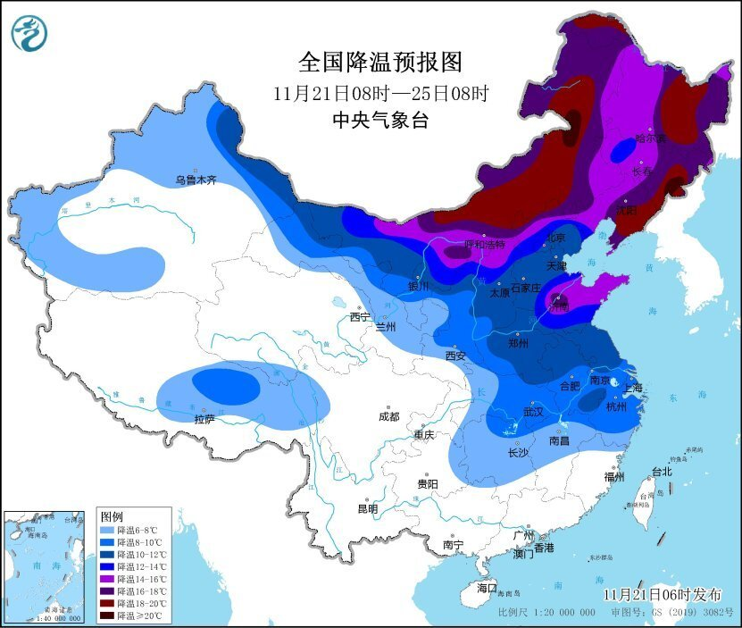
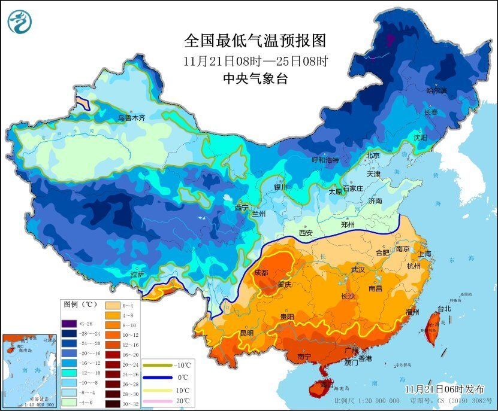
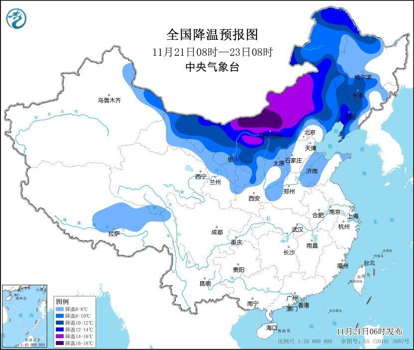

# 寒潮黄色预警：内蒙古、东北地区、华北西部和北部等地降温12-16℃

中央气象台11月21日06时继续发布寒潮黄色预警：

受寒潮影响，11月21日至24日，我国长江中下游及以北地区气温将先后下降6～10℃，其中，内蒙古、东北地区、华北西部和北部、黄淮东部等地降温12～16℃，内蒙古中东部、东北地区东部等地部分地区降温幅度可超过16℃，大风降温主要时段为22日至24日；寒潮影响后，最低气温0℃线将位于苏皖中北部至河南中南部、陕西南部、甘肃东南部等地，内蒙古中东部和黑龙江大部最低气温将降至-20℃以下，局地可达-30℃以下；同时，上述大部地区伴有4～6级偏北风，阵风7～8级，局地9级；23日至25日，我国东部和南部海区也将先后出现6～8级大风，阵风9～10级。

预计，21日08时至23日08时，新疆东部、西北地区东北部、内蒙古大部、东北地区中西部、华北西部和北部等地气温将下降6～10℃，其中，内蒙古中部和东南部、黑龙江西北部等地降温12℃以上。

**防御指南：**

1、政府及有关部门按照职责做好防寒潮工作；

2、注意添衣保暖，照顾好老、弱、病人；

3、对牲畜、家禽和热带、亚热带水果及有关水产品、农作物等采取防寒措施；

4、做好防风工作。

