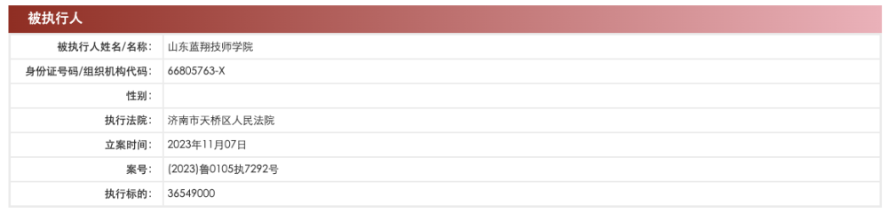
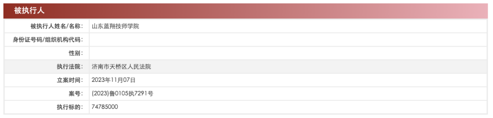
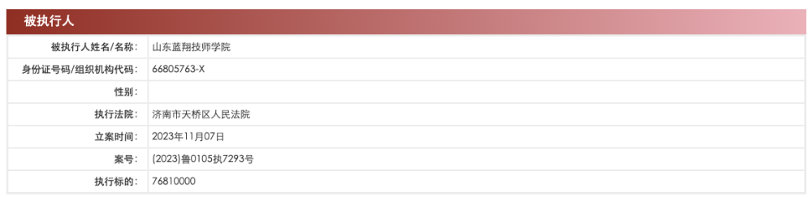

# 山东蓝翔技师学院成被执行人，执行标的合计逾1.8亿元

中国执行信息公开网显示，11月7日，山东蓝翔技师学院新增3条被执行人信息，执行标的共计1.8亿余元，均涉及广告合同纠纷案件，执行法院均为济南市天桥区人民法院，其中两起案件被执行人还包括山东蓝翔房地产开发有限公司、荣兰祥。

山东蓝翔技师学院成立于2007年10月，曾用名为山东蓝翔高级技工学校，开办资金为500万，法定代表人为荣小龙。对外投资信息显示，该学院全资持股山东蓝翔人力资源服务有限公司和山东蓝翔房地产开发有限公司。

