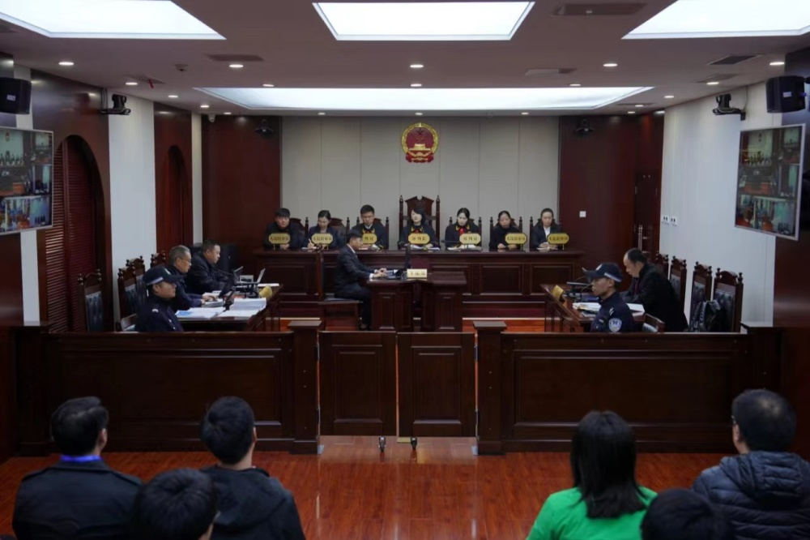

# 景区让大象表演节目被起诉 法院驳回：适度互动可增进对大象的了解

昆明铁路运输中级法院
11月21日通报称，当日昆明铁路运输中级法院依法对原告北京市昌平区多元智能环境研究所诉被告西双版纳野象谷景区有限公司生态破坏民事公益诉讼案进行一审公开宣判：驳回原告多元智能研究所的诉讼请求。

昆铁中院经审理查明：原告多元智能研究所是于2015年2月4日成立的民办非企业单位，被告野象谷景区系于2003年10月27日注册登记的有限责任公司，经营范围包括亚洲象驯养、繁殖、表演并取得亚洲象《驯养繁殖许可证》。

因原告认为被告从事大象表演是虐待亚洲象、损害自然生态系统的行为，向法院提起生态破坏民事公益诉讼，主张由被告承担停止大象表演、赔礼道歉等生态环境侵权的法律责任。

综合诉辩双方意见，昆铁中院围绕野象谷景区大象展演及驯养大象的行为是否破坏生态环境、是否对社会公共利益造成损害的焦点问题进行了审理。

法院认为，“行为人的行为违反国家规定”是环境公益侵权的构成要件之一，我国现行法律法规不禁止利用野生动物进行公众展示展演，野象谷景区取得的《驯养繁殖许可证》及营业执照经营范围表明，其具备利用大象进行展演的资质，组织展演不违反国家规定，系合法经营。驯养繁殖是指在人为控制条件下，为保护、研究、科学实验、展览及其他经济目的而进行的野生动物驯养繁殖活动。对野生动物的驯养繁殖需要采用与其生理特点、身体条件相适应的方式、手段进行约束、规制，合理的驯养不是虐待。野象谷景区大象表演是在工作人员指引下进行，并未给大象身体带来伤害，原告关于“表演即虐待”的观点既与现行法律规定相悖，又缺乏事实依据。野象谷景区用于展演的大象及展演区域仅限于野象谷且独立于野外生态环境，未破坏生态，亦未给不特定社会公众的合法权益造成损害或带来重大风险。

昆铁中院据此作出上述判决。 判决同时指出，适度的人象互动，既是特定地域传统文化的传承方式，又可以增进人们对大象的了解，培育人们保护大象的意识。

法院表示，该案原告关于被告的行为构成环境民事公益侵权的主张虽不成立，但社会公众对本案的广泛关注说明人们关于动物保护的理念在不断发展。《中华人民共和国野生动物保护法》在允许野生动物展演的同时也强调不得虐待野生动物。与此同时，伴随人类社会文明程度和科学技术的进步，“我们应该更加重视动物的保护，采用更加文明的理念和方法驯养动物。只有当人类和动物和谐共生，人类和动物所生活的这个世界，才会更加精彩与祥和。
”

（北京青年报记者 屈畅）

