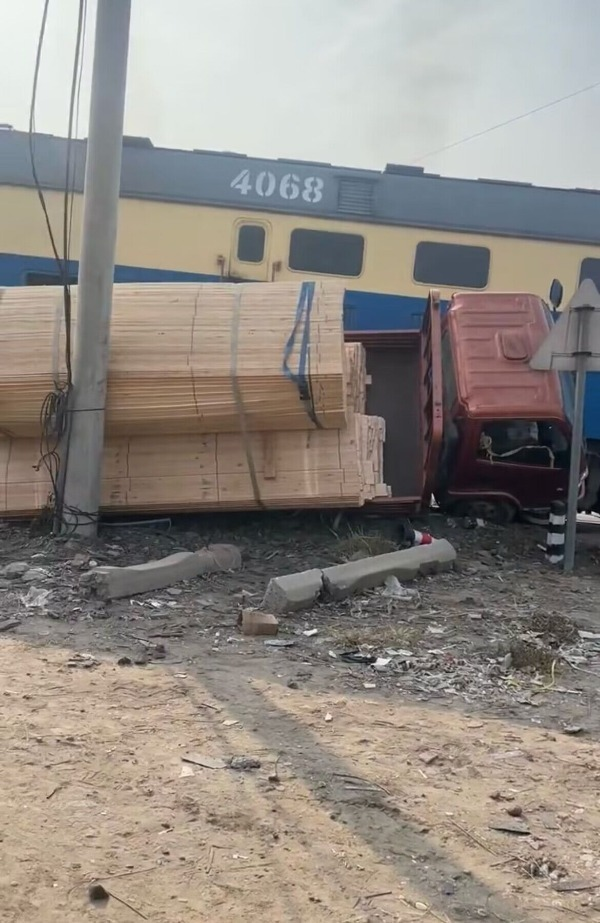

# 河北黄骅市一货车与火车相撞

**大皖新闻讯** 11月21日，有网民发布视频称当天上午，河北沧州市黄骅市一辆货车和火车相撞。

 _视频截图。_

据网民发布的视频显示，一辆装载着货物的货车与一辆火车撞在一起，货车一侧倒靠在电线杆上，另一侧是火车。

对此，11月21日下午，大皖新闻记者采访黄骅市官方部门获悉，11月21日上午，有一辆货车与火车相撞，无人员伤亡。

大皖新闻记者 余康生

编辑 张大为

