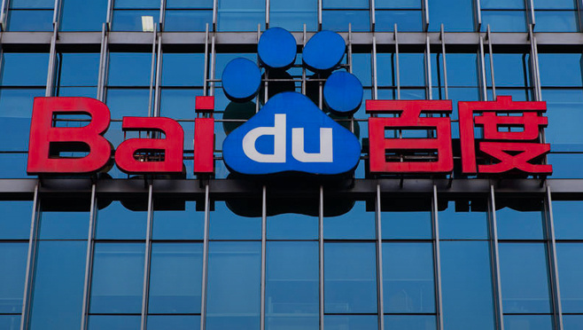
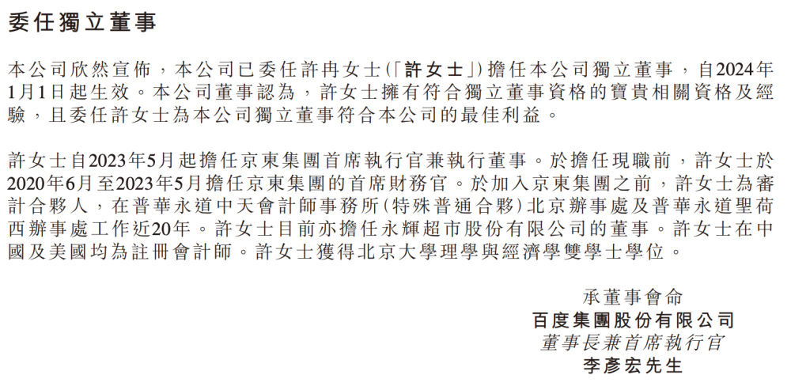

# 百度：委任京东许冉担任公司独立董事，明年1月1日起生效

腾讯科技讯 11月21日消息，百度公司今日宣布许冉女士担任本公司独立董事，自2024年1月1日起生效。

本公司董事认为，许女士拥有符合独立董事资格的宝贵相关资格及经验，且委任许女士为本公司独立董事符合本公司的最佳利益。

许女士自2023年5月起担任京东集团首席执行官兼执行董事。在担任现职前，许女士于2020年6月至2023年5月担任京东集团的首席财务官。在加入京东集团之前，许女士为审计合伙人，在普华永道中天会计师事务所（特殊普通合伙）北京办事处及普华永道圣荷西办事处工作近20年。许女士目前亦担任永辉超市股份有限公司的董事。许女士在中国及美国均为注册会计师。许女士获得北京大学理学与经济学双学士学位。

