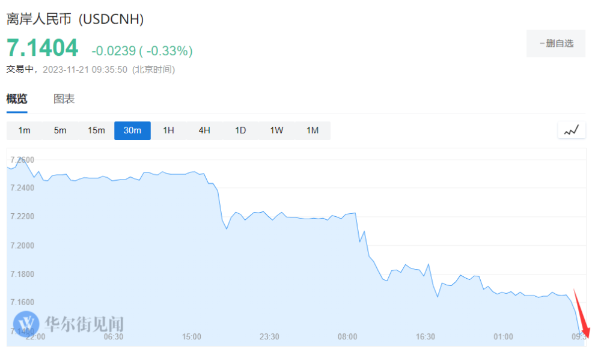

# 突破7.14！离岸人民币成交于中间价强方，为7月27日以来首次

美联储加息周期结束预期的强化继续打击美元，中间价大幅上调，双重因素刺激下，人民币连续两日大涨。周二盘初离岸人民币大涨约300点，成交于中间价强方。

11月21日，离岸人民币兑美元涨破7.14关口，日内涨约300点。盘中离岸人民币最高涨至7.1369元，强于周二的中间价7.1406元，为7月27日以来首次强于中间价水平。

今日稍早前，中国外汇交易中心数据显示，人民币兑美元中间价较上日调升206点至7.1406。

