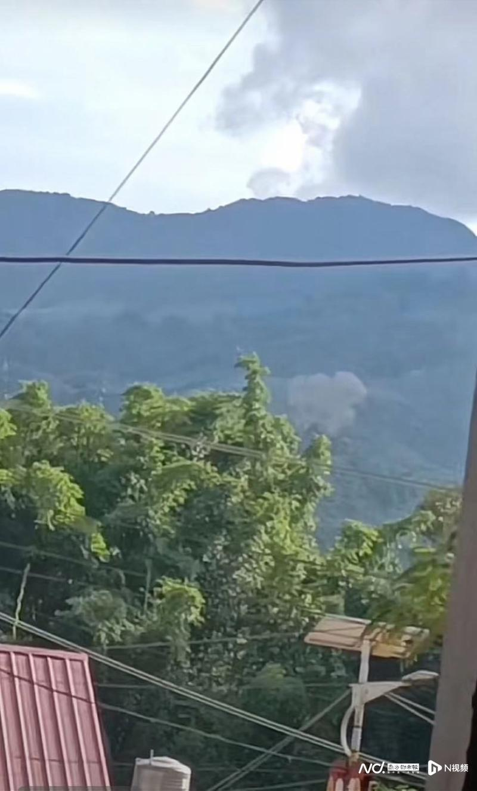

# 缅北冲突下的中缅边境贸易商：先是招工难，再遇缺订单

杨光在果敢自治区首府老街开了一家批发店，售卖从中国带去的副食品和生活用品，在当地冲突开始没多久便闭了店，与她一同在老街开店的中餐厅也暂停了生意。“辣椒800块人民币一斤，汽油涨到5000块人民币一升了。”20日傍晚，她向记者发来最新了解到的当地物价。

“相信一切都会结束的。”

在缅甸做了十年服装生意的秋秋（化名）是广东河源人，她在缅甸南部城市仰光经营着两家服装厂，雇佣约3000名工人。10月27日，缅北地区爆发武装冲突，此后态势久久未能平息，且有愈演愈烈之兆。受此影响，秋秋从中国预订陆运至缅甸的原料在中缅边境滞留了20多天，因此造成的损失达至约一百万元人民币。

在缅甸广东工商总会常务副会长陈初彪印象中，以前从未有过影响如此之大的冲突——中缅陆路运输的重要路段都被控制，在缅当地企业的货物被积压，甚至难以抵达中缅口岸。

另一边，“挖开地表，全国吃饱”曾经是挂在缅甸北部克钦邦帕敢镇矿业办公室墙外的标语。但接二连三的重创下，很多在缅的中国玉石商人都选择了回国，行业颇受打击。近日，南都、N视频记者采访了多家从事中缅边境贸易商及商会代表。他们说，眼下前途未卜，几乎只能等待。

_在云南瑞丽拍摄到缅甸边境有炮弹爆炸。受访者供图_

**货物积压**

南都记者联系上杨光（化名）时，她正身处果敢125工业园的难民救助站。

救助站靠近中缅边境125号界碑处，与云南省西南部的南伞口岸接壤。本次冲突爆发后，贫困山区的老人小孩吃住失去了保障，纷纷跑来救助站避难，杨光已在这里志愿救助将近一个月。

杨光在果敢自治区首府老街开了一家批发店，售卖从中国带去的副食品和生活用品，在当地冲突开始没多久便闭了店，与她一同在老街开店的中餐厅也暂停了生意，他们转向为在老街需要帮助的中国人提供伙食，还提出把有回国需求的同胞载到边境口岸。

11月18日，一则落款为“缅甸民族民主同盟军事委员会”的公告称，要求仍滞留在老街的中国籍人士务必尽快回国，以免造成不必要的伤亡。杨光说，这些天来，她接到了很多同胞回国的求助，现在当地的中国人“基本都回去了”。

即便是身处救助站，也并非是一片祥和光景。

杨光所在的地方手机信号并不稳定，网络时有时无，电力长期中断，物资短缺。“中国的物资不能过来，下缅甸的物资也不能过来。”

_果敢125难民救助站雨后情景。受访者供图_

杨光形容她看到的救助站难民：“吃的也没有，睡觉的地方也没有，有钱的还能搭起帐篷，没钱的就没办法了。”但近两天果敢下起了绵绵雨，淹了不少帐篷。雨水冲刷着黄泥土地，炮火不时在耳边响起，对于杨光而言，又是一个不眠之夜。

这场起源于缅甸北部的冲突持续往南部蔓延。

11月19日下午，身在缅甸中部曼德勒的翡翠商人大雄（化名）给南都记者发来了一段视频，画面里能清晰地看到远处翻滚的浓烟。大雄说，“刚才只听到轰隆一声，也不知道是什么情况。”

_11月19日下午，大雄所在的曼德勒发生了一起爆炸。受访者供图_

大雄遭受到的最大冲击，来自他所经营的翡翠高货（高价值货物）生意遇到的货物运输难题。

他向南都记者解释，因为重量的原因，玉石非常依赖陆运，可自缅北冲突爆发以来，来往中缅的陆运基本中断，很多货物一时被卡在途中。加上冲突爆发后部分地区的手机信号一度中断，导致有已在途中的物流司机陷入失联状态，绝大多数物流公司也不愿意再冒险发货。

大雄表示，即使能找到渠道发货，运输成本也会上涨，同时运输周期被拉长，当下，考验资金链的时候到了。

据他了解，此次行业内受影响最大的，是在缅甸做直播行业的玉石商人。“他们的销售主要是通过购物平台，平台对发货时间有限制，客户也会因为物流慢而退单。”

同样受到影响的还有“走量”的玉石批发商。囤积的货物因为无法发货而被积压，恢复运输的日子却仍不可预知，对于像大雄一类的商人而言，现金流是很大的挑战。也正因如此，很多中国商人选择了回国，“反正发不了货”。

受局势影响，曼德勒也爆发了游行示威。一周前，大雄的团队上街买了数十万缅币的方便面、米、油、肉，他们只能选择尽量减少接下来一段日子的出门时间。

**滞留边境**

在缅甸南部城市仰光从事服装生意10年的秋秋告诉南都记者，她从中国预订陆运至缅甸的原料已经在中缅边境滞留20多天了，目前既无法过境，也不能原路退回。

眼下，她只能重新订购一批原料，通过空运及海运辗转送抵仰光，并在生产完成后选择价格更高昂的渠道，将货品运送给远在欧洲的客户，以弥补耽搁的时间。秋秋告诉南都记者，目前许多同行都面临着这样进退两难的困境。

因为原料短缺，秋秋的工厂不得不暂时停工，在此期间她还需要继续向工人支付工资。她估算，各项损失加起来达一百万元人民币左右。

大雄还记得，这场冲突开始得非常突然。

10月27日，他看到缅甸民族民主同盟军发布了一份公告，大意是为清理老街地区的电诈集团，要对腊戍至清水河、腊戍至木姐路段实施全天候戒严，随后就“打起来了”。

事实上，除缅甸民族民主同盟军以外，德昂民族解放军和若开军两个缅甸北部少数民族地方武装组织，也在当日以打击电信诈骗的名义，在掸邦北部清水河、勐古、贵慨、登尼以及腊戍地区向缅甸政府军展开了武装行动。

冲突爆发首日，外交部发言人毛宁表示，中方高度关注有关冲突，呼吁有关方面尽快停火止战，坚持通过对话协商、以和平方式解决分歧，避免事态升级，并采取切实有效措施确保中缅边境的安全稳定。

因当地安全形势复杂严峻，外交部和中国驻缅甸使领馆于11月9日发文称，当地安全形势复杂严峻，提醒中国公民暂勿前往缅北地区，已在当地特别是果敢老街、勐古等冲突激烈地带的中国公民密切关注局势发展，尽快在确保安全前提下转移至安全地带或回国。10日，外交部发言人汪文斌再度表态称，中方敦促缅甸有关各方立即停火止战，维护中缅边境的安全稳定。

如何处理被滞留在边境的货源，成为压在包括秋秋在内一批仍在缅甸从事边境贸易商家的心头大石。

缅甸广东工商总会常务副会长陈初彪是缅籍华人，常年居住在仰光。在他印象中，此前从未有过影响如此之大的冲突，中缅陆路运输的重要路段都被控制，在缅企业的货物被积压，难以抵达口岸。

他说，11月恰好是缅甸农产品丰收的时节，缅北的居民大部分都是农民，在面临附近城市因封路造成粮食和燃油紧缺的同时，他们的农产品被封控的道路围困，无法运到中国，而中国是缅甸农产品主要出口市场之一。

缅甸中国企业商会副秘书长、纺织与服装分会秘书长罗穆珍告诉南都记者，缅北冲突使运输成为了这批在缅甸从事纺织服装业的企业面临的最大问题。自中国进入缅甸的物品，大多要经过缅北地区，如今陆路的必经之路被掐断，大部分企业需衡量风险，转而走耗时更久的海路，或经泰缅边境进入仰光，而后者也将面临重重关卡，“相对都没有那么方便”。

在此期间，罗穆珍也奔波于同缅方的服装协会、缅甸工商联协商，而陈初彪作为消息灵通、熟知情况的本地人，得知通过海运抵达泰缅口岸，经此入缅境内仍是目前安全可行的运输方式，但有消息称这一条道路也即将被攻打，导致物流公司对此产生诸多顾虑，不敢轻易收货。11月16日到20日，陈初彪前后奔赴南京、广州与三个物流公司洽谈，试图疏通泰缅边境的海运渠道，成功打消了两家物流公司的顾虑。

只是，冲突并未停歇。

11月中旬，大雄注意到，一个地方武装发布了一份公告，直指要攻打曼德勒，在缅甸最大的玉石市场“角湾”投放炸弹。15日，大雄来到当地的玉石市场，发现人流量骤减，以往需要排队两三分钟才能挤进门口的市场，已门可罗雀。

市场内，和大雄一样做高货生意的商户基本上都没有开门，市场外围的小摊也少近一半。

**“广东大道”**

缅甸与中国山水相连，自19世纪中叶开始有大量中国人移居缅甸。据商务部统计，旅缅侨胞遍及全缅各省、邦，相对集中在大中城市，福建和广东籍侨胞相对集中在仰光、勃生、彬文那、毛淡棉、土瓦、丹老、妙瓦底等缅东南地区。

缅甸仰光有一条街道名为“广东大道”，附近的大街小巷就是缅甸唐人街。傍晚，仰光河畔吹来的风，经过热带气候的浸润，带着一丝暖意，吹拂过唐人街里各式各样的中式建筑，铺散在唐人街来来往往的人群之中。

来自广东河源的晓丽（化名），在仰光生活近8年，一直从事服装行业。她告诉南都记者，起初广东人多聚居于此，后渐落地生根，故此街道称“广东大道”。

和很多早年间就在仰光扎根的广东人不同，晓丽说她属于“新人”。19岁开始就在中国从事服装业的她，瞅准了缅甸当地税务、政策和人工成本低的优势，在2015年把服装厂开到了仰光。

晓丽的服装厂主要生产棉服，是国外很多品牌的代加工厂，负责从服装的排版、剪裁、车间生产到检验、包装到出货等一系列流程。

晓丽向南都记者开玩笑称，“大家总是说缅甸就是‘免电’，仰光就是一个常年断电的地方。”近些年，当地电力短缺，造成工厂时常停电，影响生产进度的同时，也给她的服装设备造成部分损耗。

此外，受疫情和缅甸政局动荡等多重影响，晓丽能接到的订单数量经常不固定，生意主要靠维系和老顾客的关系做下来。受地区局势持续恶化影响，这些年，她的工厂人力成本也有所增加。

“我的工厂近100多人的规模，三分之二都是缅甸人。现在时局动荡，我们也自然和缅甸的工人融为一起，变得更亲近了。生意虽然难做，但是撑下去，为员工们提供生计，就是我不断坚持的原因。”

 _秋秋工厂的包装部。受访者供图_

秋秋也来自广东，是河源人，此前曾在广州成立服装公司，并建起了一间服装厂，雇佣了300名工人。2013年，因为国内人力成本提高，秋秋把服装厂搬到了缅甸仰光，并于2017年建起第二间工厂，现在两家服装厂共有约3000名工人。

罗穆珍告诉南都记者，目前在缅实际运营的服装工厂接近600家，其中超300家由中国企业运营。广东企业虽在其中占比不多，但说起在缅甸做生意的广东商家，从事纺织服装业几乎占了大头。

广州海关曾统计，2019年，广东对缅甸出口商品102.4亿元，同比增长9%。劳动密集型产品占比超两成且增幅高达52.9%，其中纺织服装出口13.3亿元，同比增长51.2%。

罗穆珍介绍道，一般来说，从事服装贸易的广东企业会把原材料运送到中缅交界的云南瑞丽，这里是国家一级口岸——瑞丽口岸所在地，同时也是中缅边境口岸中流量最大的口岸。

_瑞丽口岸。新华社资料图_

通过口岸后，企业再用货车把材料输入到缅甸境内。“陆路运输最大的好处就是时间短，虽然价格相比海运更贵一些，但是一些大宗商品像布料类的物品，一般企业还是会选择走陆运。”

孟定清水河口岸、与缅甸掸邦第一特区（果敢县）接壤的南伞口岸也是陆路运输中常用到的中国对缅甸边境口岸，但“相对小一点”，却在此次冲突中首先受到冲击。

缅军政府发言人佐敏吞公开承认，中缅边境地区的清水河已经被同盟军占据。罗穆珍也陆陆续续收到了来自多家从事边境贸易企业的反馈，指货物运送到口岸后，一直卡在了缅甸关口。

“一路上都是冲突，货物一直过不过来。”

**前途未卜**

长久以来，在民族矛盾与政治矛盾叠加情势下，缅甸局部暴力袭击和武装冲突不断。

2021年2月1日凌晨，缅甸总统温敏、国务资政昂山素季及一些民盟高级官员被军方扣押。缅甸军方电视台说，开始实施为期一年的紧急状态，国家权力被移交给国防军总司令。

2022年2月1日，在实行紧急状态满一年后，国家管理委员会主席连续两次宣布依照宪法规定将紧急状态延长至2023年2月，同时需再用6个月时间筹备大选，计划于2023年8月举行大选。

但随着选举期的逼近，缅甸军方通过在缅甸国家电视台发布声明，正式推迟了承诺于8月举行的选举，并称“持续的暴力事件是此次选举推迟的原因”。

“选举一直在推后，没有一个稳定的政治环境，对我们的影响是非常明显的。”罗穆珍告诉南都记者，缅甸政局变化后，不少时尚服饰零售商陆续宣布退出当地市场。

西方企业部分退出缅甸市场，中资企业同时面临机遇和挑战。有在缅当地从事贸易的知情人士告诉南都记者，实际上，政局动荡之时，不少企业反而“真正赚到了钱”。

“全国民主联盟执政时，非政府组织在缅甸境内非常活跃，很多工厂的员工天天闹罢工，导致工厂没有稳定的生产环境。政局发生变化后，缅元急剧贬值，但是企业卖货结算用的是美元，在当地使用的是缅币，相对来说赚了一个汇率差。”

但伴随着政局变化而来的，还有当地飞涨的物价，无可避免对企业形成了一定的负担。“虽然中资企业也会主动给员工加工资，但还是有很多工人承受不住仰光较高的消费水平，选择到周边国家务工，或者就留在老家不回来了。”

因此，尽管缅甸人口尤其是年轻劳动力较为丰富，不少企业看准劳动力市场将工厂设立于此，如今也遇到“招工难”的问题。

风波不断的国内局势，也使缅甸逐渐失去其优势。起初，不少商家看准了缅甸的劳动力市场，加之出口商品拥有的免税待遇，把经在缅甸代加工厂加工后的产品销往欧洲、日韩等地。罗穆珍说，最明显的感受就是，近来欧洲客户在缅甸下订单的信心大大减弱，很多工厂面临的不仅是“招工难”，还是“缺订单”，这一情况在今年下半年尤为明显。

“辣椒800块人民币一斤，汽油涨到5000块人民币一升了。”20日傍晚，杨光向南都记者发来她最新了解到的老街当地物价。仍在奔波为救助站寻找物资的她，白天只吃了一顿方便面果腹。什么时候恢复店铺营业，早已不是她在考虑的事情。

而对于远在仰光的秋秋，“习惯了”是她挂在嘴边的常用词。“一直都是这样，只是这次持续了比较久，很多中国企业都不会愿意离开缅甸。”

大雄则表现得更为淡定。“长期在缅甸做生意的人心理素质都很强，”他对南都记者说，身边的同行对缅甸冲突不断的局势有所了解，对近期接连发生的变局并不感到特别惊讶。

他认为，只要在交易时与客户充分沟通，说清楚发货的困难，赢得对方的理解，这次缅北冲突对自己的翡翠高货生意不会产生太大的影响。

在缅甸北部克钦邦帕敢镇做翡翠生意的阿华（化名）选择了回国。在帕敢镇矿业办公室墙外，一条标语形象地写道——“挖开地表，全国吃饱”。只是这两年很多矿区无法正常开采，通商口岸关闭，很多玉石商人选择了回国，全球翡翠行业由此受到重创。

阿华说，好不容易等到疫情结束，现在又开始了武装冲突，“缅北冲突对生活的影响不大，但是对翡翠行业的打击很严重。”

未来何去何从，阿华也不知道，但现在回国，或许只能是无奈之举和权宜之计。

出品：南都即时

统筹：南都记者 向雪妮 何嘉慧

采写：南都记者 何嘉慧 翁安琪 杨苓妍 实习生 余颖欣

