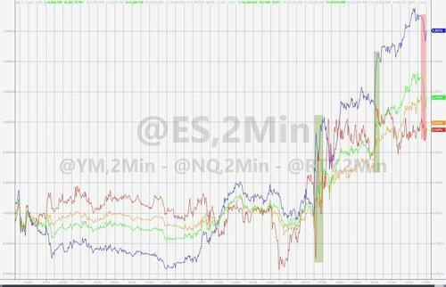
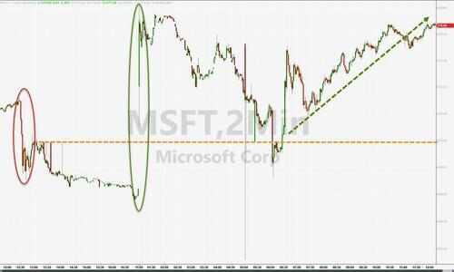
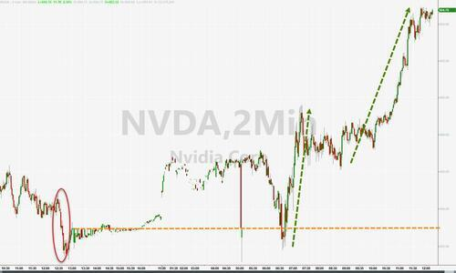
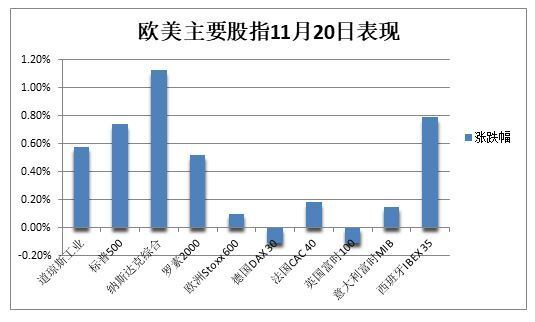
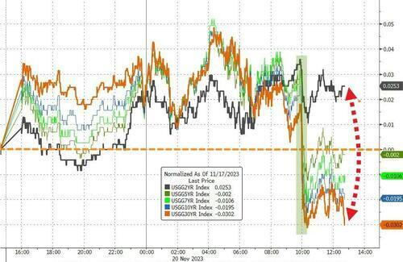
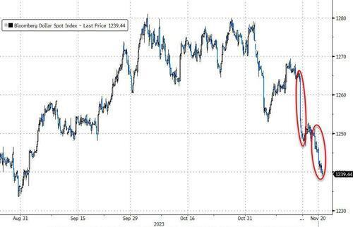
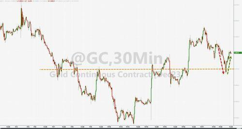

# 美股收盘：纳指涨超1%，微软、英伟达新高，中概指数一度涨4%

市场等待周二的英伟达财报和美联储11月FOMC会议纪要，前者或揭示2024年AI需求趋势，后者可能提供利率路径线索。期货交易员押注美联储最早明年3月开始降息的概率为30%。

周四美股和美债市场将因感恩节假期休市一天，周五均提前收盘。感恩节和“黑色星期五”促销将提供衡量美国消费者支出状况的重要指标。

市场还押注欧洲央行最早明年4月开始降息的可能性高达70%，且明年或降息100个基点。但欧洲央行管委兼西班牙央行行长表示，现在开始谈论降息绝对为时过早。

明年FOMC票委、里士满联储主席巴尔金也称，现在不是给出利率前瞻指引的好时机，“在更长时期内维持更高利率”将取决于美国经济形势的变化。市场一致认为美联储已完成加息。

德国央行预测，由于外部需求减弱和能源价格居高不下，今年四季度“欧洲火车头”德国经济将继续萎缩，但市场参与者对经济景气预期趋于稳定，乐观预计明年初德国有望恢复增长。

道指收涨200点，纳指和纳指100涨超1%，微软、英伟达和纳指科技指数均创新高

11月20日周一，美股三大指数高开高走并集体收于日高附近。午盘时纳指和纳指100涨超1%，道指涨200点并升破3.5万点整数位，罗素小盘股升破1800点。

科技、通信服务和能源板块在标普大盘中涨幅最佳，波音和英特尔作为成分股提振道指。纳斯达克科技市值加权指数（简称纳指科技指数）与微软、英伟达均创盘中历史最高。

**截至收盘，**
道指在七个交易日里第六天上涨，至8月14日以来的三个月最高，标普大盘和纳指均连涨五日，标普创8月1日来最高并脱离技术位盘整，纳指创7月31日来最高，罗素小盘股创9月20日来的两个月最高。纳指100升破1.6万点，创2022年1月以来的近两年新高：

标普500指数收涨33.36点，涨幅0.74%，报4547.38点。道指收涨203.76点，涨幅0.58%，报35151.04点。纳指收涨159.05点，涨幅1.13%，报14284.53点。“恐慌指数”VIX跌至13区间，创9月15日以来的两个月最低。

罗素2000小盘股指数涨0.5%，纳指100涨1.2%，衡量纳指100中科技公司表现的纳斯达克科技市值加权指数（NDXTMC，简称纳指科技指数）涨1.5%，至历史收盘最高。

_道指收涨200点至三个月最高，纳指和纳指100涨超1%_

有分析称，除了对美联储已结束加息的乐观情绪，感恩节假期前交易量清淡也会影响市场走势。11月历来是标普大盘表现最好的月份，目前道指和标普均迈向2022年10月来最佳涨幅。

**明星科技股齐涨。** 元宇宙Meta涨
1.5%，三日连涨至两年最高，亚马逊涨0.7%至19个月最高，微软涨2%至历史收盘最高，苹果涨近1%，五日连涨至三个半月最高，奈飞涨近2%至四个月最高，谷歌A涨0.7%接近三周高位，特斯拉跌1.4%后转涨0.6%，离上周所创的四周高位不远。

_挖角OpenAI CEO之后，微软涨2%至历史收盘最高_

**芯片股普涨，且多只个股创新高。**
费城半导体指数涨1.5%，升破3800点至8月1日以来的三个半月新高。英特尔涨超2%至19个月最高，AMD涨0.8%至五个月最高，英伟达涨超2%创历史收盘最高，博通和科磊KLA
Corporation也创历史新高。

_财报前夕，英伟达涨超2%创历史收盘最高_

**AI概念股尾盘快速下行**
。C3.ai涨超7%后转跌超4%，无缘两个半月新高，SoundHound.ai脱离两个月最高，BigBear.ai涨超8%后仅收涨2%，但Palantir
Technologies涨4%至两年高位。

消息面上，上周五被OpenAI董事会罢免的原首席执行官Sam
Altman将加入微软，领导一个新的高级人工智能研究团队。首席科学家等OpenAI超过九成员工威胁辞职，要求公司重新聘用Altman且董事会下台。不少主流券商看好微软的AI优势因此扩大。C3.ai将裁员。客户关系管理软件龙头赛富时Salesforce邀请OpenAI的研究人员加盟AI团队。

券商伯恩斯坦援引电动汽车增长放缓趋势，重申对特斯拉“减持”评级。媒体称苹果无法实现明年1月推出混合现实头显Vision
Pro的最初目标，现计划明年3月发售。SK海力士据悉正与英伟达联合讨论HBM4“颠覆性”集成方式，通过3D堆叠直接集成在芯片上。

**热门中概强势跑赢美股大盘。** ETF
KWEB涨3.7%，CQQQ涨2.6%，纳斯达克金龙中国指数（HXC）涨3.6%，盘中最高涨4%并一度上破6700点，在七日里第六天上涨至近六周最高。

纳斯达克100成份股中，京东、百度和拼多多均涨约3%。其他个股中，阿里巴巴涨超1%，腾讯ADR涨3%，B站涨超4%。蔚来汽车涨5.6%，小鹏汽车涨8.6%，理想汽车涨3.7%。满帮涨超15%。蔚来联合创始人此前发言安抚投资人称公司“绝无可能”倒闭。小米ADR涨超2%，三季度营收和净利均超预期，单季度盈利创近两年新高。

**银行股指近期因美国经济避免衰退的希望而反弹**
。行业基准费城证交所KBW银行指数（BKX）接近抹去盘初1%的跌幅，徘徊8月14日以来的三个月最高，10月底曾创2020年9月以来的三年最低。KBW纳斯达克地区银行指数（KRX）跌0.2%，仍徘徊9月1日以来高位，5月11日曾创2020年11月来最低。花旗集团涨0.8%后转跌，将裁减300多个经理职位或10%的管理人员。

**其他变动较大的个股包括：**

“疫情红利股”Zoom视频通讯盘后涨7%，三季度营收超预期，上调全年营收指引。除了英伟达之外，周二还有百思买、科尔百货、劳氏公司等零售股财报。

波音涨4.6%至9月初以来的两个月最高，德银上调评级至“买入”，理由是波音飞机交付加速的业绩改善趋势可以持续。

巴西矿业巨头淡水河谷涨超3%至七个月最高，美国银行上调评级至“买入”，理由是铁矿石价格上涨将推动自由现金流增加。

美国药企百时美施贵宝跌近4%，创三周最大跌幅和2020年3月以来的三年半新低，合作伙伴2Seventy
Bio跌18%至历史最低，美国食药监局FDA无法在目标日期前批准其早期癌症疗法。

德国药企拜耳的欧股一度跌超19%为史上最大跌幅，因“缺乏疗效”而放弃一项抗凝血药物的大型后期试验，又因在除草剂致癌案中败诉，美国一家法院要求公司向原告们支付15.6亿美元。

此外，Global
X明晟阿根廷ETF涨11%至9月1日以来的两个半月最高，该国能源公司YPF涨40%创2009年来最大涨幅。被称为“阿根廷特朗普”的米莱在总统大选中胜出，其预算削减计划受欢迎，并支持YPF公司私有化、废除央行和国家货币转向美元以遏制高达三位数的通胀。

通胀降温，令投资者继续评估欧央行明年降息前景，欧股中仅德国和英国股指收跌，泛欧Stoxx
600指数收涨0.1%至9月20日来最高，油气板块涨超1%领跑，意大利银行股指跌1.2%。

20年期美债标售稳健令长债收益率转跌，10年期美债收益率徘徊两个月最低

对货币政策更敏感的两年期美债收益率一度升2个基点并上逼4.93%，基本收复上周三以来跌幅。10年期基债收益率则在美股盘中转跌，最深下行3个基点至4.41%，交投9月21日以来低位。

稍早美国财政部拍卖160亿美元20年期国债，得标利率4.780%，脱离一个月前5.245%所创的历史新高，投标倍数2.58基本持平前次的2.59，被称为标售强劲，因此拉低长债收益率。

_10年期美债收益率徘徊两个月最低_

欧债收益率也冲高回落，作为欧元区基准的10年期德债收益率尾盘涨2个基点至2.61%，上周五曾跌至2.55%的两个半月最低，两年期收益率涨6个基点至3%，上周跌穿2.92%至五个月最低。

有分析称，评级机构穆迪上周将意大利的信用评级前景从负面升级至稳定，并将葡萄牙的长期发行人评级上调两档，缩小了欧洲负债较深外围国家国债收益率与德国基债的息差。

油价盘中涨3%，接近收复上周三以来跌幅，美油11月15日以来首次升破78美元

国际油价继续受到OPEC+本周末或宣布深化减产的预期提振。WTI
12月期货收涨1.71美元，涨幅2.25%，报77.60美元/桶。布伦特1月期货收涨1.71美元，涨幅2.12%，报82.32美元/桶。

交投更活跃的美油WTI明年1月期货最高涨2.42美元或涨3.2%，盘中自11月15日来首次升破78美元，布油最高涨2.32美元或涨2.9%，尝试上逼83美元，均接近收复上周三以来跌幅。

_油价盘中涨3%，接近收复上周三以来跌幅_

上周美油曾较9月份触及的一年多最高短暂跌入技术位熊市，布油也在熊市边缘徘徊，尽管上周五油价齐涨4%但均连跌四周，期货结构转入“期货溢价”（contango），暗示短期内供应充足。

欧洲基准的TTF荷兰天然气期货涨1.7%，仍不足50欧元/兆瓦时整数位，但收复上周三以来过半跌幅，脱离一个月低位。ICE英国期货跌约2%，美国天然气一度跌3%接近六周低位。

美元两个半月最低，日元涨1%上逼148，在岸与离岸人民币均升破7.17元至三个多月最高

市场转而关注美联储降息，衡量兑六种主要货币的一篮子美元指数DXY最深跌0.5%，失守103.40至9月1日以来的两个半月最低。上周美元累跌近2%，创7月份以来的最大单周跌幅。

_美元跌穿200日均线技术位至两个多月最低_

欧元兑美元上涨并站稳1.09上方，创8月中旬以来的三个月最高。英镑兑美元升破1.25至9月中旬以来的两个月高位。日元兑美元上逼148关口或涨1%至七周最高。

在岸与离岸人民币均升破7.17元且盘中涨超500点。在岸人民币兑美元收报7.1655，较上一交易日夜盘涨480点，离岸人民币最高涨近580点，至8月初以来的三个半月最高。

证券日报称，人民币对美元汇率收复“7.2”大关，专家称向好的经济基本面是人民币走强基础。上证报称，人民币汇率一日连破五关，短期乐观情绪驱动下，不排除汇率涨至7.1区间。

**主流加密货币涨跌不一。**
市值最大的龙头比特币涨1.5%升破3.75万美元，接近上周所创的去年4月来最高。第二大的以太坊涨超2%重上2000美元，月初曾升破2100美元至七个月高位。

黄金盘中跌幅收窄上逼1980美元，伦铜涨近2%至两个月最高，伦铝涨超1.7%

COMEX 12月黄金期货收跌0.2%，报1980.30美元/盎司。COMEX 12月白银期货收跌1%，报23.614美元/盎司，较盘初跌幅砍半。

美联储纪要发布前，由于美元走低和美国长债收益率转跌，现货黄金在美股盘中跌幅显著收窄并上逼1980美元整数位，上周曾升破1990美元创两周新高，且全周累涨超2%。

_黄金盘中跌幅收窄上逼1980美元_

**美元走软和中国政策带来的需求前景提振，令伦敦工业基本金属齐涨：**

经济风向标“铜博士”涨近2%并升破8400美元，创9月中旬以来的两个月最高。伦铝涨1.7%，收复11月9日以来跌幅。伦锌和伦锡均小幅上涨且脱离一周低位。伦镍上逼1.7万美元，仍徘徊2021年4月以来的两年半低位。仅伦铅跌0.8%，盘中曾升破2300美元至去年5月来最高。

