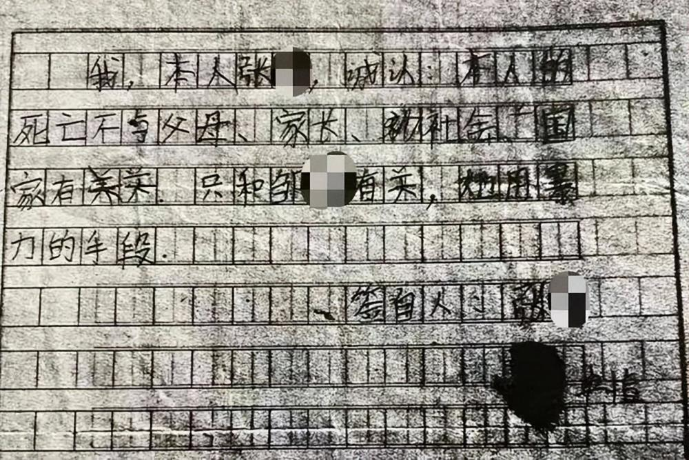

# 11岁男孩留遗书控诉班主任施暴后跳楼身亡，两年后教室监控视频仍缺失

2021年11月9日，11岁的男孩张某放学后从24楼一跃而下。在留下的37字遗书中，他指控班主任邹某存在暴力行为，并称自己的死只和她有关。

事发后，张某父母查看教室当天及前半个月的监控时发现，邹某曾多次对张某进行言语讥讽、辱骂、掐脸。据张某父亲张先生介绍，事发当天，张某被邹某怼了多达8次。张某父母向九江市濂溪区人民法院提起刑事自诉，请求判定邹某犯侮辱罪和虐待被看护人罪，追究其刑事责任。

2023年8月9日上午，该案一审宣判。法院认为，邹某对张某的批评、教育、惩戒发生在正常的教育教学过程中，用语和行为虽有失当之处，但总体上未偏离教育目的。无证据证实被告人邹某对张某实施了自诉人诉称的虐待行为。宣判后，张某父母提起上诉。

11月21日，该案二审在九江市中级人民法院开庭审理。张先生（张某父亲）告诉中国新闻周刊，此次开庭，他们提交了多组新的证据，包括教育局对邹某和其他家长做的笔录材料、公安对邹某及张某同学的调查笔录、张某自己的练习册、作业本等，希望在法庭上证明张某并非邹某所描述的“差生”。

“此次审理的核心，仍是关于邹某行为的评价和认定，是教育惩戒行为，还是刑法上的侮辱行为。”他还提到，教室的监控视频缺失了6个小时，录像内容目前仍然是谜。

二审并未当庭宣判。法官称，后续将安排技术团队，对视频的原始储存卡进行鉴定和数据恢复。

_一审宣判现场。图片来源/濂溪区人民法院_

**11岁少年留下遗书**

对于张先生和妻子汪女士来说，张某的死毫无征兆。张先生在交警部门工作，汪女士则是一名心理咨询师。在他们眼中，张某一直是一个乖巧懂事的孩子。

事发当天下午4点左右，六年级的张某从所住小区的另一栋高楼一跃而下。监控视频显示，回小区时，他并未走离自家最近的大门，而是绕行了另一处门。

事发第三天，张先生夫妻从警方处得知儿子身上留有遗书。遗书写在作业纸上：“我，本人张某，诚（承）认：本人的死亡不与父母、家长、社会、国家有关，只和邹某有关，她用暴力的手段。”落款处签着张某的名字并印有手指印。

_张某留下的遗书（复印件）_

夫妻二人悲愤交加，他们通过刑事自诉，以侮辱罪、虐待被看护人罪将邹某告上法庭。

教室里的监控视频成为关键。事发后，他们多次要求查看监控视频，起初被告知视频声音无法恢复，只有影像资料。后来，张先生自己联系技术人员，完成了对视频的修复。

当天的监控画面终于传出声音，张先生夫妻听到了邹某对张某的大声呵斥，“张某是欠债大王！小册小册不过关！试卷试卷不过关！作文作文还欠债！”“我做梦都没想到张某是我们班的骗子，言而无信”。此外，邹某还称张某是“吃纸贼”，并嘲笑其寒酸，用书本拍张某的头。“一天被怼了8次”，张先生认为，这样公开的辱骂让张某最终不堪重负。

此后，夫妻二人看到了张某出事前15天内的监控视频。据张先生介绍，邹某多次把张某作为“负面案例”，对其言语讥讽、辱骂、掐脸，此外还有肢体接触、罚站等。

2022年7月，九江市教育局通报了对邹某的处理意见。通报指出邹某存在“违规收受服务对象红包礼金，接受服务对象宴请和接受庐山住宿安排等问题”、“多次对多名学生有讥讽、歧视行为等违反师德师风的问题”，给予邹某党内严重警告处分、降低两个岗位等级处分和调离教学岗位处理。

张先生称，在被处分后，邹某仍留在了学校，被调离至图书馆工作。

**一审法院作出无罪判决**

2023年4月29日，九江市濂溪区人民法院一审开庭审理此案。张先生称，他们提交了多项证据，包括班上学生、老师的证词、教室的监控视频等。

张先生认为，庭审中，邹某一直在为自己辩护，“比如说我儿子不交作业、疯狂地咬纸吃”。中国新闻周刊获悉，邹某否认有打骂张某的行为，认为自己“一视同仁”，系“幽默式教学”。

今年8月，法院宣判邹某无罪。据通报，法院经审理查明，被告人邹某系张某班主任、语文老师，事发前，张某多次未按规定的时间、形式、质量完成作业任务，且存在多次请假现象。

根据教室监控视频显示，2021年10月26日至11月9日期间，被告人邹某在教学过程中，对张某使用了“脑子笨死”“欠债大王”“言而无信”“咬本子吃”“常用的惯例”等言语批评，还实施了一次用书本拍头颈部、一次半小时左右的罚站、一次换座位、课后到讲台站着读课文等行为。

法院经审理认为，被告人邹某的行为是否构成侮辱罪中的侮辱行为，需要准确区分侮辱行为与教育惩戒行为。被告人邹某的行为是否超过相关教育法律法规规定的教育惩戒的合理限度，构成侮辱罪中贬损他人人格、破坏他人名誉的侮辱行为，要综合考量其目的的正当性、手段的合法性和程度的相当性。

经审查现有证据，被告人邹某对张某的批评、教育、惩戒发生在正常的教育教学过程中，用语和行为虽有失当之处，但总体上未偏离教育目的，旨在促使张某更好地完成学习任务，并引以为戒、认识和改正错误；所采用的教育、惩戒措施总体上未违反中华人民共和国教育部颁布的《中小学教育惩戒规则（试行）》的规定，且在程度上基本与张某的行为相适应；在张某同班同学的基本认知里，没有造成张某人格贬损、名誉破坏的不良影响。法院认为，被告人邹某的行为不符合侮辱罪的构成要件，不构成侮辱罪。

法院还表示，经审理查明无证据证实被告人邹某对张某实施了自诉人诉称的虐待行为。自诉人指控被告人邹某对其他同学实施的虐待行为现无其他证据印证，且超出其自诉指控的范围，不属于本案的审理范围。故依法判决被告人邹某无罪。

法院认为，被告人邹某的批评、教育、惩戒的用语和行为不符合师德师风建设的有关要求，对学生的心理情绪亦失于关心关爱，未及时加强对学生的帮扶和与家长的沟通。教育主管部门已对其违反师德师风的行为给予相应的党纪政务处分。

对于本案张某的自杀，法院深感痛心和惋惜，呼吁全社会更加关心重视未成年人的教育问题。学校、教师应当讲究教育的方式、方法，更加重视家校协作，积极与家长沟通，争取家长对实施批评、教育、惩戒等措施的理解、支持和配合；家长应当配合学校、教师对学生进行教育，共同促进未成年人的健康成长。

一审宣判后，自诉人当庭表示上诉，被告人邹某表示服判不上诉。

**“惩戒应是善意的”**

11月21日，该案二审在九江市中级人民法院开庭审理。张先生向中国新闻周刊表示，他们当庭进行举证，希望说明孩子遵守纪律，按时完成作业，按要求完成作业的事实。

北京中闻（西安）律师事务所律师谭敏涛向中国新闻周刊分析称，从侮辱罪的定义来看，此罪是指使用暴力或者以其他方法，公然贬损他人人格，破坏他人名誉，情节严重的行为。在他看来，学生遗书的指向，能够证实老师的批评是其走向自杀的主要因素，但老师的言语不当是否构成侮辱罪，仍然需要结合老师的语言和行为本身，即便老师可能是出于某些原因区别对待学生。

谭敏涛介绍，虐待被看护人罪的虐待要求，要远远高于侮辱的标准，在无法证实达到侮辱的标准时，一般也很难达到虐待的标准，“通常，虐待被监护、看护人罪属于公诉案件，而家属直接提起刑事自诉，很可能是当地公安机关认为不构成刑事案件标准，不予刑事立案。”刑事自诉不成立，并不妨碍家属对教师以及学校提起民事起诉，要求涉案教师和学校给予民事赔偿。

一些法律人士认为，相对而言，涉事教师的行为是否构成侮辱罪，在本案中争议更大，也是庭审辩论的重心。事实上，类似的自诉案件并不常见。张先生向中国新闻周刊提及2003年重庆市一名15岁女学生跳楼自杀的案件。该女生遗书中控诉，班主任称其“连坐台都没资格”。当时，有媒体称该案系重庆首起学生因为反抗教师粗暴教育而在校跳楼自杀的事件。最终，涉事班主任被认定犯侮辱罪。

“邹某的行为已经超出了教育惩戒的范围”，张先生表示，首先，惩戒应是理性的、尊重的、善意的，有正当目的。而侮辱和打骂则是随意的、情绪化的，根据个人喜好情绪化的一种发泄的方式，并且是无度的，有时候甚至是恶意的。

据张先生讲述，他并没有从邹某对张某说出的话里，感受到一种该对孩子表达的爱。

“这么多孩子当中，只有张某出了这样的事，并不能说明这种事是小概率事件”，张先生称，他们在法庭上明确阐述了观点，即张某自杀的后果，与邹某的伤害、侮辱行为有时间、空间和因果的紧密联系。

事发后，张先生辞去干了15年的工作，于今年3月入职上海一家律师事务所，自己代理张某的案子。汪女士则仍然从事心理咨询师的工作。

作者：陈威敬

