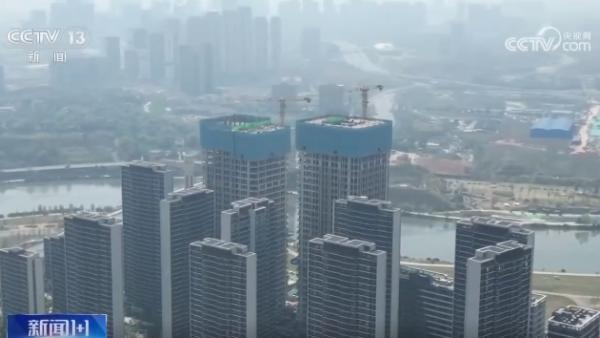

# “保交楼”面临哪些难点？金融机构如何满足房企融资需求？专家解读

近期，加快落实“保交楼”工作不断被提及。人民银行等三部门联合召开金融机构座谈会，强调各金融机构要一视同仁满足不同所有制房地产企业合理融资需求，加大保交楼金融支持。在各个地方，也强调要加快保交楼的进度。“保交楼”工作已经持续了一年多，为何在此时，要更进一步推动金融支持保交楼工作？接下来政策的发力点又是什么？《新闻1+1》邀请清华大学五道口金融学院研究员、长江证券首席经济学家伍戈，共同关注：“保交楼”：房企底线，百姓民生！

**新一轮“保交楼”工作在推进**

近期，湖南株洲、重庆等很多地方，正在以更强力度推进实现“保交楼”的相关工作。除了各地在保交楼工作上的发力，国家层面也在进一步出台相关措施。人民银行等三部门，就联合召开金融机构座谈会，会议强调，各金融机构要一视同仁满足不同所有制房地产企业合理融资需求，对正常经营的房地产企业不惜贷、抽贷、断贷。

**“保交楼”，当前面临的挑战和难点？**

**清华大学五道口金融学院研究员、长江证券首席经济学家 伍戈：**
最核心的原因在于“保交楼”的工作，确实遇到了难点。比如从开发商的角度而言，今年销售回款的力度比预期要弱。对于保交楼的主体而言，如果销售回款没有想象中恢复得迅速，会对过去欠下的一些债务，包括上下游的工程款，也包括对“保交楼”的资金形成一定掣肘。因此会造成目前的一些挑战。从需求端来说，老百姓在疫情之后，资产负债表确实在修复，但修复需要一个过程。另一方面，由于前期客观上讲，作为微观的供房的主体开发商而言，由于高债务、高周转模式积累的债务的量，比我们想象中可能要大，特别是随着时间线的拉长，很多债务还是要还本付息的。总之，从目前来看，“保交楼”还是取得了积极进展，但是在一些局部的领域还是有压力，压力可能更多还是现金流的问题。如果现金流的问题能够很好解决的话，它的资产或者负债还是可以维系下去。

**金融支持保交楼，如何让金融机构做到一视同仁满足不同所有制房企的合理融资需求？**

**清华大学五道口金融学院研究员、长江证券首席经济学家 伍戈：**
首先在于商业银行，特别是以国有为主导的商业银行。按照国家战略要求，应该承担更多义务和责任，能够主动有所担当。从技术层面，包括主管部门召开的会议，也提出了一些技术性手段。比如“三个不低于”，不管是哪个所有制的房企，最终信贷支持的力度节奏，甚至是增速都要保持一视同仁。从我们过去很多年的实践而言，民企也好或者其他所有制企业也好，他们各自背后的担保力量是不完全一样的，不仅在房地产领域。这一次直接提出对不同所有制的企业一视同仁，信号意义可能会大于实质意义。也就是说除了这次之外，我们期待可能还会在其他领域，或者是在房地产政策进一步推进过程中，还会有更多更加公平或者更加有效果的一些政策。

**保交楼，在如何发力？**

2022年7月，中央政治局会议首提“保交楼”政策，2022年12月，中央经济工作会议再次指出，要扎实做好“保交楼、保民生、保稳定”等各项工作。中国人民银行的数据显示，2022年，中国人民银行一共推出3500亿元的保交楼专项借款，设立了2000亿元保交楼贷款支持计划。相关部门为解决“保交楼”问题，还采取了哪些措施？

**促进“保交楼”工作，金融方面还需要哪些发力点？**

**清华大学五道口金融学院研究员、长江证券首席经济学家 伍戈：**
对于中国金融或融资而言，最主导的应该是以商业银行为主的间接融资体系。所以首当其冲的应该是商业银行，特别是当整个房地产市场出现了一些市场失灵时，政策或者政府的主动介入，进一步稳定市场，这变得尤为关键。除此之外，2022年也开始动用，但剂量还不是非常大的一些政策，包括“第二支箭债务融资”以及“第三支箭”股权融资，我觉得随着房地产形势的不断变化，未来都可能会适时强化。

来源：央视新闻

