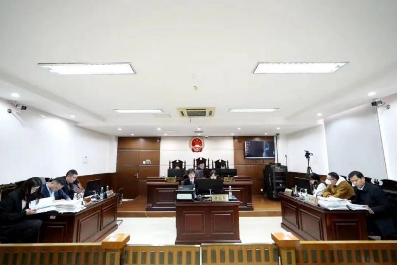

# “男孩跳楼案”二审：曾留遗书称遭班主任施暴 涉事教师一审被判无罪

据九江市中级人民法院消息，2023年11月21日，江西省九江市中级人民法院依法公开开庭审理上诉人张某某、汪某某诉原审被告人邹某侮辱、虐待被看护人上诉一案。

张某某、汪某某诉邹某侮辱、虐待被看护人案，九江市濂溪区人民法院经一审审理，于2023年8月作出判决，宣告邹某无罪。宣判后，张某某、汪某某不服，向九江市中级人民法院提出上诉。

在二审审理中，九江市中级人民法院依法保障上诉人及原审被告人的诉讼权利，就双方有争议事实、证据充分听取了控辩双方的意见。部分人大代表、政协委员旁听了庭审。该案将择期宣判。

此前的一审中，法院查明，2021年11月9日16时左右，张某（自诉人之子）在学校对面一小区坠楼身亡，公安机关接报警到达现场，发现张某身上有遗书一份，内容为“我，本人张某，诚（承）认：本人的死亡不与父母、家长、社会、国家有关，只和邹某有关，她用暴力的手段。签自（字）人：张某”，落款下有红色指印，旁边注明中指。2021年12月3日，公安机关经调查，认为没有违法事实，决定终止调查。张某父母遂向九江市濂溪区人民法院提起刑事自诉，请求法院以侮辱罪、虐待被看护人罪追究被告人邹某刑事责任。

根据刑事诉讼法规定，自诉案件中被告人有罪的举证责任由自诉人承担。本案审理中，自诉人四次向法院申请调取证据，法院均予以准许，并依法调取了相关书证、证人证言、视听资料等证据。

法院经审理查明，被告人邹某系张某班主任、语文老师，事发前，张某多次未按规定的时间、形式、质量完成作业任务，且存在多次请假现象。根据教室监控视频显示，2021年10月26日至11月9日期间，被告人邹某在教学过程中，因张某未按规定的时间、形式、质量完成作业任务，未正确回答问题等原因，使用了“脑子笨死”“欠债大王”“言而无信”“咬本子吃”“常用的惯例”等言语批评，还实施了一次用书本拍头颈部、一次半小时左右的罚站、一次换座位、课后到讲台站着读课文等行为。

法院经审理认为，被告人邹某的行为是否构成侮辱罪中的侮辱行为，需要准确区分侮辱行为与教育惩戒行为。被告人邹某的行为是否超过相关教育法律法规规定的教育惩戒的合理限度，构成侮辱罪中贬损他人人格、破坏他人名誉的侮辱行为，要综合考量其目的的正当性、手段的合法性和程度的相当性。经审查现有证据，被告人邹某对张某的批评、教育、惩戒发生在正常的教育教学过程中，用语和行为虽有失当之处，但总体上未偏离教育目的，旨在促使张某更好地完成学习任务，并引以为戒、认识和改正错误；所采用的教育、惩戒措施总体上未违反中华人民共和国教育部颁布的《中小学教育惩戒规则（试行）》的规定，且在程度上基本与张某的行为相适应；在张某同班同学的基本认知里，没有造成张某人格贬损、名誉破坏的不良影响。法院认为，被告人邹某的行为不符合侮辱罪的构成要件，不构成侮辱罪。关于自诉人指控被告人构成虐待被看护人罪，经审理查明无证据证实被告人邹某对张某实施了自诉人诉称的虐待行为。自诉人指控被告人邹某对其他同学实施的虐待行为现无其他证据印证，且超出其自诉指控的范围，不属于本案的审理范围。故依法判决被告人邹某无罪。

但是，被告人邹某的批评、教育、惩戒的用语和行为不符合师德师风建设的有关要求，对学生的心理情绪亦失于关心关爱，未及时加强对学生的帮扶和与家长的沟通。教育主管部门已对其违反师德师风的行为给予相应的党纪政务处分。

对于本案张某的自杀，法院深感痛心和惋惜，呼吁全社会更加关心重视未成年人的教育问题。学校、教师应当讲究教育的方式、方法，更加重视家校协作，积极与家长沟通，争取家长对实施批评、教育、惩戒等措施的理解、支持和配合；家长应当配合学校、教师对学生进行教育，共同促进未成年人的健康成长。

一审宣判后，自诉人张某某、汪某某当庭表示上诉，被告人邹某表示服判不上诉。部分人大代表、政协委员及相关单位人员、媒体记者和群众等旁听了宣判。

文/北京青年报记者 李铁柱

编辑/朱葳

