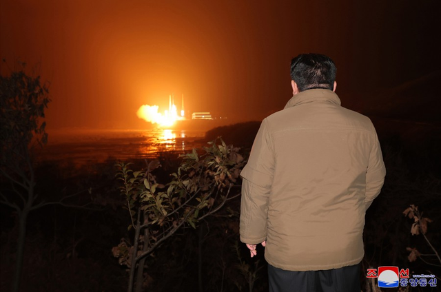
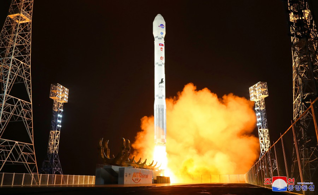

# 两次失败后，朝鲜这次卫星发射为何成功了？

经历两次试射失败之后，朝鲜11月22日宣布，侦察卫星“万里镜-1”号试射成功。这也是2016年以来，朝鲜首次成功发射卫星。

朝鲜中央通讯社22日上午发布报道称，朝鲜国家航空航天技术总局于11月21日22时42分28秒，在平安北道的西海卫星发射场使用“千里马-1”型新型运载火箭，成功将“万里镜-1”号发射升空。发射后705秒，即22时54分13秒，“万里镜-1”号顺利进入轨道。

22日中午，朝鲜中央电视台改变每天下午开始新闻播报的惯例，提早发布了关于卫星试射成功的消息。据朝鲜媒体报道，朝鲜最高领导人金正恩在现场观摩了卫星发射，并和参与发射的人员合影。

_金正恩现场观摩了侦察卫星发射 供图/朝中社_

不过，常陪同金正恩观摩洲际弹道导弹发射的妻子、女儿，此次并未出现在朝鲜媒体发布的影像中。朝鲜媒体文字报道亦只提及分管军工及航天工作的高级干部金正植、张昌河陪同。

另一个细节是：这一次，朝鲜媒体仅将“万里镜-1”号称为“侦察卫星”。今年5月、8月，朝鲜两次在西海卫星发射场试射“万里镜-1”号失败。朝鲜媒体两次都发布了报道，将“万里镜-1”号称为“军事侦察卫星”。

**为何“提前发射”？**

韩联社报道称，朝鲜21日向日本通报称，将于11月22日至下月1日之间的窗口期发射卫星，“但当晚提前发射”。

11月21日，既不临近朝鲜重要节庆日，也不接近重要会议会期。朝鲜为何选择这个日子，第三次试射侦察卫星？一些分析认为，卫星发射需要特定窗口期，而朝鲜的重大节日集中在10月及之前；11月28日的“导弹工业节”等节日，“重要性尚不足以用发射卫星来祝贺”。

 _卫星发射现场 供图/朝中社_

值得注意的是，卫星发射当天，朝鲜国家航空航天技术总局研究员李成进在朝中社发表了一篇题为“旨在先发制人打击的太空军事化活动无论如何也绝不能正当化”的评论文章。该评论针对的事件是：韩国国防部近日表示，计划于11月30日在美国加州范登堡军事基地发射韩国第一颗军事侦察卫星。

今年5月31日朝鲜首次发射“万里镜-1”号失败后，韩国国情院就曾宣称，韩国于5月25日成功发射自研火箭“世界号”，或许“刺激到朝鲜”，让他们缩短了卫星发射准备周期。

近年来，朝韩双方都在大力发展侦察卫星，试图在军事侦察领域形成军事优势。前述署名李成进的评论文章明确指出，在现代战争中，“侦察情报战是准备战争的首要程序，也是决定战争胜败的先决条件”。

按照韩国军方的计划，从今年11月到2025年，韩国将由美国太空探索技术公司（Space
X）帮助发射至少5颗军事侦察卫星，形成对朝鲜军事活动的纵深侦察能力。韩国自主研发的固体火箭助推器也准备在今年之内进行发射。

此外，根据美日韩三国领导人此前达成的协议，从今年12月开始，美日韩将共享朝鲜导弹发射等军事情报。日本军方亦将于2024年开始在五年内发射4颗军事侦察卫星。李成进评论称，这意味着“把傀儡加入美国的预警卫星系统”。

李成进写道，美国“勾结走狗，在地区加快完善卫星监视体系的目的在于加强对地区国家的情报搜集能力，提高反导系统的有效性和可靠性”，目的是占据对朝鲜的“战略优势”，这一情况“迫使我国进一步加快军事侦察卫星开发等自卫的外空开发工作”。

_卫星发射现场 供图/朝中社_

**为何“突然成功”？**

本次试射成功前，“万里镜-1”号已经经历了两次发射失败和一次发射延迟。

今年5月31日，“万里镜-1”号首次试射，搭载卫星的“千里马-1”型运载火箭在一级分离后，二级箭体点火失败，坠入西海海域。8月24日，“万里镜-1”号第二次试射，问题还是出在“千里马-1”型运载火箭：一级、二级火箭正常运行，但第三级火箭在飞行途中因故障爆炸，发射再次失败。

今年10月，朝鲜向日本预告了第三次试射周期，但直到发射窗口期结束也没有进行试射。11月初，韩国国防部长官申源湜接受媒体采访时曾表示，韩方认为朝鲜第三次试射推迟，主要还是在解决第三级火箭的问题。朝中社早些时候的报道指，“千里马-1”型火箭的问题主要是新型发动机系统可靠性和稳定性较差，以及所用推进剂的燃烧不稳定。

自1998年以来，朝鲜共九次进行卫星及卫星运载火箭发射试验，算上这一次共三次将卫星送入轨道。今年9月，在两次试射“万里镜-1号”失败后，朝鲜重组国家宇宙开发局为“国家航空航天技术总局”，将主管卫星研发、试射的机构上升到和导弹总局及军兵种相同的地位。朝鲜军事科学院院长张昌河出任国家航空航天技术总局首任局长。

此前，张昌河是朝鲜洲际弹道导弹研发工作的主要负责人之一。最近两年，朝鲜洲际弹道导弹研发取得明显进展，不仅“火星炮-17”型导弹被韩美军方评估为“确已形成战斗力”，固体燃料火箭、新型导弹发射车的成功研发，也增强了朝鲜核力量的生存能力。卫星运载火箭和洲际弹道导弹使用的火箭虽然在关键技术特性上有所不同，但技术、部件、操作都有一定的共通性。

不过，韩国政府认为，朝鲜在短期内解决了“千里马-1”型运载火箭的技术难题，并不是张昌河及朝鲜科学家们的功劳。韩国防长申源湜称，他认为俄罗斯“向朝鲜提供了诸多相关技术”，而朝鲜10月推迟试射卫星，就是为了等待相关技术指导到位。韩国统一部长官金暎浩本月也表达了相同的观点。

今年9月，金正恩对俄罗斯进行历史性访问，和俄总统普京在俄罗斯东方卫星发射场见面并举行会晤。俄罗斯媒体报道称，金正恩对卫星及运载火箭相关技术“尤其感兴趣”，普京也承诺将在太空技术上帮助朝鲜。

不过，根据俄罗斯方面的消息，目前双方尚未就航天技术合作的具体问题达成协议，深度合作尚未展开。

可以确定的是，本次卫星试射成功，只是朝韩双方密集发射侦察卫星的开端。今年4月18日，金正恩提出，朝鲜要在五年内“把大量侦察卫星”多角布置在太阳同步近地轨道上，形成自己的卫星情报网。

根据朝中社报道，在“万里镜-1”号试射成功后，国家航空航天技术总局第一时间提出了新计划：在短期内追加发射几颗侦察卫星，“继续确保对南朝鲜地区和共和国武装力量作战关注地区的侦察能力”。该计划将提请劳动党八届九中全会审议。

同时，正在英国访问的韩国总统尹锡悦21日召开国家安全保障会议常任委员会会议，决定暂停履行朝韩领导人2018年签署的《九一九韩朝军事协议》部分条款，恢复在韩朝边境一带的对朝监侦活动。

记者：曹然

