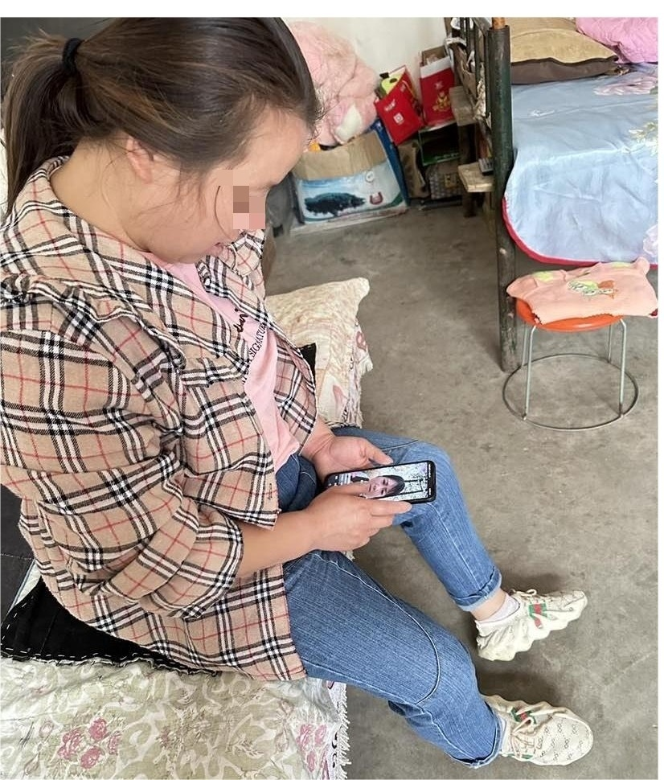
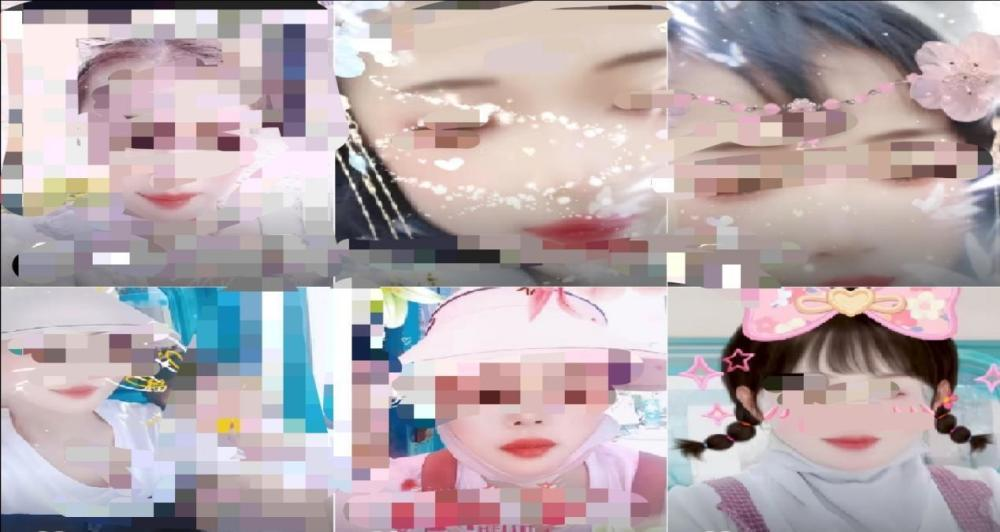
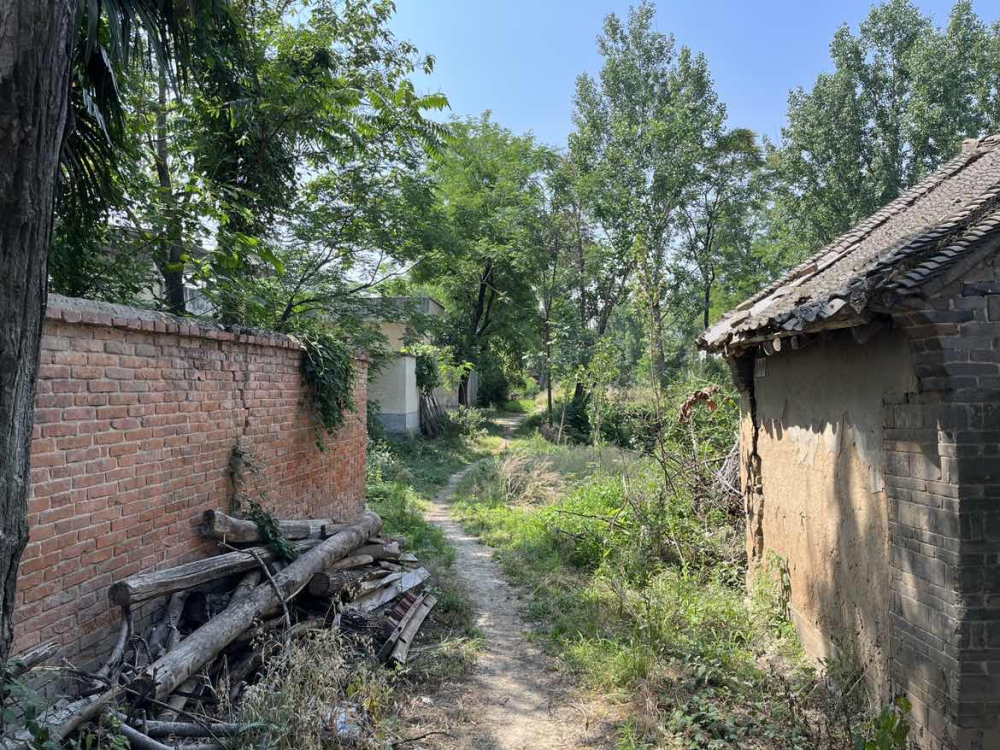

# 农村女性“沉迷”短视频，追求中年浪漫，丈夫想不通520为啥要送花

**核心要点：**

  * _1_ 农村男性更热衷赌博、钓鱼、养狗，女性则最爱玩短视频。男人辛苦赚钱养家的价值得到充分肯定，女性在家操持家务的贡献则被轻看。农村女性通过短视频可以让自己的价值“被看见”。
  * _2_ 54岁的刘大妈拥有5000粉丝，曾为某商家带过货。刘大妈很快发现，带货需要在线进行产品介绍，需要调动粉丝的购买欲望，并不是件容易的事。刘大妈忙活了三个月，只卖了2件产品，销售额为150元。
  * _3_ 乡村女性开始注重七夕、情人节、520，兴起了一股“中年浪漫”风潮。这些浪漫话语通过短视频进入中年女性头脑。在情感表达上，她们变得更为主动、热烈。乡村女性的中年浪漫，引发了丈夫的不适。
  * _4_ 村里中年男性认为，“那都是娘娘唧唧的人才拍的，拿着自己的手机照着自己的脸盘子，你想说啥，咱也看不出来，真没有意思。”他们自己不拍短视频，但是也不干涉妻子。家里的婆婆要么和儿媳妇一起玩短视频，要么因没有账号被“数字鸿沟”隔离在外。

当农村女性遭遇短视频，会发生什么？

李丹和他的团队长期在农村开展田野调查。2023年上半年，他和几个学生穿梭在华北平原的溪村，村民们沉迷刷快手短视频的景象，不可阻挡地抓住了他们的眼球：在黄河滩边的偏僻村庄中，75岁以下的留守妇女几乎人人刷快手、玩自拍。

这个景象也让李丹展开了如下追问：乡村女性为何如此热烈地拥抱短视频？短视频以何种方式和力度塑造了乡村女性的精神世界？短视频给乡村治理带来了何种影响？

以下是李丹的讲述。

**讲述人：李丹丨南阳师范学院讲师、中国法治现代化研究院特邀研究员**

**乡村女性为何“沉迷”短视频？**

54岁的刘大妈让我印象深刻。

刘大妈是村里玩快手风潮的引领者，拥有5000粉丝、获赞10万，是名副其实的“快手女王”。但是，村里多数人并不确知她的大名，只是称其为“郑权家的”“小皮皮奶奶”。一个嫁入村庄32年并在村开办幼儿园十多年的村庄网络大V，竟然是一个附属于丈夫、孩子的“无名者”！

 _溪村女性刷短视频_

玩短视频是农村女性的普遍现象。

一方面，农村男性玩短视频的数量明显低于女性。农村男性更热衷赌博、钓鱼、养狗，女性则是最爱玩短视频。

另一方面，农村男性只是观看短视频，女性则热衷自己拍摄短视频。少数农村女性不那么“沉迷”短视频，主要是她们比较忙。这些人会抱着一种羡慕的眼光看待那些玩短视频的女性，觉得她们生活闲适、时髦新潮。

我将乡村女性玩短视频行为概括为三个方面。

其一，零成本变美。短视频平台提供了在线“化妆盒”“衣帽间”，使得乡村女性可以零支出体验美颜、美妆、美体、滤镜。

其二，日常化出镜。尽管她们酷爱滤镜美颜，但是只是线上玩玩，并没有为自拍专门去购买化妆品和首饰。

其三，低频率更新。中年女性发现，控制短视频更新频率很重要，否则就会被视为“游手好闲”“不务正业”。目前，溪村最活跃的13位中年女性，她们基本上每周只发一条短视频。

在这个全民刷屏的时代，乡村娘子军是一支庞大的队伍。乡村女性“沉迷”短视频是一种消磨闲暇时光的途径。一旦闲下来，女性就可能更关注自身的情感体验，也更容易觉得空虚无聊。现在农村日益空心化，乡村文化生活不断萎缩。电视中上演的宫斗剧、都市情感剧与农村生活场景不搭界，少部分乡村题材剧则远离农村女性的个人生活体验。广播、电影、电视这些媒介都是精英进行文化生产和表达的载体。面对影视作品，农民只是被动的信息接收者、屏幕前的被教化者。短视频平台为草根创作提供了零成本、低技术门槛的表达渠道。借助短视频平台，农村女性既可以看到最贴近生活体验的农村实况，也可以依自己心意创作短视频作品。

更深次的原因是，农村女性长期处于乡村的边缘地带。短视频下乡给农村女性提供了历史性的出场机会。

长期以来，在男权主导的乡村家庭文化中，女性被定义为“相夫教子”的家庭配角。按照“男主外女主内”的家庭分工，男人辛苦赚钱养家的价值得到充分肯定，女性在家操持家务的贡献则被轻看。一直在为承认而奋斗的农村女性，她们通过短视频平台可以使自己的日常生活和人生价值“被看见”。

**不仅刷，还会拍，有的还带货**

乡村女性的短视频创作主题可分为两类。

一类是乡村女性的个性化表达。乡村女性通过创作短视频，或是在线诉说生活的不易，或是展示自己贤惠能干、有才艺，或是利用短视频平台工具秒变“肤白、长腿、细腰”的减龄美少女。

另一类是乡村女性的生活分享型呈现。以分享生活为主题的视频中，有97%的场景是田野、工地、小作坊等劳动生产场所，3%的场景是生日聚会、节日聚餐等生活仪式。

_溪村女性的自拍短视频页面截图_

乡村女性玩短视频主要是日常娱乐消遣。乡村女性创作短视频存在赚钱的可能性，但是这件事并不被村民看好。

54岁的刘大妈拥有5000粉丝，曾为某商家带过货。刘大妈很快发现，带货需要在线进行产品介绍，需要调动粉丝的购买欲望，并不是件容易的事。刘大妈忙活了三个月，只卖出去了2件产品，销售额为150元。

乡村存在“网红”，但村民并不追捧“网红”。

21岁的彤彤能歌善舞，经人介绍拜一位网红“娜姐”为师，加入娜姐的直播团队。获得娜姐团队的流量加持后，彤彤靠唱歌、打PK自己开直播，每次直播在3个小时左右，直播间人最多的有8000多人，最少有20个人，3个月内粉丝涨到了4.8万，直播挣得最多的一次是3200元，但人数越来越少，6月份一个月挣了不到1千元。彤彤只好忍痛割爱，关掉直播前往广州打工。在村民看来，连年轻漂亮、有才艺和会经营的彤彤都放弃了，看来靠成为网红赚钱是不靠谱的。

在村民的观念中，“网红”意味着“不安分”。村里的“快手女王”刘大妈有5000多粉丝，但却未被村民们当成网红。然而，仅仅拥有1058个粉丝的“雅菊”却被村民们戏称“乡村网红”。在乡村的话语中，“网红”是那些没有工作、想靠脸蛋快速赚钱的人。溪村人历来奉行“勤劳致富”，对于那种博眼球引流量的赚钱方式不以为然，视之为“瞎搞”“胡闹”。

**乡村女性玩短视频，“出镜不出格”**

女性玩短视频存在着显著的城乡差异。

从时间的角度看，城市女性一般都有固定工作，只有在工作之余才有时间玩短视频。农村女性则拥有更多的闲暇时间，可以长时间玩短视频。

从生活需求满足的角度看，城市女性的消遣渠道丰富，可以去逛商场、看电影院、听演唱会等。农村女性则处于空心化的村庄，其物质生活和精神生活均十分匮乏。

从平台工具的角度看，城市女性玩短视频的平台更为多样，包括但不限于抖音、快手、小红书、B站、微信视频号、微博等。农村女性玩短视频的主要平台是快手。

_空心化的溪村一角_

在广土众民的中国，区域差异十分明显。按照我们团队在全国各地的调研情况来看，乡村女性在短视频平台中的展演逻辑差异较大。

实地调研经验表明，在村庄结构性力量强大的华北农村地区，乡村女性的线上展演本分、有序。我们所调研的溪村，就地处华北平原的黄河沿岸。基于对这里的女性新媒介实践行为的观察，我将之概括为“出镜不出格”。

相比之下，在原子化程度很高的地区，乡村女性为博眼球、攒流量而做出低俗、出格举动的新闻频繁见诸报端。

在我看来，乡村女性的线上展演行为，只是露出水面的冰山一角，其根子还是在村庄社会结构。当乡村内部的权威、规范皆萎缩时，乡村女性的线上展演就失去了公共舆论的约束，更有动力按照流量变现的市场逻辑去实现收益最大化。

总体来看，玩短视频的农村女性存在一些共性。

其一，有闲暇。

农村女性玩短视频存在年龄分化。45岁～60岁以下的中年女性是绝对主力。村中很少有年轻女性，她们要么外出打工，要么进县城陪读。对于中年女性来说，儿子娶妻生子之后，自己的主要人生任务已经完成，便可以放缓生活节奏，开始享受生活。

其二，乐于接受新事物。

60岁以上的老年女性，通常识字不多，不会操作智能手机。她们也不太愿意去了解新生事物，更喜欢和同龄人聚在一起聊天、打麻将、听戏剧。中年女性则普遍接受过中学教育，也乐于借助短视频了解村庄外面的讯息。

其三，善于表达。

农村女性不仅喜欢观看短视频，更热衷自己拍摄短视频。对于那些乐观、外向的农村女性来说，不管是干农活、做菜、赶集，还是发呆、生气、哭泣，都构成自拍短视频的理由。

**“中年浪漫”席卷乡村女性**

藉由玩短视频，乡村女性之间的互动频次增多、情感认同提升。在农村生活过的人都清楚，以前村里人之间的互动机会非常多。通过串门、一起看电影、料理红白事、赶集、帮工等，邻里之间关系密切、交往频繁。

现如今，在空心化的村庄中，大家聚在一起的机会少了很多，人际交往稀疏、冷淡。对于玩短视频的农村女性来说，她们呈现出“抱团出镜”的特征。她们互相鼓励带动，交流视频拍摄技术，形成了玩短视频“统一战线”。

通过玩短视频，乡村女性变得有技术素养、变得追求生活浪漫、变得善于表达。对于中年农村女性来说，玩短视频是有技术门槛的。她们普遍文化程度不高，对于电子设备的接触也不多。通过拍摄短视频，她们的媒介技术素养得到很大提升。更为关键的是，借助短视频平台，乡村女性便捷地获得了关于城市和远方的知识信息，拓展了对于美好生活的认知和想象。

近些年来，乡村女性开始注重七夕、情人节、520，兴起了一股“中年浪漫”风潮。这些浪漫话语是通过短视频进入中年女性头脑。在情感表达上，她们变得更为主动、热烈。每逢孩子、父母和老公过生日时，她们会在网络上搬运文案，配上图或视频，在线表达自己的祝福。

_短视频平台上的浪漫表达教程_

乡村女性玩短视频对其家庭关系有双重影响。

一方面，乡村女性玩短视频有助于强化家庭成员的情感互动。

如前所述，通过短视频平台，原本不善言辞的乡村女性，开始变得注重抒发自己的情感。乡村女性不再停留于“心里有数”，也开始“口中有词”。从“心里有爱口难开”到“爱你就要大声说出来”，乡村女性在镜头前展现出“能说会道”的自信从容。作为家庭关系的连接点，乡村女性在情感表达方面前进一小步，能够带动整个家庭的情感互动前进一大步。

另一方面，乡村女性玩短视频也对家庭关系构成了冲击。

婆媳关系是农村短视频中的最热门话题。我印象特别深的是，有好几个50多岁的中年妇女看了一些婆媳冲突的短视频后非常焦虑，她们开始探讨“如何做一个好婆婆”或者准备早点与独子分家单过。

从总体上说，溪村女性“出镜不出格”。但是，还是有个别的越轨事件发生。有位40多岁的女性经常发自拍短视频，引起了邻村一名男性的关注，后来两人在县城宾馆开房被当场抓获。

除此之外，乡村女性的中年浪漫，引发了其丈夫的不适。中年乡村男性不喜欢买礼物、送花，认为这些属于乱花钱、不实惠。他们也不觉得5月20日有什么特别需要庆祝的，想不通这些花里胡哨的节日究竟有啥意思。中年夫妻的非对称性改变，加剧了夫妻之间的不理解和摩擦。

**乡村生活正在发生改变**

在打工经济的持续影响下，空心村的社会交往频次急剧减少。当新媒介进入溪村后，对于村庄内部、村内与村外的人际互动都产生了积极影响。

60岁的刘爱萍平时不发短视频，但会看村里其他女性的快手更新。她表示：“都是一个村嘞，点个赞呗，俺们都互关了。平时不咋说话，咱能跟人家聊啥，见面也就是打个招呼，她们好多人都该叫我嫂子呢。”

2023年夏天的一场雨后，小皮皮奶奶通过快手视频向在外的邻居喊话：“莹莹，过来看看俺家的房子，你看这雨下得多大。”在外的村民看到这条视频后，纷纷评论道：“咱家的雨下的可真大”。当在外村民说出“咱家”时，他们暂时超脱了物理空间的现实阻隔，获得了一种“共同在场”的情感体验。

 _空荡荡的溪村主干道_

玩短视频没给乡村女性带来经济收入，不会直接提升其家庭地位。但是，玩短视频使乡村女性的思想视野、生活观念得到了拓展，有助于提升其参与家庭发展的软实力。

农村女性玩短视频已成为一种日常化的消遣娱乐方式。子女是中年女性玩短视频的“技术顾问”。在2016年，村里的中老年人获得了子女们的淘汰手机。与此同时，村里的年轻人成长为“技术前辈”，他们通过“数字反哺”教会了长辈。

丈夫原则上不反对中年女性玩短视频。溪村中年男性认为，“那都是娘娘唧唧的人才拍的，拿着自己的手机照着自己的脸盘子，你想说啥，咱也看不出来，真没有意思。”他们自己不拍短视频，但是也不干涉妻子。家里的婆婆要么和儿媳妇一起玩短视频，要么因没有账号被“数字鸿沟”隔离在外。

当短视频席卷整个村庄后，村里人通过“互粉互关”，在线发布村里的新闻消息，形成了“线上乡村情报站”。尤其需要强调的是，村民们通过“互粉互关”，老熟人变粉丝，线上和线下的人际圈子基本重合。溪村的公共话语体系漫灌进了线上空间，半熟人社会结构控制了溪村女性的线上自我呈现。

**短视频新媒介重塑乡村治理**

从总体上来看，新媒介正在加速推动乡村社会的现代转型步伐，也为城乡中国背景下的乡村治理带来契机。

首先，新媒介激活公共生活，实现村庄闲暇的公共化再造。

从媒介使用的角度来看，全村人不再聚集村头看电影，而是在家看电视、刷手机，村庄闲暇的满足方式越来越私人化。但是，乡村盛行的开直播聊天，带来的话题控制，提升闲聊内容的公共性。

其次，新媒介延续社区记忆，实现移动社交过程的“地方再造”。

一方面，新媒介促进村庄内部人际互动。另一方面，新媒介勾连起出村者和留守者。在新媒介的联结之下，村民的“自己人”意识实现了线上再生产。

最后，新媒介涵养社会心态，塑造开放包容的公共舆论。

新媒介为村庄提供了更多的信息获取和意见表达渠道，同时也打破了传统的信息传播壁垒。在这一过程中，新媒体促进了更开放、包容和多样化的村庄公共舆论。

**（图片由作者自己拍摄，文中地点和人物均为化名）**

**版权声明：本文系腾讯新闻知识万象独家稿件，未经授权，禁止媒体转载。欢迎个人转发至朋友圈。**

