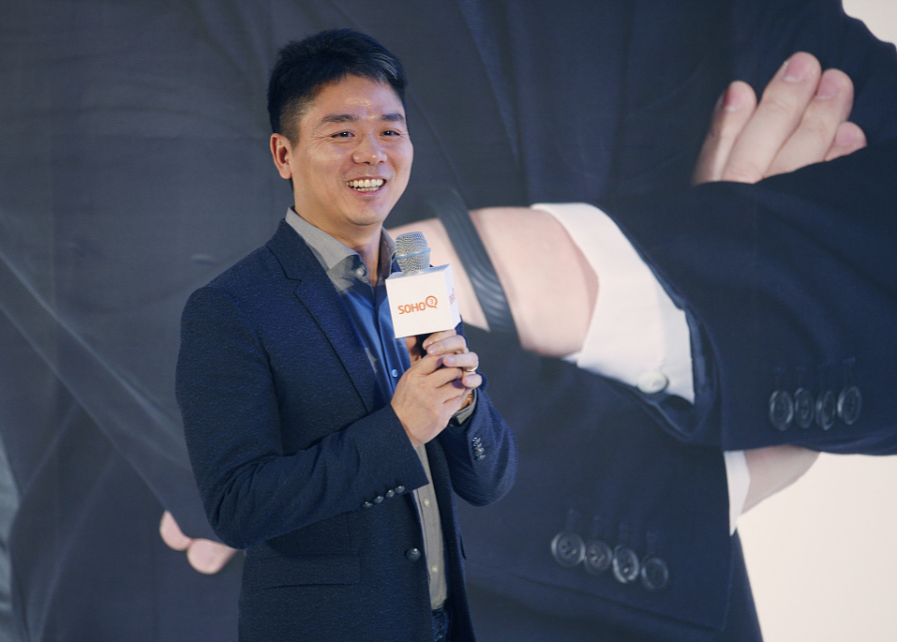

# 刘强东再换帅：不满京东业绩表现，更猛烈价格战要来了

 _来源：视觉中国_

作者|叶蓁

编辑|康晓

出品|深网.腾讯小满工作室

京东零售的掌舵人辛利军易主，给刚刚结束双十一的电商江湖再次投下涟漪。

11月15日晚，京东公布了一则人事任命，辛利军不再担任京东零售CEO职位，该职位由半年前刚刚升任京东集团CEO的许冉兼任，即刻生效。辛利军的去向，公告表示“将在公司另有他任。”也有京东内部人士透露，“京东健康可能是辛利军下一步的归宿。”

京东2023年三季度财报显示：京东增长承压，面临的现实严峻，尤其是京东零售，增长陷入停滞。京东零售贡献了整个集团收入的87%，收入2120.6亿元，同比去年仅微增0.1%。商品收入为1953.04亿元，同比减少0.9%，其中，电子产品与家用电器商品的收入几乎没有增长，日用百货商品收入则为759亿元，同比下降2.3%。

此时换帅，“ **刘强东肯定对业绩并不满意，老刘一直都是业绩导向型，辛利军被换掉跟业务有关系，这个是毋庸置疑的，**
前三季度京东零售业务表现不太好，直接责任人要背锅的。”海豚社创始人李成东对《深网》分析。

**一位京东内部人士则告诉《深网》：这次辛利军卸任京东零售CEO，是去年岁末刘强东归来后，京东架构调整的延续。**

刘强东重归一线后，打出的第一张牌是“低价”。 京东内部人士透露，“低价是京东过去成功最重要的武器，以后也是唯一基础性武器。”

而此前一个月，京东还经历了二级市场的“悲观预期”，多家银行对京东下调评级。10月13日，京东港股跌超11%，创今年以来新低。三季报发布后，
11月15日，京东股价大涨7.04%，每股报收28.59美元，总市值一夜之间增加29.59亿美元（约合人民币214亿元）。

财务出身的许冉将统管京东集团和零售核心业务，她面临的是一个更为复杂的局面——如何将刘强东的战略贯彻下去，使得京东主营业务重回增长轨道。

**“从零售业务能力上来说，徐雷和辛利军的能力肯定在许冉之上，这两个人在过往的京东的岁月中，都是真刀实枪拼杀出来的，他们都不是空降的高管。”有接近京东高层的人士对《深网》表示，“或许刘强东只是缺一个能把他战略执行到位的人，许冉就是那个最合适的人。”**

**京东零售承压 辛利军卸任**

京东发布2023年三季度财报。数据显示，京东总营收达2477亿元，同比增长1.7%；经营利润同比增长6.6%至93亿元；归属于公司普通股股东的净利润为79亿元，去年同期为60亿元。

京东三季度财报中的收入占比中，京东零售贡献了整个集团收入的87%。众所周知，3C产品是京东零售的基本盘。在京东的主阵地3C市场上，增速下滑已是不争的事实。

公开资料显示，2012年10月，辛利军加入京东，历任京东商城开放平台家居家装部总经理、京东商城居家生活事业部总裁、京东商城生活服务事业群总裁。2019年起辛利军担任京东健康CEO。2021年9月起接替徐雷，担任京东零售CEO。

刚刚过去的“双11”，京东媒体开放日，站在舞台上的辛利军，表达了对头部主播的“全网最低价”的不满，表示“京东是全国最大的零售商，能给供应商提供最好的成本，凭什么还有人在我们眼前叫板？全网最低价，除了京东，没人能做到。”

事件的缘起是：10月24日，京东采销工作人员发朋友圈称收到品牌商律师函，他晒出的截图显示：品牌商海氏指控京东私自改价，导致了海氏与其他客户中被动违约，有巨额赔偿的风险。

刘强东去年回归后，京东打出的第一张牌是“低价”。“这次百亿补贴有一个频道的一级入口，商品覆盖全品类，自营和POP（Platform Open
Plan，特指第三方商家）商家都能参与其中。”一位京东内部人士告诉《深网》。此外，1月份，京东调低了商家的入驻门槛。

3月8日，京东百亿补贴上线。据了解，京东“百亿补贴”的项目由辛利军主导。显然，这一项目直接对标拼多多。不仅仅是拼多多，抖快电商这些后起之秀们打造“低价心智”，也在分食老牌电商们蛋糕。

从2018年开始发力百亿补贴以来，拼多多的苹果等数码设备，凭借百亿补贴开始在消费者的心目中站稳了脚跟，而这正是以3C数码见长的京东主战场。京东虽然有跟进但成效不明显。对京东来说，百亿补贴面临的压力是京东的营收增长持续承压。

去年11月23日，京东零售等业务线开启了高层架构调整。公开资料显示：原3C家电事业群负责人闫小兵转任国际业务负责人，原生活服务事业群负责人姚彦中被任命为京东零售3C家电零售事业群负责人，缪钦被任命为京东零售生活服务事业群负责人。

此外，京东零售规模最大的3C家电事业群，被拆分为家电家居事业群和电脑通讯事业群，新的家电家居事业群由原京东零售集团CFO李帅负责，电脑通讯事业群的新负责人为原电脑数码事业部总裁吴双喜。而现在，京东零售的CEO辛利军卸任了。

**京东将如何重回增长**

京东零售的CEO变成了许冉。许冉于2018年7月加入京东，2020年6月升任集团CFO。今年5月，京东集团CEO徐雷宣布退休，许冉接任CEO，直接向刘强东汇报。

**“其实对刘强东来说，更多的是缺一个执行决策的人，把老刘的战略执行到位的这么一个人。”李成东对《深网》分析。“许冉后成为京东集团CEO后，现在又主管了零售的业务，肩上的担子更重了，零售业务还是很复杂的。”**

“你不开车了，把方向盘交给别人，实际上你就放弃了，”刘强东曾告诉《深网》作者。“如果不能控制这家企业，我宁愿把它卖掉”，刘强东也曾直言。

但近几年，种种原因影响，刘强东的管理哲学发生了变化，不再事必躬亲，学会了适度放权。从2019年开始，刘强东淡出一线管理，除了高级别的管理会议。在基层员工的眼中，刘强东越来越像京东的精神领袖。

不过，即使徐雷出任京东CEO后，依旧向刘强东汇报，且京东的方向盘一直在刘强东的手中。

近几年，京东已形成了SEC+SDC的集体决策机制：SEC是由各业务板块、职能体系负责人组成的战略执行委员会；SDC是集团一线业务部门负责人组成的战略决策委员会。一位接近京东高层人士表示，“卸任CEO后，刘强东仍会参与京东每月的SEC和SDC的会议。”

担任京东集团CFO期间，许冉与其团队完成了达达、德邦、中国物流地产等上市公司的并购，京东科技的业务重组，进一步完善京东集团业务的战略布局，推动主导了京东集团香港二次上市，京东健康、京东物流和京东仓储设施的分拆上市。

许冉的专业可以帮助京东将财务效率提升。目前来看，许冉上任CEO后交出的答卷还不错。

京东财报显示：京东归属于普通股股东的净利润为79亿元，同比增长32%。非美国通用会计准则下净利润为人民币106亿元，同比增长6%。第三季度，京东的营业成本增速低于营收增速，研发开支和行政开支分别同比下降了7.8%和5.6%。

费用方面，第三季度，京东的履约开支较上个季度有所扩大，同比增长6.1%至152亿元。由于“6·18”结束，京东大幅缩减了营销开支，80亿元的支出同比增长4.6%。上个季度的营销开支为111亿元。

京东Q3财报电话会上，几乎陷入停滞的京东零售业务的增长也是公众关注的话题。许冉表示，零售业务是京东最核心、收入占比最高的业务，更是京东多元化业务的基础，接下来仍会推进零售以成本效率体验为核心的战略落地，会推动零售与其他业务板块间的协同。

现在电商江湖群雄崛起，刘强东感受到了增长的压力，京东如何重回增长？昔日电商江湖剩者为王的刘强东显然有着更多思考和实战经验。

