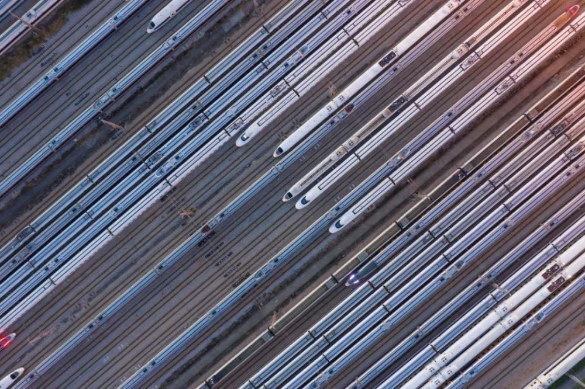
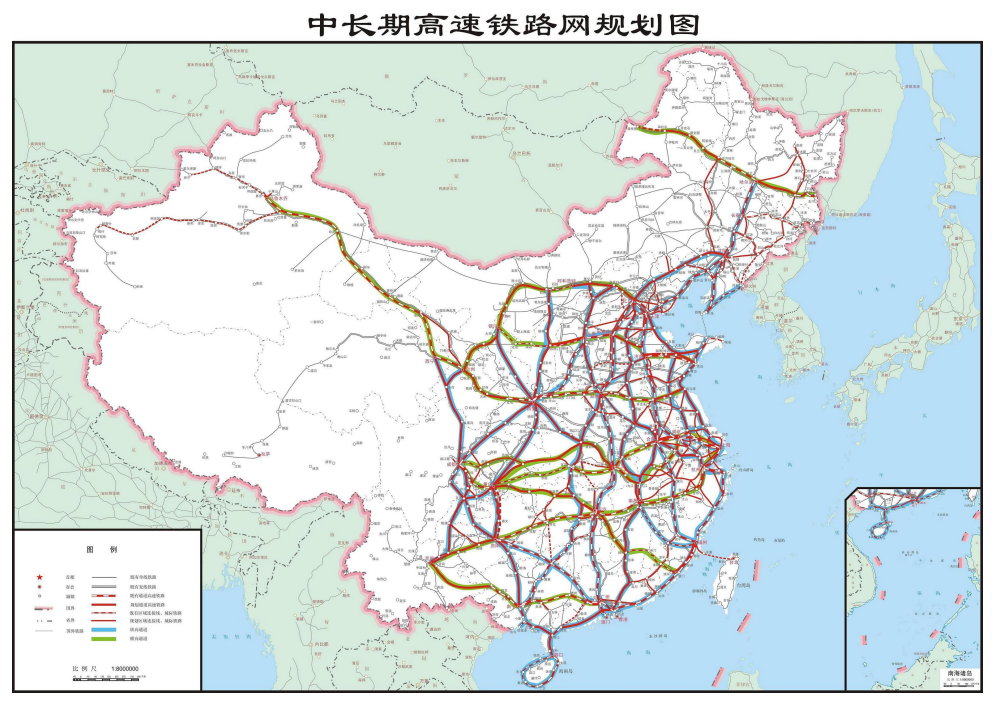

# 包头8小时到海口：世界最长高铁要来了？

近日，陕西省延安至榆林高速铁路开工动员会，在榆林南站举行，陕西经济第二大市榆林由此迈向高铁时代。该项目建成后，西安至榆林的铁路运行时间将由5个小时缩短至2个小时。

更为关键的是，延榆高铁是国家“八纵八横”高铁网中包（银）海通道的重要组成部分。

与此同时，西安至安康高速铁路的建设近日取得新进展，全线首个1公里以上长隧道——秦丰隧道顺利贯通，西康高铁全线重点控制性工程之一——安康隧道出口至明挖段（VI级围岩）掌子面顺利贯通。

西康高铁于2021年6月开工建设，同样是国家高速铁路网规划中包（银）海通道的重要组成部分。该高铁路线起于西安，向南通过安康，然后连接“长江经济带”的核心城市重庆。

根据2016年发布的国家《中长期铁路网规划》，包（银）海通道由包海高速铁路、银西高速铁路以及海南环岛铁路三部分组成。其中，包海高铁起于内蒙古包头市，止于海南海口市，途经延安、西安、重庆、贵阳、南宁等城市。延榆高铁、西康高铁皆为包海高铁的重要组成部分。

根据相关规划和构想，包海高铁全长约2300公里，大部分线路设计时速为350公里。这一长度较目前世界运营里程最长的高铁——京广高铁还要长。京广高铁于2013年12月26日全线贯通，全长2298公里。

这意味着，包海高铁一旦全线贯通，将成为全世界最长的高铁线路。近期，社交网络上也出现“世界最长高铁要来了”的声音。

那么，贯穿中国南北的包海高铁，真的要来了吗？

_高铁列车。图/图虫创意_

**已经有多段开通运营**

事实上，对于这条贯穿南北的高速铁路大通道，沿线省份和诸多城市期待已久。

在京广高铁全线贯通的第二年，2014年12月30日，陕西省发改委会同内蒙古、湖北、湖南、广西、广东、海南省（区）发改委及中铁第一勘察设计院召开了西部高速铁路通道（包头—西安—海口）项目前期座谈会，提出建设包海铁路的构想。

陕西省发改委的消息称，通道建成后，将连接“丝绸之路经济带”新起点西安和“21世纪海上丝绸之路”腹地广西、广东、海南，贯穿长江经济带湖北、湖南，是一条承载国家战略的高铁通道。

这次座谈会后，包海高铁的构想引发外界的高度关注。根据构想，该线路北起内蒙古包头，经内蒙古鄂尔多斯，向南进入陕西省，然后经榆林、延安、铜川引入西安枢纽，出站后穿越秦岭经安康进入重庆，后引线进入湖北恩施，经湖南省张家界、吉首、怀化向南进入广西，经桂林进入广东湛江，跨琼州海峡，引入海南海口。

2015年2月，包海高铁南段张家界—桂林—玉林—海口高铁项目推进会在广西玉林召开，原铁道部经济规划研究院、中铁二院集团与沿线4省（区）11市共同研究张家界—桂林—玉林—海口高铁线路路径和技术方案，提出要进一步增进沟通，形成共识，汇聚力量，共同推动该项目纳入国家“十三五”规划。

也是在这一年，有关规划建设包海高铁的提案，出现在全国两会代表、委员们的案头。

2015年3月，全国两会期间，民革中央提交了《关于将包头至海口快速客运铁路纳入国家“十三五”规划》的提案。该提案建议：将包海高铁通道建设列入国家“十三五”铁路发展规划，并尽快启动项目前期工作；国家发改委牵头研究推进项目建设；在线路走向上应与沿线省（区、市）已有的铁路建设规划相衔接；在设计标准上应“适度超前”。

与此同时，包海高铁沿线的省份，甚至市县都开始行动，希望将这条高铁通道变为现实，不少地方政府甚至将包海高铁写入政府工作报告。比如湛江市在2016年政府工作报告中明确提出，启动包海高铁玉林至湛江段、湛江至河源高铁前期工作。

在2016年3月全国两会上通过的“十三五”规划纲要，将包海高铁通道列入交通建设重点工程，明确提出：“十三五”期间将贯通哈尔滨至北京至香港(澳门)、连云港至乌鲁木齐、上海至昆明、广州至昆明高速铁路通道，建设北京至香港(台北)、呼和浩特至南宁、北京至昆明、包头银川至海口、青岛至银川、兰州(西宁)至广州、北京至兰州、重庆至厦门等高速铁路通道，拓展区域连接线。

这意味着，包海高铁在国家层面被提上了日程。

_中长期高速铁路规划图。图源：《中长期铁路网规划》_

时间来到2016年7月，国家发改委发布《中长期铁路网规划》，明确提出构筑“八纵八横”高速铁路主通道，包（银）海通道被纳入其中，具体路线为：包头—延安—西安—重庆—贵阳—南宁—湛江—海口（三亚）高速铁路，包括银川—西安以及海南环岛铁路。

具体来看，国家发改委公布的包（银）海高铁路线，与此前陕西会同其他七省份的构想有一定差别。该线路以包头起点，南下经延安、西安引入重庆，之后经贵阳、南宁、湛江，跨琼州海峡引入海口。连接了西安、重庆、贵阳、南宁、海口4个省会城市和一个直辖市，联动作用更加明显，出行需求也更加旺盛。

遗憾的是，曾经积极召开包海高铁南段项目推进会，共同推进该项目纳入国家“十三五”规划的广西玉林，以及湖南张家界、吉首、怀化等曾在包海高铁最初构想中的城市，未被纳入国家公布的包（银）海通道路线之中。

中国新闻周刊了解到，截至目前，这条贯通南北的高铁大通道，已经有多段开通运营。其中，渝贵高铁（重庆—贵阳）的开通，将两地通达时间缩短到了3个小时；邕北高铁（南宁—北海）让两地只需1个小时可达；贵南高铁（贵阳—南宁）也于今年8月31日全线开通运营；而海南东西环高铁，已成为环岛旅游出行的重要选择。

此外，鄂榆延高铁（鄂尔多斯—榆林—延安）、西延高铁（西安—延安）、渝西高铁（重庆—西安）也都已分段开工建设。前文提到的延榆高铁，即为鄂榆延高铁的一部分；而西康高铁，则是渝西高铁路线的西安至安康段。

今年7月，鄂尔多斯市发改委在人民网留言板回复网友时说，鄂榆高铁计划与正处于勘测设计阶段的包鄂高铁统筹研究，以便统一优化线路方案，避免衔接工程造成资源浪费。下一步，将积极对接国家和自治区相关部门，加速推动两条高铁线路前期工作，力争助推项目早日落地实施。

至于包海高铁其他区段，目前为止，仍有包鄂高铁（包头—鄂尔多斯）、渝贵高铁（重庆—贵阳）、合湛高铁（合浦—湛江）、湛海高铁（湛江—海口）尚未开工。不过，渝贵高铁可行性研究已通过内部评审；合湛高铁已获国家发改委批复，进入环评公示阶段；湛海高铁已成功纳入国铁集团及广东省的2023年开工建设计划。

国家“十四五”规划提到，构建快速网，基本贯通“八纵八横”高速铁路。也就是说，包海高铁“基本贯通”至少要到“十四五”末期，鉴于目前各段线路的工程进度，全线贯通的时间可能会更久。

**仍面临一系列挑战**

对于这条贯穿中国西部多个省份的高铁通道，沿线省份和社会各界都抱有期待。

长期从事铁路研究的国家发改委综合运输研究所规划研究中心原副主任张江宇曾指出，京广线以西腹地大，但是一直缺乏一条南北大干线。在他看来，京广线以西再建一个南北大干线是必要的，这样可以把很多省会城市通过该线串起来。

《中长期铁路网规划》提到，包（银）海高铁连接西北、西南、华南地区，贯通呼包鄂、宁夏沿黄、关中平原、成渝、黔中、北部湾等城市群。具体来看，贯穿内蒙古、陕西、重庆、贵州、广西、广东和海南7个省份，连接包头、延安、西安、重庆、贵阳、南宁及海口等多座城市。

从地理位置上看，这条线路经直接链接和辐射范围涵盖华北、西北、西南、华南等地区，国土面积占全国近二成，人口占全国三分之一强，GDP总量占全国四分之一以上。

在不少业内人士看来，其建设不仅能够进一步完善我国高速铁路网络，还将增强各大城市群、经济圈之间的互动交流，形成南北经济合作、人员往来、文化交流的通道，促进沿线地区的经济和社会发展。

这一点，从京广高铁全线贯通带来的影响，就能窥见一斑。全线开通接近10年的京广高铁，是我国“八纵八横”高速铁路网纵向主通道之一，纵贯北京、河北、河南、湖北、湖南、广东6个省份，贯穿京津冀协同发展核心区域、中原城市群、长江中游城市群和粤港澳大湾区。

京广高铁的开通，让北京西到石家庄、郑州、武汉的最快通达时间，分别压缩至60分、2小时11分和3小时48分；将原来北京到广州需要的20多个小时缩短到8小时，大大节省了出行时间。

相关数据显示，10年来，京广高铁全线发送旅客超16.9亿人次。高速便捷的出行方式，有效节省了旅客的时间，大大提高经济活动的效率。同时，也带动了沿线各地的新发展，将环渤海经济圈、中原经济区、武汉都市圈、长株潭城市群、珠三角经济区等串联起来，促进了沿线经济社会发展。

不少业内人士认为，未来包海高铁全线通车后，意义不亚于京广高铁的开通。高铁的开通意味着沿线各省份的时空距离被大幅缩短，这不仅让沿线的经济互补发展更为迅速，还将为沿线地区带来产业升级和城市化发展的新机遇。

事实上，已经开通运营的包海高铁多段线路，已经产生了良好的“化学反应”。以海南东环高铁为例，其北起省会海口，南至热门旅游城市三亚，将海南岛东部各城市连接。高铁开通后，海口到三亚的时间从原来的4小时多，缩短到了1个小时，极大地推动了两地在经济、文化、旅游等方面的交流与合作。

湖北民族学院经济与管理学院教授谭宇认为，西部地区加快高铁建设，有利于解决该地欠发达的问题，包头—海口高铁建成，对于发展旅游产业为先导，带动以农产品和特色产品为主的相关服务业的发展，促进结构变化较快的方向发展有重要意义。

包海高铁沿线拥有众多旅游名胜，未来高铁开通无疑可以为这些景区提供便捷的交通条件，吸引更多游客前来观光旅游，带动景区周边服务业发展。

当然，包海高铁建设也面临一系列挑战。首先，沿线地区的地质特点复杂，需要穿越多种地貌单元，尤其是广西和贵州的多山地区，地形陡峭和地质灾害频发，无疑都增加了施工难度和建设成本。

另外，高铁建设需要巨额的资金，动辄投资几百上千亿。虽然国家曾明确提出“加大对中西部铁路项目的支持力度”，但对于经济欠发达的地区来说，高铁建设资金的筹措，仍然是需要直面的挑战。

北京交通大学经济管理学院教授赵坚告诉中国新闻周刊，高铁建设的资金主要由地方政府筹措，地方政府也希望通过高铁建设拉动地方经济，但巨额的建设资金对于地方政府来说有一定的压力。

以近日开工的延榆高铁为例，从2016年提出相关规划，到现在的落地开工，这条铁路的筹划准备持续了7年之久。有分析认为，这与高铁建设需要巨额的资金不无关系。

2017年7月起，中央要求严控地方债务增量，在降杠杆、严监管的政策影响下，基建增速快速回落，2018年以来持续个位数增长。而从2018年到2022年，正是延榆鄂高铁推进的关键时间，也是国内基建投资增速进入低迷的时间。

更为关键的是，高铁建成后是否有充足的客流量，也是需要考虑的问题之一。赵坚告诉中国新闻周刊，2021年国家发展改革委等部门发布的《关于进一步做好铁路规划建设工作意见的通知》（以下简称《通知》），对规划建设高铁线路的客流密度进行明确规定。

《通知》提到：规划建设贯通省会及特大城市、近期双向客流密度2500万人次/年以上、中长途客流比重在70%以上的高铁主通道线路，可采用时速350公里标准。规划建设串联规模较大的地级以上城市、近期双向客流密度2000万人次/年以上、路网功能较突出的高铁线路，可预留时速350公里条件。规划建设近期双向客流密度1500万人次/年以上的高铁区域连接线，可采用时速250公里标准。规划建设城际铁路线路，原则上采用时速200公里及以下标准。除此之外，规划建设中西部地区路网空白区域铁路新线一般采用客货共线标准。

赵坚提到，实际上现有不少高铁线路客流密度达不到《通知》要求。他担心未来包海高铁开通，是否有足够的客流支撑。

但无论如何，这条被称为“世界最长高铁”的南北大通道，依然值得期待。

值得一提的是，2022年4月，中央政治局会议要求“全力扩大内需，发挥有效投资的关键作用和消费对经济循环的牵引带动作用，全面加强基础设施建设”。此后，多地加快推进基础设施工程建设，一批高铁建设项目取得新进展。

在可预见的未来，包海高铁的建设加速也并非没有可能。一旦包海高铁全线贯通，乘坐高铁从北方工业重镇包头，8个小时即可到达海口。

作者：孙晓波

