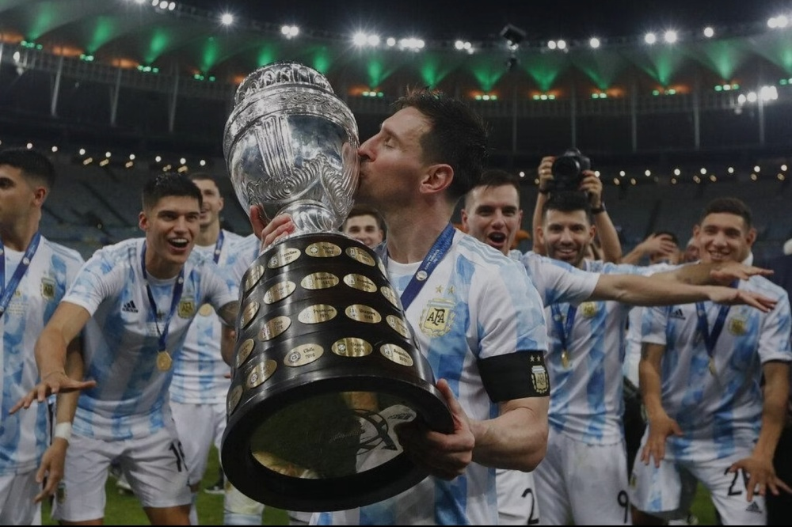
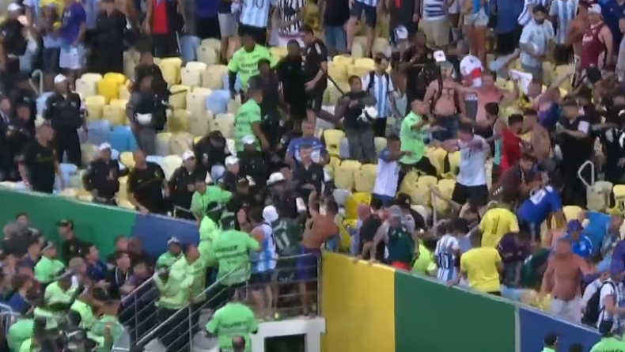
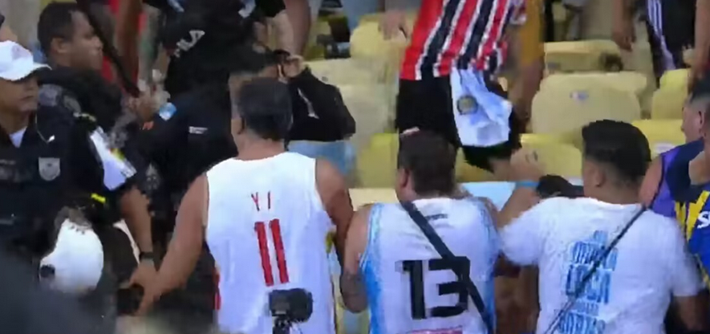
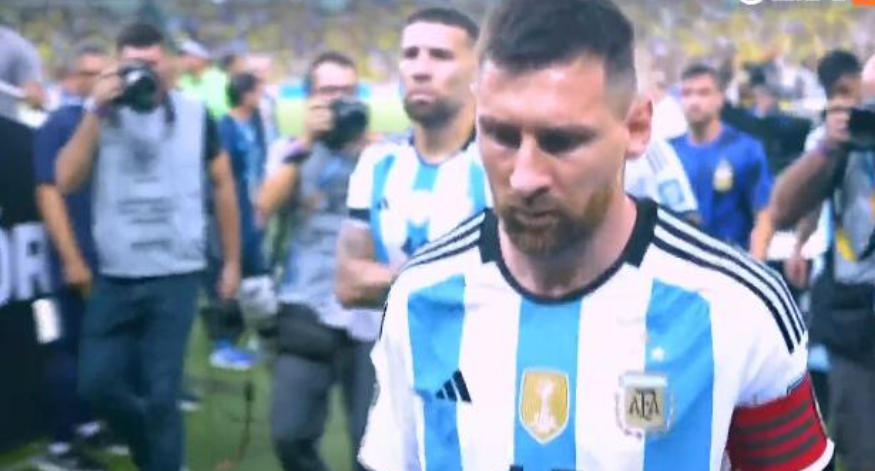
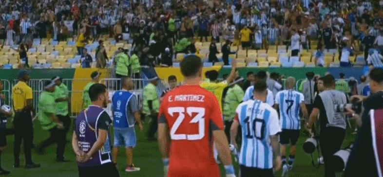

# 巴西阿根廷球迷火爆冲突，易建联粉丝乱入，梅西回更衣室：不踢了

北京时间11月22日，世预赛南美区焦点战，巴西主场迎战阿根廷，比赛还没开始，两队球迷就爆发激烈冲突，梅西在劝架之后率队离开球场。

本场比赛在著名的马拉卡纳球场举行，两年前阿根廷就是在这里击败巴西，夺得了美洲杯冠军，那也是梅西的国家队大赛首冠。再加上巴西和阿根廷之间的恩怨情仇，所以赛前的气氛就非常“热烈”。

结果比赛还没开始，巴西和阿根廷的球迷就在看台上打了起来，甚至有人直接把椅子拆了，开干！其中竟然出现了一名穿着男篮11号易建联球衣的球迷，也被打了。

梅西率领阿根廷球员以及巴西球员一起翻过球场护栏，前去劝架。但是没有收到太多效果，随后，梅西率队离开球场，返回更衣室，根据TYC报道，梅西表示：“我们不踢了，回去了！”

巴西球员们也还留在场上，但也有些不知所措。

