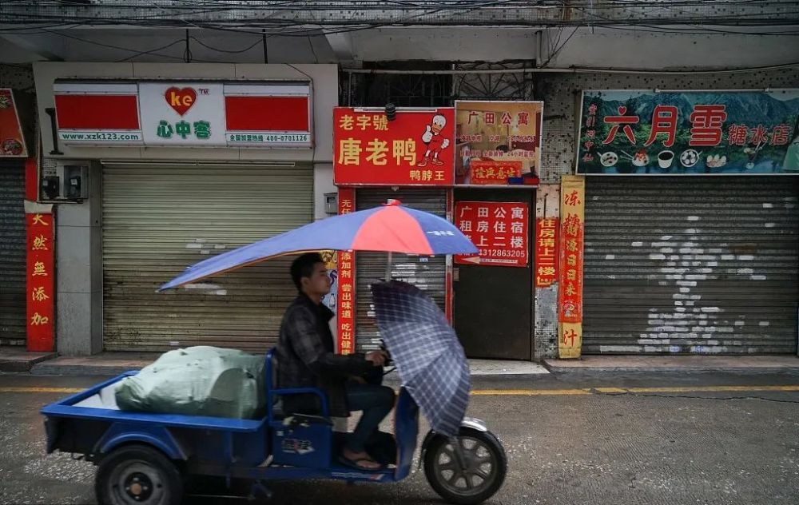
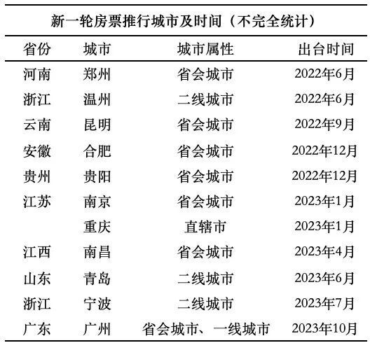

# 拆迁户们再难一夜暴富了！广州探索房票安置政策，系一线城市首例

_图源：视觉中国_

实习作者 | 冯晔

编辑 | 陈弗也

出品 | 棱镜·腾讯小满工作室

广州再次成为一线城市的“楼市”风向标，今年9月，广州成为首座放松楼市限购的一线城市，如今，它有望在一线城市开启城中村改造的“房票”之风。

今年10月24日，在第四届广州市规划委员会地区规划专业委员会第十四次会议上，《广州市城市更新专项规划（2021-2035年）》、《广州市城中村改造专项规划（2021-2035年）》被审议通过。

上述两个文件提到，优化成本核算与征拆标准，探索房票安置政策机制，破解城中村改造难题，提升改造效率。

早在7月，一份《广州市城中村改造房票安置实施办法（建议稿）》就在网上流传，“房票”开始进入到更多人的视野，如今这个传言正在得到证实。

在众多一二线城市中，广州城中村有着面积大、人口多的特点，今年10月，中国城市百人论坛召开，论坛还有另外一个名称，叫做“中国式现代化与超大特大城市城中村改造跨界研讨会”，论坛披露了一项数据。

来自中国人民大学研究团队的数据显示，广州的村庄建设面积为634.7平方公里，位居一线城市之首，总人口1128万，在一线城市中也仅次于深圳，远高于北京和上海。

**去库存、刺激楼市**

何为“房票”？这并不是一个新词，早在2014年就有城市推行房票安置制度。

在上一轮棚改中，这一制度在三四线城市中被运用，一定程度上，起到去库存方面的效果。2018年，棚改货币化安置政策退场，房票制度便渐渐淡出人们视线。

近两年，在房地产市场下行的背景下，房票安置政策再度出现。据不完全统计，自2022年以来，有超过30个城市推行房票安置政策，如昆明、厦门、温州等二三线城市。但在北上广深四座一线城市中，这个政策一直未曾施行。

_（《棱镜》作者根据公开资料整理）_

目前，广州房票安置政策的细则尚未公布，但结合网传建议稿和其他推行城市的相关文件，可以总结出，这一政策是指对被征收人的房屋安置补偿权益进行货币量化，然后为其出具购置房屋的结算凭证，即“房票”。这些“房票”可以用来购买住宅、车位、商铺等。

不过，这些“房票”的流通会有限制，比如有使用期限、限制转让次数等。当然，在使用“房票”购房时，则可以享受到一些折扣、税收优惠等政策。

以广州为例，此前网传建议稿显示，房票的票面金额是被征收房屋按照广州现行拆迁安置补偿计算权益货币量化后的总金额，包括基础补偿金额、房票安置政策性奖励等。

建议稿提到，原则上，各区发放的房票优先在本辖区内统筹兑换安置，本辖区范围内房票房源不足以满足安置需求的，报市政府研究同意后，可在广州市内其他区统筹存量房源。

此外，房票安置政策还有相应奖励政策。比如，中心城区选择房票安置的给予2%的政策性奖励，外围城区选择房票安置的给予5%的政策性奖励，这些奖励会列入到房票票面金额中。同时，还以现金方式奖励被征收人3个月的临迁费。

对于政府来说，去库存，刺激楼市，一直都是房票的主要目的。

比如，联合咨信在一份《广州房票安置政策点评》中就举例写道，义乌在2023年2月底推出房票安置政策，在推出后的63天内，10亿元的房票被置换使用，销售总金额达21.46亿元，对义乌的房地产市场刺激作用明显。

“房票只能用在购买房屋上，这使拆迁户们的‘拆迁款’在楼市里形成闭环，这显然更利于刺激楼市。而在之前，拆迁款会用在其他方面。”一位熟知房地产行业的人士向作者分析。

**为什么是广州？**

随着上述两份“专项规划”的通过，广州有望成为首个推行房票安置政策的一线城市。

“广州和深圳在城中村改造方面比较早，尤其是广州，一直是全国城中村改造比较积极的城市，走在前面。”易居研究院研究总监严跃进告诉《棱镜》。

广州积极推进城中村改造，与其本身的特点不无关系。除了广州的城中村改造面积大之外，广州城中村还有一个特点，很大一部分集中在中心城区，形成了城中村镶嵌在繁华商圈的独特城市形态。改造此类城中村，需要花费高昂的成本，以传统的“拆迁房”和“拆迁费”作为安置手段，会极大增加政府财政压力，使城中村面临“改不起”的难题。

严跃进认为：“房票可以发挥双向的效应，既降低了政府财政方面的支持，也能更好地去库存。”

经济学家宋清辉有着同样的看法，他向作者表示，广州政府预期通过房票政策或将获得两大方面的成效，一方面是拓宽城中村拆迁安置渠道，满足市民对房屋安置的多样化需求。另外一方面，城市的环境品质也能够进一步提升，这也是城市营商环境的重要体现之一。

在国家政策层面，今年以来，有关城中村改造的政策也正在加速推进。

7月下旬，国务院办公厅印发《关于在超大特大城市积极稳步推进城中村改造的指导意见》，明确了超大特大城市分三类推进实施：符合条件的实施拆除新建、开展经常性整治提升，以及介于两者之间的实施拆整结合。

根据《经济日报》的报道，如今，各地正按照部署，扎实开展制定配套政策、摸清城中村底数、编制改造项目方案等工作。

据《中国房地产报》，广州某区城市更新局的工作人员向其记者表示，房票安置是广州市规划和自然资源局在牵头的工作，区一级尚未有明确的部署。一位知情人士则透露：“可能会先找试点区，对政府主导型的城中村项目实施房票安置。”

如今，“房票”已经成为了广州城中村改造乃至整个楼市的一件大事，备受“房东们”关注，也有一些城中村“闻风而动”。

近日，广州市黄埔区的夏园旧村改造方案突然对外公示，令不少人感到意外。夏园的旧改计划一度陷入停滞，甚至未出现在2022年初网传的广州市城市更新计划的名单中，此次突然公布方案，被认为是要赶在房票政策正式落地之前，拿到旧改方案的批复。

**要房票，还是要房子？**

目前，“房票”虽然尚未正式在广州推行，但已引发了不同程度的关注和讨论。

“房票不行，肯定要现款，肯定要现房”。已经六十有余的陈祥（化名）在天河区某城中村拆迁区内有两栋房产，每栋约有7层，每层约100平方米左右，两栋合计约1400平方米。陈祥告诉《棱镜》作者，他的两栋房产按照当地的房价折算，至少达到2000万。

如果拆迁将以房票的形式补偿，需要他自行去购房，“我肯定是不愿意的”。

根据多位城中村“房东”的表述，不少村民不太愿意接受这种安置方式，他们更倾向于此前的回迁款、回迁房的形式。

广州一位年轻的“房东”向作者表示，希望拿到拆迁款，然后去做其他方面的投资。在他看来，现在的楼市投资价值不高，而他自己又不缺房子。

不过，也有村民表示，根据现在的楼市行情，他们这些“拆迁户”很难再像几年前那样“一夜暴富”，如果房票在兑换楼房时有优惠，这个形式未尝不可。

此外，和很多一二线城市一样，广州城中村也有着极其复杂的情况。比如，一些城中村已经形成了产业集群效应，如鹭江村的制衣产业；很多城中村也早已由二房东、三房东经营，很难见到真正的房东。

_天河区棠下村的便民信息宣传栏，招租广告上的联系方式大多是二房东、三房东。作者拍摄_

如何兼顾产业发展问题，也是摆在各大小城市城中村改造面前的一大难题。

在宋清辉看来，在楼市方面，广州一向是楼市政策的“领头羊”，各项楼市宽松政策基本上都是最先开始执行，具有极高的风向标意义。

广州推行的“房票”是否会对其他三座一线城市，尤其是深圳的城中村改造起到示范效应？这也是很多业内人士关注的问题。

严跃进认为，广州推行房票安置政策和广州的城市基本面以及房地产情况是密切相关，广州城中村改造的空间比较大，一些地块的投资价值也较大。但在谈及房票安置政策是否会在其他三个一线城市推行时，严跃进则表示这个可能性反而小。

“北京和上海这两个城市的政策一般不会轻易放，而且这两个城市潜在的基本面和广州还是
不一样的。广州的楼市相对来说可能要偏弱一些，北京和上海的政策一放，市场反弹的空间可能要更大一点。”严跃进分析说。

他表示，房票安置政策在特大城市中推行还是少的，至少从目前来说，还没有听到其他一线城市推行的风声。

