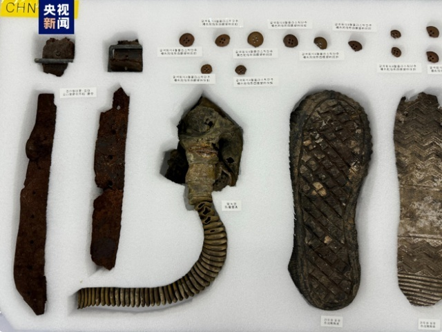

# 接英雄回家！第十批在韩中国人民志愿军烈士遗骸装殓仪式在仁川举行

当地时间22日上午，第十批在韩中国人民志愿军烈士遗骸装殓仪式在设于韩国仁川的一处临时安置所内举行。来自中国退役军人事务部、中国驻韩使馆、韩国国防部等中韩两国人员共同参与。

此次韩方共向中方移交25名中国人民志愿军烈士遗骸及遗物，装殓仪式结束后，中韩双方23日将在韩国仁川国际机场举行遗骸交接仪式，交接仪式后烈士遗骸将搭乘中国空军运-20专机返回祖国。

2014年起，韩国每年向中国移交上一年度在韩国发现的中国人民志愿军烈士遗骸及遗物，包含此次的第十批在内，回归祖国的志愿军烈士遗骸数量将达到938名。（总台记者
唐鑫）

**【来源：央视新闻客户端】**

