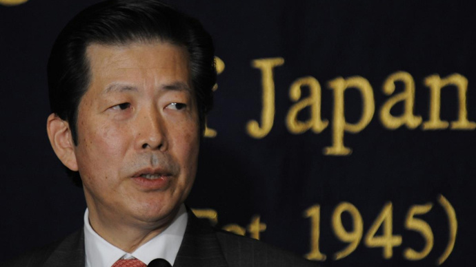

# 携首相亲笔信，日本公明党党首4年来首次访华

据《参考消息》等报道，11月22日上午，日本公明党党首山口那津男从东京羽田机场启程，开启对中国为期两天的访问，计划与中国高级官员举行会谈，并转交首相岸田文雄写给中国领导人的亲笔信。

这是山口继2019年8月后时隔4年再次访华，也是他自2009年就任公明党党首以来的第7次访华。今年正值中日和平友好条约缔结45周年。在中日领导人上周于旧金山举行面对面会晤的背景下，作为日本执政党体系内的重要人物，山口此访释放怎样的信号，将为中日关系这艘大船重回正轨、破浪前行注入怎样的动力？

**一则缓和讯息**

山口那津男现年71岁，自2009年首次就任公明党党首以来一直成功连任。公明党于2012年应众议院第一大党自民党之邀结成自公联合政权，成为执政党至今。

长期以来，公明党被视为日本政坛的友华力量，致力于中日友好事业，在中日邦交正常化过程中发挥过重要作用。作为公明党现任党首，山口那津男一直积极推进中日友好。

更为重要的是，山口是执政党体系内的重要人物，可直接对自民党的对华政策产生影响，在日本政坛的影响力非民间友华人士可比。自担任公明党党首以来，他曾6次访华，多次扮演日本首相对华信使的角色，斡旋中日关系。

不过，虽是北京的“熟面孔”，但山口此访也非一蹴而就。早在去年，日本国内就传出山口有意访华的消息；今年8月，山口曾计划访华，以促进改善中日关系，但由于日本政府8月24日正式启动福岛核污染水排海，导致其访华行程延期。

时隔3个月，山口的对华访问终于成行。中国外交部发言人21日表示，中方欢迎山口那津男党首率公明党代表团访华，希望通过沟通交流推动中日关系改善和发展。

“公明党是日中之间的桥梁，现在是访问中国的最佳时机”。有公明党成员日前表示。

“山口此次顺利来访，可谓中日关系趋向缓和的一则令人鼓舞的好消息。” **上海市日本学会名誉会长、上海国际问题研究院资深研究员吴寄南指出**
，一方面，公明党是日本政坛始终坚持对华友好的政党，每当中日关系处于重要节点，公明党总能从长远和大局出发，发挥积极的推动作用。前不久逝世的公明党创始人、创价学会前会长池田大作在1968年就发出“恢复日中邦交正常化”的倡议，为1972年中日实现邦交正常化作出了巨大的历史贡献。

另一方面，山口此行的背景是中美元首举行旧金山会晤、中美关系进入相对缓和阶段，美国的其他盟国也在积极调整对华立场。这让日本当权者产生紧迫感，希望在中日关系上有所行动，以免陷入孤立和被动。岸田在旧金山与中国领导人会晤后，又让山口带着亲笔信来华，传递了日方希望与中方相向而行、让中日关系止跌回稳的意愿，这标志着持续僵冷的两国关系近期将出现一定转机。

**一场深度对话**

这是山口4年多来首次访华，正值中日和平友好条约缔结45周年。这是继去年中日邦交正常化50周年后又一特殊节点。作为岸田的执政盟友，山口此访带有怎样的任务，将和中方官员谈些什么，受到外界关注。

山口在临行前提到，通过签署日中和平友好条约，两国提出相互不谋求霸权、促进经济文化关系。他希望此访能就条约的意义和精神取得共识；也希望能展开对话，为进一步深化两国战略互惠关系发挥作用。

日本政府、日本媒体也向外界披露一些消息。

从行程和议题看，山口将与中方官员举行会谈，拟呼吁早日重启2018年以后中断的中国共产党与日本自民、公明两党定期对话的“日中执政党交流机制”，并以此助推两国领导人的相互往来。此外，山口可能还会请求中国向仙台市出借大熊猫。

从任务和期待看，山口受首相岸田托付，拟向中方领导人转交一封亲笔信。“两国领导人近期确认了构建具有建设性、稳定的日中关系，并就保持各层级对话沟通达成一致。强烈期待山口党首此次访华促进两国交流和沟通。”日本内阁官房长官松野博一21日表示。

有日本经济界人士称，希望以两国领导人此前商定的适时举办新一轮日中经济高层对话为动力，找到突破口，实现两国关系更根本性的改善。

对此，吴寄南指出，作为联合执政的执政党党首，山口此行并不限于一般的党际交流，他与东道主之间可就广泛议题深度对话，将会涉及两国一些悬而未决的“悬案”，比如日本大幅提高防卫费、在半导体等领域对中国实施出口限制以及福岛核污水排海等。双方也会就促进青少年交流、租借大熊猫等事宜交换意见。

“中方非常重视公明党在日本执政联盟中发挥的关键少数作用，将利用山口此访向日方传达中方对继续推进中日战略互惠关系，开展政府间磋商、促进民间往来和经贸交流的意愿，希望岸田内阁能尽快消除阻碍中日关系发展的人为障碍，使其重归正常轨道。”

**一种策略调整**

其实，山口并不是近期首位访华的日本高官。日本内阁特别顾问、国家安全保障局长秋叶刚男曾于11月9日突访北京，参加中日高级别政治对话机制磋商。

舆论认为，日方近期的一些言行显示出日本各界加强对华接触、改善两国关系的迫切心情，包括其为促成中日领导人旧金山会晤“进行了最大程度的院外活动”等。

外界好奇，日方的对华态度为何趋于主动？

吴寄南认为，日本当权者试图缓和对华关系，更多的是一种策略调整，主要基于外部环境、经贸合作、执政基础等三方面的考量。

首先，日本当权者在中美关系出现微调的背景下，为避免再次出现“越顶外交”、被撇在一边的窘境，不得不对其一段时间来的涉华强硬路线作出某些调整。

其次，日方也有稳住中日经贸合作的考虑。中国是日本最大的贸易伙伴，但由于内外各种因素交互作用，中日双边贸易近两年来出现持续下滑局面。这次山口来访，很可能会成为中日重启经济高层对话的契机。

再次，就岸田个人而言，缓和中日关系也有夯实其执政基础的考量。近几个月来，岸田内阁受经济决策错位、政治丑闻迭出等因素影响，支持率已跌至20%出头一点。如果说，接近30%是执政“危险水域”，那么20%左右就是“下台水域”。岸田也希望稳住中日关系，至少在明年自民党总裁选举前不能让中日关系继续滑坡。

不过，“没有任何迹象表明，日方将放弃亲美疏华的既定路线。”吴寄南说。

**一艘合作的大船**

当然，尽管中日关系的气氛有所缓和，但中日之间结构性分歧仍然难解，包括日本对华的整体战略认知、日美同盟和美日韩三方合作动态等。

一段时间以来，日本在对华政策方面追随、依附美国，在台湾、东海和南海等问题上采取激进立场，在对华高科技出口管制方面动作频频，以所谓“国家安全”为由大幅提高防卫开支，积极将域外军事力量引入亚太，在福岛核污染水排放问题上不负责任……凡此种种，都给中日关系制造新的困难。

“中日关系虽出现一定转机，但还不具备迅速升温的可能。”吴寄南说道，中日关系在过去一段时间里“伤得不轻”，其根源在于日本当权者的对华认知和战略定位出现严重偏差，将中国视为威胁而非伙伴。这是由多重因素所导致的。归根到底是其难以摆脱追随美国的惯性思考、非黑即白的二元逻辑、弱肉强食的丛林法则和对华优越的历史包袱。

围绕中日关系发展，吴寄南指出，如果将中日关系比作一艘大船，它必须有“三大件”——指引方向的罗盘、防止碰撞的护栏以及减少颠簸的压舱石。其中，罗盘最为重要，就是中日间四个政治文件和一系列原则共识，特别是要把“互为合作伙伴，互不构成威胁”政治共识落实到实际行动中；护栏就是两国之间的危机管控机制，如海空联络机制等；压舱石就是经济、人文等领域的交流与合作。

“正是因为拥有这‘三大件’，中日关系这艘大船虽然正面临风浪的考验，但总体可控。”吴寄南指出，展望前路，关键在于，日本当权者要客观理性地看待中国的发展，要重信守诺，不能丢掉罗盘、拆除护栏、卸下压舱石。

