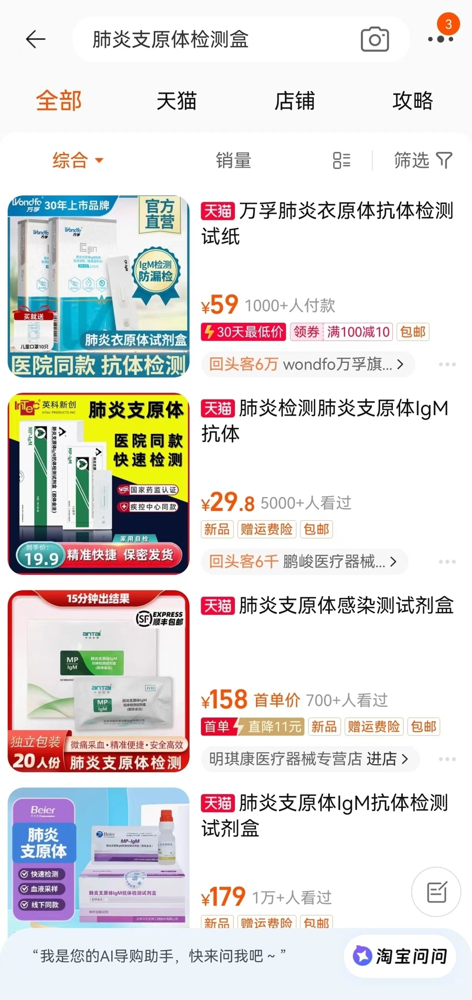

# 支原体肺炎自测盒热销：网售自测盒准确性低，是否感染需综合分析

近日，肺炎支原体检测盒在电商平台上热销。有人担心去医院可能会交叉感染，所以囤了检测盒备用。但是，自行在家检测靠谱吗？

上海市普陀区中心医院呼吸内科副主任医师朱林筠表示，肺炎支原体检测对操作方式、取样位置、患病阶段等要求较高，自行检测的结果准确率偏低，因此不建议普通民众自行在家检测。

**网售自测盒准确性低**

记者注意到，网购平台售卖的检测盒中，有抗体检测、抗原检测等不同类型，主要为胶体金法，价格在几十到几百元不等。销量大都不错，在一家网店里，这样的检测盒最近一个月已销售了1000多笔。

_肺炎支原体检测盒在电商平台上热销。_

需要注意的是，不同检测方式的准确度存在差异。

朱林筠说，抗原检测敏感度较低，目前医院实验室常采用核酸检测和抗体检测。

但抗体检测对支原体感染的诊断准确性也不够高，其缺陷包括疾病早期的假阴性和疾病恢复期的假阳性。

基于此，民众购买抗体检测盒或抗原检测盒进行自测后，无论结果如何，都不能作为是否感染肺炎支原体的判断依据。

**是否感染需综合分析**

临床上，判定是否得了支原体肺炎主要分两步：首先确定病人是否患了肺炎，然后再判断导致肺炎的病原体是什么。

朱林筠将目前肺炎支原体的临床检测方法总结为以下几种：支原体抗体检测（抽血）、支原体核酸检测（鼻拭子、咽拭子）、病原体高通量测序和支原体培养等，不同的方法各有优劣。其中，支原体抗体检测是最常见的检测方法，但抗体检测结果准确性低。因为抗体并不是感染后马上出现、病好了马上消失，而是感染后过一段时间（一般1周左右）才出现，而病好了以后抗体还会持续存在数个月。所以，抗体阳性并不代表正在感染，也可能是以前感染过；而抗体阴性不能排除感染，可能是查得早，抗体还没出现，所以抗体检测容易误诊和漏诊。

支原体核酸检测准确性较高。但肺炎为肺实质感染，位于下呼吸道，鼻拭子采样不一定能够取到病原学标本，且该检测无法区分是致病感染还是无症状携带，目前国内部分医院还没有开展此项检测。

目前，临床上对病原体检测还会使用宏基因组测序，仪器可对送检样品内DNA或RNA进行高通量随机测序，与已知的微生物参考基因组数据库进行比对，分析出病原体。对肺炎患者进行支气管镜下支气管肺泡灌洗，可以较精确地取到病变部位的标本，但检测结果需要根据临床表现和测序报告综合分析。

肺炎支原体培养则是诊断肺炎支原体感染的金标准，但由于肺炎支原体培养需要两三周时间，等结果出来可能病人已经自愈了，难以用于临床诊断，因此支原体培养主要用于科研而非临床。

需要提醒的是，网上所谓“快速肺炎支原体培养”的准确性不佳，不建议做。因为病原体培养需要严格的条件，无法自行在家完成。

由此可见，没有哪个单独检测项目能一步到位判断是否得了支原体肺炎。支原体肺炎的诊断需结合检测结果和临床特征综合判断。

一般来说，如果孩子处于学龄期（5-17岁），出现反复发热、咳嗽等症状，医生听诊肺部有呼吸音改变，影像学有肺部感染——在这种情况下，就要特别注意支原体肺炎的可能。

朱林筠建议，孩子出现发热、咳嗽等症状，家长应及时带孩子前往医院就诊，自行检测的结果仅供参考，不能作为确定感染的依据；在用药方面也需听取医生意见，勿自行服药，避免增加其他风险。

