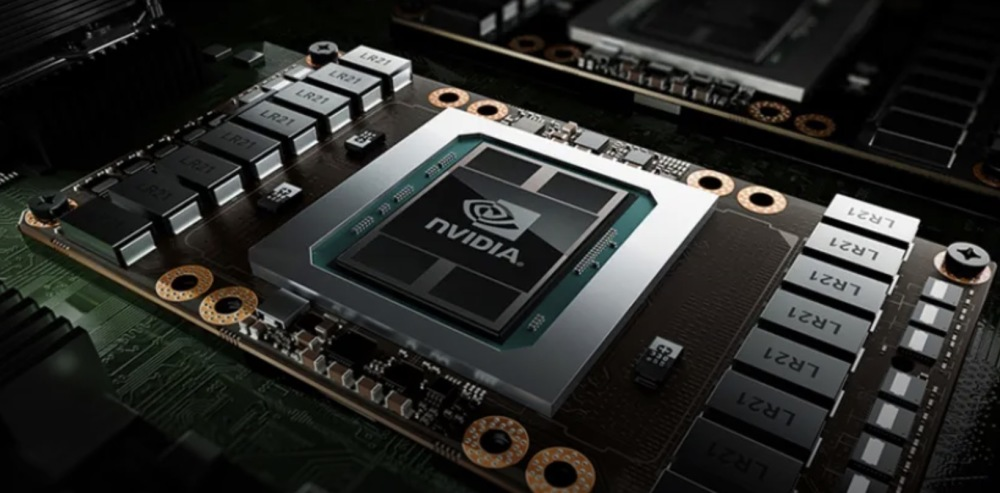

# 英伟达Q3营收增206%净利增1259%，外媒称未满足投资者对AI高期望

**划重点**

  * _1_ 彭博社认为，尽管英伟达业绩超出了分析师的平均预期，但依然未能满足押注人工智能繁荣的股东的更高预期。
  * _2_ 路透社称，英伟达第四财季营收预期高于分析师预期，但中国市场销售前景不明朗依然令该股承压。
  * _3_ CNBC表示，AI芯片热潮推动了英伟达营收增长两倍，英伟达GPU的需求还将继续增长。

腾讯科技讯
11月22日消息，美国当地时间周二，英伟达公布了该公司2024财年第三财季财报。财报显示，英伟达第三财季营收达181亿美元，同比增长206%；净利润92亿美元，同比增长1259%；摊薄后每股收益为3.71美元，同比增长1274%。财报发布后，外国媒体对英伟达业绩给予了肯定，但认为其依然未能满足投资者对人工智能的高期望，盘后股价跌1.53%。

**财报概要：**

英伟达三季度调整后EPS为4.02美元，分析师预期3.36美元。

三季度营收181.2亿美元，分析师预期160.9亿美元。

三季度数据中心营收145.1亿美元，分析师预期128.2亿美元。

三季度游戏营收28.6亿美元，分析师预期27.0亿美元。

三季度汽车营收2.61亿美元，分析师预期2.669亿美元。

三季度毛利润率75%，分析师预期72.5%。

美国许可证要求未曾（在三季度）对本公司造成实质性影响。

预计四季度营收200.0亿美元（上下浮动2%），分析师预期179亿美元。

预计中国市场销售将在四季度大幅下滑。

英伟达（NVDA）美股盘后短时间涨1.37%，随后转而下跌。

**外媒评论**

**彭博社：英伟达未能满足投资者对AI繁荣的高期望**

英伟达的投资者对该公司最新季度报告反应冷淡，该公司2024财年第三财季业绩超出了分析师的平均预期，但未能满足押注人工智能繁荣的股东的更高预期。

英伟达周二在一份声明中说，预计第四财季营收将达到约200亿美元。尽管这超过了分析师平均预期的179亿美元，但仍低于有些人210亿美元的预期。

虽然英伟达又公布了一个令人印象深刻的季度业绩，但投资者的预期还会更高。他们今年向该股投入了大量资金，使其上涨了242%，希望人工智能行业能给英伟达带来爆炸性的销售增长。

财报发布前，英伟达股价周二在纽约证交所收于每股499.44美元，是费城证券交易所半导体指数今年表现最好的股票，估值超过1.2万亿美元。事实上，英伟达目前的市值比竞争对手英特尔高出1万亿美元以上。而直到不久前，英特尔还是全球最大的芯片制造商。

英伟达首席执行官黄仁勋将其在图形芯片方面的实力发挥到了他所谓加速计算领域的领导地位。该公司的处理器可以通过并行计算处理更多数据，已成为训练人工智能服务的首选工具。

英伟达的数据中心部门是其业务中表现最出色的部门，收入145亿美元，较上年同期增长279%。与此同时，该公司的个人电脑部门已经从整个行业的放缓中反弹，营收增长81%，至28.6亿美元。

英伟达在向微软和谷歌等公司销售人工智能芯片方面取得了成功，但也使其成为众矢之的。微软上周发布了自己的内部人工智能处理器，此前亚马逊旗下AWS也做出了类似的努力。第四季度，AMD也将推出一款与英伟达竞争的产品MI300。

但英伟达并没有止步不前，该公司最近推出了备受推崇的H100芯片的继任者H200，并将于明年初上市。

人工智能始终是今年科技投资者最热门的话题，每家大公司都在谈论自己在这一领域的布局。但英伟达是少数几家从该趋势中赚到大钱的企业之一，自2022年11月OpenAI的ChatGPT公开亮相以来，这一趋势不断加速。这个工具有助于向更广泛的受众展示生成式人工智能的潜力。

**路透社：英伟达第四财季展望好于预期，但芯片出口禁令担忧挥之不去**

因供应链问题缓解，英伟达周二公布2024财年第四季财季营收预期高于华尔街预期，但中国市场销售前景不明朗令该股承压。

英伟达将生产外包给台积电等芯片制造商，该公司表示，预计其人工智能芯片的供应每个季度都会有所改善。英伟达往往会提前付款，并下不可取消的订单，以确保供应商优先考虑生产其芯片。

对人工智能服务器的需求迅速增长，研究公司TrendForce估计，由于人工智能服务器被用于OpenAI的ChatGPT等产品的驱动，今年的出货量将增长约40%。

但人工智能芯片的火热市场是在美国大幅扩大对英伟达向中国出口产品的出口管制的背景下出现的。Investing.com的高级分析师杰西·科恩（Jesse
Cohen）表示：“投资者似乎担心美国扩大限制向中国销售其高端芯片的负面影响。”

尽管美国加大了对芯片出口的限制，但分析师预计，英伟达的订单至少要到明年8月才会满，因为对其人工智能芯片的需求，尤其是在美国，将继续超过供应。

不过，英伟达也发出了一些警告，称该公司数据中心部门四分之一的销售额来自目前正受到美国新出口管制影响的地区。

英伟达首席财务官科莱特·克雷斯（Colette
Kress）在声明中表示：“我们预计，在2024财年第四财季，我们对某些国家和地区的销售额将大幅下降，尽管我们相信，其他地区的强劲增长将抵消这种下降。”

一名消息人士和分析人士表示，为应对美国扩大出口管制，该公司已经为中国市场推出了三款新产品。

**CNBC：AI芯片热潮推动英伟达营收增长两倍**

在第三财季，英伟达营收增长了两倍多，达到181亿美元。扣除某些项目后，每股收益达3.71美元。高于去年同期的6.8亿美元，以及每股收益0.27美元。分析师此前预计其营收约为160亿美元，每股收益为3.36美元。

英伟达的数据中心业务收入总计145.1亿美元，增长279%，超过分析师普遍预期的129.7亿美元。英伟达表示，数据中心收入的一半来自亚马逊等云基础设施提供商，另一半来自消费者互联网实体和大公司。

游戏业务贡献了28.6亿美元收入，同比增长81%，同样高于分析师普遍预期的26.8亿美元。

在第四财季业绩展望方面，英伟达预计第四财季的收入为200亿美元，这意味着营收将增长近231%。

在第四财季，英伟达发布了GH200图形处理器，它的内存比目前的H100更大，并增加了额外的Arm处理器。H100价格昂贵，但需求旺盛。英伟达表示，总部位于澳大利亚的艾瑞斯能源公司是比特币挖掘数据中心的所有者，该公司将以1000万美元的价格购买248个H100，相当于每个约4万美元。

就在两年前，用于在个人电脑上玩视频游戏的图形处理器还是英伟达最大的收入来源。现在，该公司的大部分收入来自服务器群内的部署。

2022年，微软支持的初创公司OpenAI推出了ChatGPT聊天机器人，这促使许多公司寻找方法，在他们的软件中添加类似的生成式人工智能功能。因此，对英伟达GPU的需求急速增加。

不过，英伟达也面临诸多挑战，包括来自AMD的竞争，以及由于出口限制而导致的营收下降，这可能会限制其GPU在中国的销售。但在周二的才把发布之前，一些分析师仍持乐观态度。

Raymond James的斯里尼·帕杰里（Srini Pajjuri）和雅各布·西尔弗曼（Jacob
Silverman）表示：“随着通用人工智能在各个垂直行业的普及，GPU的需求继续超过供应。我们并不十分担心竞争，预计到2024年，英伟达在新一代人工智能加速器市场的份额将保持在85%左右。”他们对英伟达的股票评级为“强烈买入”。

**The Verge：英伟达旗下有个生成式人工智能火箭**

英伟达2024财年第三财季的业绩显示，该季度的收入为181.2亿美元，其中145.1亿美元来自其数据中心业务，因为全球人工智能公司都在争夺英伟达的芯片。这一总收入比去年增长了206%，标志着该公司的持续增长趋势。

英伟达还指出，中国和其他地区占其芯片销售额的20%至25%，美国新的出口限制将很快削减这一比例。然而，其他地区的销售增长应该“足以抵消”这种下降。

**VentureBeat：AI芯片需求激增推动英伟达业绩再创纪录**

英伟达周二公布了其2024财年第三财季财报，显示其营收和利润均超出了华尔街的预期。

这家图形处理器(GPU)和人工智能芯片公司公布的第三财季营收达到创纪录的182亿美元，同比增长206%，环比增长34%。英伟达数据中心部门营收同比增长279%，环比增长41%，达到145.1亿美元，占第三季度总收入的79%。

英伟达第三财季每股收益为3.71美元，比去年同期增长了12倍以上，比上一季度增长了50%。

首席执行官黄仁勋在声明中表示：“我们的强劲增长反映了广泛的行业平台从通用向加速计算和生成式人工智能的过渡。大语言模型初创公司、消费互联网公司和全球云服务提供商是第一批推动者，下一波浪潮正在开始形成。许多国家和地区组织正在投资AI云以服务当地需求，企业软件公司正在他们的平台上增加AI助手，企业正在创造定制的AI来使世界上最大的行业自动化。英伟达图形处理器、CPU、网络、AI代工服务和NVIDIA
AI Enterprise软件都是全速增长的引擎。生成式人工智能的时代正在腾飞。”

在数据中心方面，英伟达宣布推出配备新H200张量核心图形处理器的NVIDIA HGX
H200，这是第一款配备HBM3e内存的图形处理器，预计将于明年第二季度上市。黄仁勋说，生成式人工智能是英伟达几十年来最大的总可用市场扩张。

“它几乎改变了一切，”他说，并指出了自然语言查询中的文本到视频或文本到3D等创新。黄仁勋补充道：“真正有影响力的领域之一是软件业，它的规模约为万亿美元，随着时间的推移，它将受益于人工智能的合作伙伴。”（文/金鹿）

