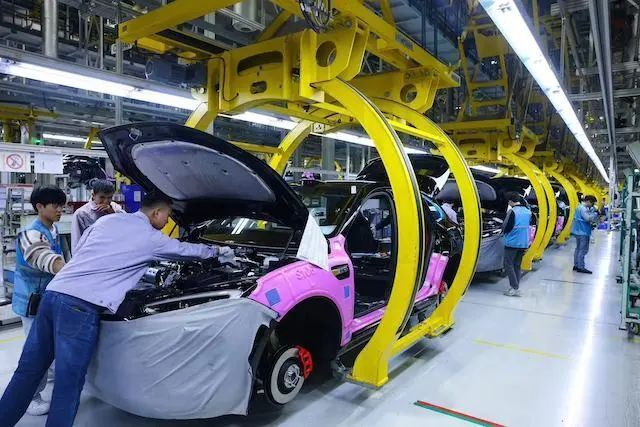

# 华为余承东亲自“督战”：问界新M7产能目标提至日均700台

被华为终端BG CEO余承东视为汽车业务“起死回生”关键的问界新M7，其交付能力一直是外界关注的焦点。

近日，第一财经记者在赛力斯汽车智慧工厂走访时了解到，目前问界新M7产能目标提升至日均700台，最大年产能可达20万辆。赛力斯相关负责人对记者表示，今年9月M7的月产量是5000台，10月已经破万，接下来的目标是月产2万-3万台。

2021年4月，余承东接管华为汽车业务车BU，推出智选车模式，在该模式下华为参与到产品定义及整车设计以及渠道销售，而赛力斯则负责研发、制造、交付、服务等环节，同时，赛力斯也是华为智选模式首个合作伙伴。2021年年底，双方又合作推出了AITO问界系列汽车品牌以及问界M系列车型。

目前，赛力斯在重庆拥有三座新能源整车工厂，分别生产问界M5、问界M7及问界M9。据工厂负责人介绍，目前M5工厂的产能是每小时30台。按照10小时工作制，日产300台，双班制度下则是600台。

_摄影记者：任玉明_

“传统企业一般（提升产能）要2-3个月，整个体系才会成熟，我们要求是一个月。”上述工厂负责人对记者表示，目前有一些核心供应商已在重庆厂区附近建厂，为了确保交付，供应链上的人力投入也在加大。

今年下半年，余承东多次现身赛力斯智慧工厂，亲自监督车辆生产速度与质量。在10月份到访赛力斯工厂后，余承东公开表示，华为在整条供应链上新投入超过10个亿，增加了2万多人，提高生产班次。

上述工厂负责人对记者表示，10亿元的投入主要包括生产的节拍、流程、效果的提升。

“华为的流程管理运用在汽车领域，有些方法在传统汽车行业来看有点‘过了’，但从效果看是可行的。”上述负责人表示，传统汽车下线后跑两三公里后经过调试就基本结束了检测，但是在赛力斯产线上需要做400多项测试，各种数据形成“心电图”后在云端直接“问诊”，这种方式可以将长期问题提前暴露，但成本较高。

余承东曾表示，希望华为汽车业务板块到2025年可以盈利，“目前智选这一块华为没有亏，也没有利润，我们帮车厂实现（销量）过了100万，车BU就能盈利。”

对于智选模式的未来发展，上述赛力斯智慧工厂负责人对记者表示，模式本身还在发展过程中，也还没有到盖棺定论的时候，但过去从来没有两家企业用这样的方式生产过汽车，证明这种模式是值得被挖掘和反复研讨的。

值得注意的是，随着未来智界S7等新车型的上市，华为智选车业务的合作方也从过去的一家变更为了四家，合作企业与华为之间如何调配资源，利益如何分配，渠道如何平衡，都将是这一业务模式即将面临的挑战。

