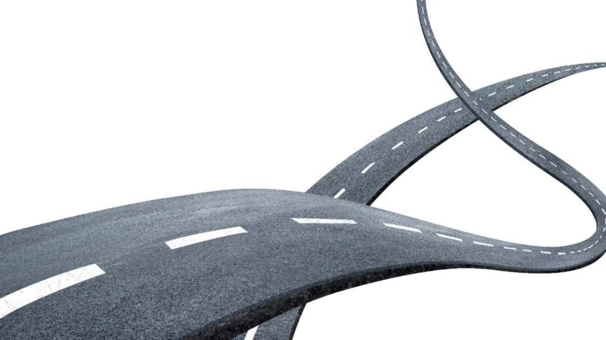
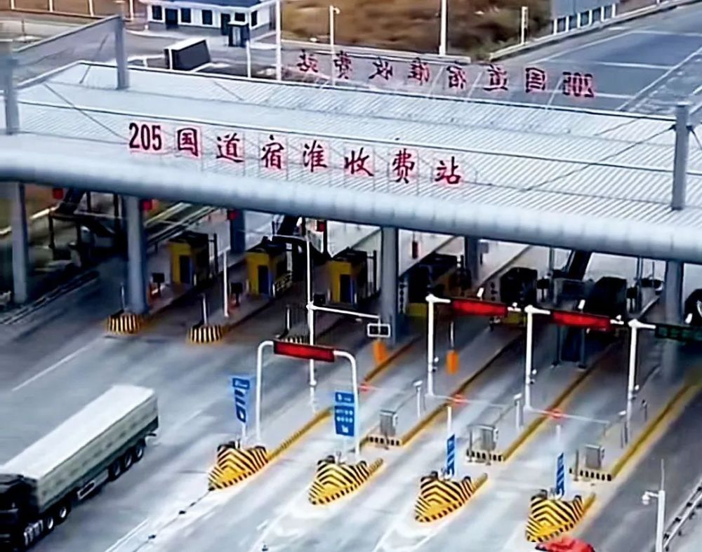

# 国道收费，越来越多？

“国道也能收费？”这是不少人看到205国道宿淮段即将收费的消息后的第一反应。

10月20日，江苏省政府官网发布消息，同意205国道宿淮收费站建成并符合通车条件后开征车辆通行费，按照政府还贷公路管理，由宿迁、淮安两市进行联合收费。

收费期限从开征车辆通行费之日起计算，在收费站运行两年后再进行评估核定。收费标准为一至四类客车每车次10元、12元、15元、15元，一至六类货车每车次10元、15元、30元、35元、40元、50元。

包括国道在内的普通公路收费通常不在人们的经验范围内，特别是在高速公路收费年限频繁被关注的情况下，“国道收费”容易引发争议。

不过，非高速公路在收费的情况并不在少数。根据交通运输部2022年底发布的《2021年全国收费公路统计公报》，全国有1.76万公里一级公路和0.75万公里二级公路收费，占收费公路总里程的13.4％。

从现行《收费公路管理条例》来看，这次收费无可非议，但又显得与已经持续十余年的削减收费公路的努力“格格不入”。

 _图/视觉中国_

**哪些公路可以收费？**

其实，宿淮收费站在2018年年底便已获批。江苏省发改委当时作出“关于205国道宿淮收费站工程可行性研究报告的批复”，同意建设205国道宿淮收费站工程，总投资估算6865万元，全部由沭阳县政府财政资金解决，建设工期一年。

而205国道并非新近建成，其又被称为山海关-
深圳公路，即山深线。北起河北秦皇岛市，南至广东深圳市。全程2976.450千米，途经河北、天津、山东、江苏、安徽、浙江、福建和广东8个省份。

宿淮收费站也并非205国道上唯一一座收费站，向北93公里便是位于江苏徐州的205国道新沂收费站。

205国道新沂收费站前身是沭河大桥收费站，原本收费期限只到1998年，本应撤掉之时赶上新沂市完成对205国道新沂段的改建，新的205国道正好从沭河大桥经过。

于是，沭河大桥收费站更名为新沂收费站，延长收费年限16年，直到2014年。此后，新沂收费站不断延长收费期限。2023年7月，这座命名于1998年的国道收费站还开通了数字人民币缴费方式。

宿淮收费站是在这条早已建成的国道上又一座新设的收费站。

对于为何新设收费站，江苏省发改委2018年作出批复时表示，为提升国道服务水平，缓解政府还款压力。

近日有媒体曾在江苏省政府官网政民互动栏目留言咨询，江苏省交通厅工作人员回电解释称，205国道宿迁至淮安段是政府还贷一级公路，按照规定是可以收费的。“这条路从建的时候，就是作为收费公路来融资和建设的，现在还有将近10个亿的存量债务”。

根据江苏省交通厅官网发布的信息，截至2022年12月，江苏省有16条普通公路收费，包括国道、省道，总里程达到1131.8公里。

2020年6月，江苏省政府同意104国道官山收费站开征车辆通行费，收费年限达15年，给出的理由同样是“还债”。“收费站所收车辆通行费全额解缴睢宁县财政，纳入同级财政预算管理，用于该工程建设债务本息和收费站正常开支。”

从全国的情况来看，近年位于一级公路的收费站数量小幅增加。在高速公路以及一至四级公路的五个技术等级公路中，区分一至四级公路的因素是“是否只供汽车行驶以及车道数量”等，如：一级公路为供汽车分方向、分车道行驶，全部控制出入的多车道公路；二级公路为供汽车行驶的双车道公路。205国道宿淮段便属一级公路。

交通运输部发布的《2021年全国收费公路统计公报》（以下简称《公报》）提及，2021年末，一级公路收费站由300个增加至308个，净增加8个；二级公路收费站由122个减少至115个，净减7个；独立桥梁及隧道收费站由59个增加至61个，净增两个。

如2022年一年，湖北省荆门市便增加了两个一级公路收费站，使得收费公路通行费收入从上年的5866.84万元增长至11093.36万元。

也就是说，现实中收费站并非只位于高速公路，也存在于国道、省道等一、二级公路，尽管其占比较小。

上述《公报》显示，截至2021年末，全国收费公路里程18.76万公里，占公路总里程528.07万公里的3.55％。其中，高速公路16.12万公里，一级公路1.76万公里，二级公路0.75万公里，独立桥梁及隧道1329公里。

也就是说，除了高速公路，还有14.1％的一级公路、二级公路等在收费，分别收取通行费101.1亿元、26.8亿元。

 _（视频截图）宿淮收费站。_

**削减收费公路是大势所趋**

当前我国公路收费的依据是什么？

交通运输部公路局相关工作人员在接受媒体采访时表示，相关权力在地方政府，无须交通运输部批准。一般流程是当地交通主管部门提出，报当地政府，后者审批即可。按照现行条例，未规定一二级公路不能收费。

所谓“现行条例”主要指2004年11月1日起施行的《收费公路管理条例》，其中第十条规定，“政府还贷公路”和“经营性公路”经依法批准后，可以收取车辆通行费。

“政府还贷公路”指县级以上地方人民政府交通主管部门利用贷款或者向企业、个人有偿集资建设的公路。这是地方政府以“还债”为由在公路设置收费站的依据。

政府还贷公路由所在地省级政府交通管理部门实行统一管理、统一贷款，收费站的设置也由省级政府审查批准。

究竟哪些公路可以收费？《收费公路管理条例》对于建设收费公路的技术等级和规模也有明确约定：一级公路连续里程50公里以上。技术等级为二级以下（含二级）的公路不得收费。但是，在国家确定的中西部省、自治区、直辖市建设的二级公路，其连续里程60公里以上的，经依法批准，可以收取车辆通行费。

因此，205国道宿淮段符合收费标准，并且审批权限就在省级政府。

但值得关注的是始于2013年的《收费公路管理条例》修订。此后曾在2013年、2015年、2018年三次公开征求社会意见。2018年12月，交通运输部对外发布了《收费公路管理条例（修订草案）》，向社会开展为期一个月的公开征求意见。

这份修订草案中最重要的变化便是有关收费公路的条款，特别是提高收费公路设置门槛，规定新建的收费公路只能是高速公路，停止新建收费一、二级公路和独立桥梁、隧道，严格控制收费公路规模。同时明确车辆通行费收入无法满足债务利息和养护管理支出需求的省份不得新建收费公路，防止盲目投资建设。

在收到69份反馈意见、共计272条意见后，交通运输部新闻发言人曾在2019年1月表示，将在研究吸收各方意见的基础上进一步修改完善修订草案后，按程序报送国务院。

但是《收费公路管理条例》的修订尚无结论。2021年年初，交通运输部办公厅一度表示当年将统筹推进其列入国务院年度立法计划，并推动尽快出台。不过在2021年、2022年和2023年的国务院年度立法计划中，始终未见“收费公路管理条例”身影。

这也是205国道宿淮段收费依然符合现行规定的原因。

其实，无论是2004年开始施行的《收费公路管理条例》，还是2018年发布的修订草案，都只是为新建收费公路设置门槛。但是收费公路存在的历史远早于2004年，而是始于1984年开始实施的“贷款修路、收费还贷”政策。

除去《收费公路管理条例》的修订另一个重要的时间节点可以追溯至2009年2月，国务院办公厅当时转发了国家发改委、交通运输部和财政部制定的“逐步有序取消政府还贷二级公路收费实施方案”（下称“实施方案”），对于东、中、西部地区停止审批新的收费二级公路项目，以及取消已有政府还贷二级公路收费都给出明确时间表。

随着《收费公路管理条例》于2004年施行，东部地区已于当年停止发展二级收费公路。实施方案要求，中部地区从2009年起，停止审批新的二级收费公路项目。西部地区的省份如决定取消政府还贷二级公路收费，从决定取消之日起，同步停止审批新的二级收费公路项目。此外，对于存量收费二级公路，从2009年起到2012年年底前，东、中部地区逐步取消政府还贷二级公路收费，使全国政府还贷二级收费公路里程和收费站点总量减少约60％。西部地区是否取消政府还贷二级公路收费，由省级政府自主决定。

就在2009年2月底与4月底两个时间节点，先后有第一批5个省份与第二批7个省份，共计12个中东部省份停止政府还贷二级公路收费，占全国政府还贷二级公路收费站总量的65％。

2016年9月，国务院办公厅印发了《关于转发国家发展改革委物流业降本增效专项行动方案（2016—2018年）的通知》，要求交通运输部、国家发展改革委、财政部按职责分工负责，持续推进“逐步有序取消政府还贷二级公路收费”。

一些西部省份取消收费二级公路则经历了更为漫长的过程，如甘肃直到2017年年底前才一次性取消全省政府还贷二级公路收费。

在当时收费公路总里程中，收费二级公路里程和收费站均占收费公路总量的60％左右，但是随着高速公路建设逐渐形成网络，原有的二级公路的干线骨架作用功能逐渐削弱，加之二级公路收费站大多分布在城乡居民频繁使用的区域，因此收费二级公路成为第一批被取消的收费公路。

尽管实施方案仅涉及二级公路，但是一些省份会将收费的一级公路同步取消。如2017年4月，宁夏比原计划提前半年多撤销全区25个政府还贷普通公路收费站，涉及一级公路、二级公路、独立的大型桥梁和隧道。

在实施方案推出后，时任交通部新闻发言人特别强调，将加强一级收费公路管理，特别是严格控制和规范将取消收费后的政府还贷二级公路改建升级为一级公路继续收费，从而建立以高速公路为主体的、低收费、高效率的收费公路网络和以普通公路为主体的非收费公路网络。

这也是人们习惯将高速公路与收费公路相对应，国道、省道等普通公路与非收费公路概念对应的由来，这也确实是2009年以来的趋势。

**取消收费后，新建公路如何筹资？**

“贷款修路、收费还贷”政策，最早是因政府财政资金不足而兴起，在取消收费公路时也势必面临两个问题，存量收费公路如何还贷？后续新建公路如何筹资？

“贷款修路、收费还贷”模式，曾对中国公路网的快速发展起到过积极作用。截至2009年年中，在国内公路网络中，95％的高速公路，61％的一级公路，42％的二级公路依靠收费公路政策建设。据时任交通运输部新闻发言人何建中介绍，如果没有收费公路政策，我国二级以上高等级公路将比现在减少三分之二以上规模。

当时之所以没有对西部地区取消政府还贷二级公路定下收费时间表，主要是由于区位、财力等原因，西部地区当时还难以进行大规模的高速公路建设，二级公路仍是区域干线公路建设发展的主要重点。如果取消收费二级公路，干线公路建设的筹资将会遇到很多困难，这也是当年实施方案提出“逐步有序取消”的原因。

其实，2009年“实施方案”发布的一个重要契机便是2008年年底，国务院印发了《关于实施成品油价格和税费改革的通知》，逐步有序取消政府还贷二级公路收费是其中的重要组成部分。

当时确定中央每年从成品油消费税中安排260亿元专项资金，补助各地取消政府还贷二级公路收费，用途包括债务偿还、人员安置、养护管理和公路建设等。普通公路投资的体制逐步被理顺。

何建中在2009年曾表示，在今后一段时期内，收费公路政策仍将是我国筹集公路基础设施建设资金不可或缺的政策渠道。但是，随着国家财力的不断增强和公路网络的逐步完善，各级地方政府要不断加大财政资金的投入力度，逐步提高政府预算内资金在公路建设和养护费用中的比重，发挥政府在公路建设和发展中的主导作用，承担政府应有的公共财政义务。

换言之，以2008年成品油价格和消费税改革为契机，相对于高速公路，普通公路的公益性逐步强化。

不过，现行政策依然为以“贷款修路、收费还贷”的方式建设一级公路，乃至为西部省份的二级公路收费留下“口子”。

“普通公路并未被严格定义为一种政府提供的公共产品，因此资金来源仍然多元，是否收费也取决于此，如果资金来源于公共预算收入，自然不会收费，但如果来自银行贷款，或是通过PPP模式引入社会资本，则需要收费还债。不过从过往PPP入库项目来看，更多是高速公路项目，鲜有普通公路项目。”中央财经大学教授温来成告诉《中国新闻周刊》，一方面是由于普通公路网络已经日益完善，另一方面则由于高速公路能获得稳定收益。

在政策留有空间的情况下，地方财力成为决定修路资金来源的关键。

2012年4月发布的《江苏交通“十二五”发展规划纲要》曾提出，对部分政府财力不足的苏北地区适当发展一级收费公路项目，加紧普通公路调整布局，指导普通收费公路持续健康发展。此次引发关注的宿淮收费站正位于苏北。

是否继续收费，往往也影响到当地的营商环境，不少司机和当地市民也普遍呼吁尽早取消普通公路收费。

以312国道陕西咸阳至永寿一级公路收费站为例，早在2018年，当地媒体曾接到咸阳市双照街办和乾县的一些村民反映，称312国道咸阳至永寿段上的双照和乾县两座收费站已经设立20年了，不仅增加了沿线群众出行负担，更阻碍了地方经济的发展，希望政府能够从民生和招商引资方面考虑，撤销这两座收费站。

“为了节省过路费，许多车辆都选择从收费站两侧的村子绕行。”
当地村民认为，咸永一级公路这两座收费站从1998年元月份开始收费，到2018年已经接近20年。2012年，政府已经取消了312国道上的永寿、彬县、长武收费站，但不知为何没有取消这两座收费站。

312国道咸阳至永寿一级公路收费经营权在2003年被转让给陕西咸永路业发展有限责任公司，期限为20年。按照陕西省人民政府《关于国道312咸阳至永寿一级公路收费经营权转让的批复》（陕政函【2003】152号），该收费站应于2023年8月31日到期。后因疫情原因，延长到2023年11月
18 日。

在收费超过20年后，这座收费站近日终于正式“退休”。咸阳市交通局于2023年11月17日公告，咸永一级公路收费期限届满，其所属的双照、乾县收费站将于2023年11月18日8时起停止收费。

记者：陈惟杉

