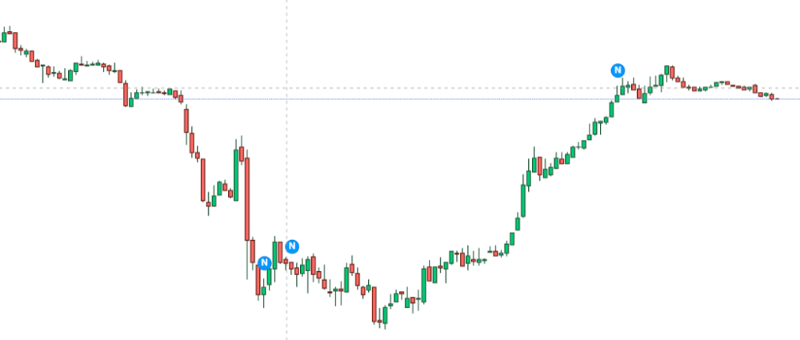

# 大逆转！OPEC+会谈推迟到下周，油价盘中跌超5%后几乎收复失地

由于难以统一产量共识，本月由23个成员国组成的OPEC+会议推迟，谈判艰难程度超出市场预期。OPEC+推迟会议的决定让许多成员国也大跌眼镜。

周三，OPEC表示，原定于11月26日举行的OPEC+会谈将推迟四天，到11月30日，油价跌幅应声扩大。

**OPEC代表们对媒体表示，沙特阿拉伯与成员国们就产量水平进行了艰难的谈判。**
消息出来后，WTI原油、布伦特原油持续走低，北京时间周三晚间约11点，盘中一度重挫约5%。

**有业内人士直言，“这种级别会议的改期是一件大事。一般不会那样做。”**

SEB首席大宗商品分析师Bjarne Schieldrop表示， **本次的OPEC+会议“将是一场痛苦的讨论”：**

现在OPEC+必须在即将举行的会议上发出强烈信号。我认为沙特将要求科威特、伊拉克和阿联酋进一步削减产量，这将是一场痛苦的讨论。

油价“神反转”

不过此后，油价逐渐攀升，持续收复失地。 **截至北京时间周四凌晨原油期货收盘时，美油、布油已收复当日绝大部分失地，仅小幅收跌。** WTI
1月原油期货收跌0.67美元，跌幅0.86%，报77.10美元/桶，盘中一度跌超5.1%。布伦特1月原油期货收跌0.49美元，跌幅0.59%，报81.96美元/桶。

刺激上述油价走势大反转的原因，与媒体关于本次OPEC+会议的争议焦点报道有关。媒体最新报道称，OPEC+推迟产量会议的主因可能是沙特等摆不平非洲产油国。与会代表们透露，
**安哥拉和尼日利亚对话语权更大的大产油国压低其配额的做法感到不满，各方需要更多时间进行谈判。**

作为6月达成的协议的一部分，阿联酋有权在明年1月小幅增产。目前尚不清楚该国有没有面临放弃增产的压力。

OPEC+稳油价政策压力山大

上周，由于库存增加和对全球经济放缓的担忧，供应紧张的担忧消退，原油期货大跌，给OPEC+的稳油价政策带来更大压力。

高盛Daan Struyven和Callum Bruce等分析师认为，原油价格大跌，
**“主要意外因素是非核心OPEC成员国产量远强于预期，部分抵消了OPEC核心成员国的减产”** 。

在OPEC+会议前可能会有一些测试性（措施），他们曾多次在油价处于每桶82-85美元的范围内宣布减产或延长减产。我们目前的预期是，沙特的减产会完全延续到明年上半年，我们预期OPEC+不会做整体性减产。

沙特和俄罗斯今年已通过减产来支撑价格。OPEC领导者沙特阿拉伯重申其打算在年底前每天减产100万桶。俄罗斯还表示，将继续减产30万桶/日，直至12月底。

但减产的效果越来越微弱，反而供应似乎正在稳步增长——尤其是非OPEC国家的供应。

例如，美国、加拿大、巴西和圭亚那的产量都在快速增长，美国上周石油产量维持在历史最高，石油出口量也在飙升。巴西政府设定了到2029年成为全球第四大石油生产国的目标。伊拉克表示途经土耳其的管道在关闭半年多后随时可以恢复45万桶/日的出口。

**这些非OPEC国家的供应增加，可能迫使OPEC+进一步减产。**

上周，有四位熟悉沙特政府想法的人士对媒体透露，OPEC“带头大哥”沙特极有可能将当前预定在年底结束的100万桶/日自愿减产至少延长到明年春季。以沙特和俄罗斯为首的产油国联盟OPEC+可能会考虑再额外削减产量最多100万桶/日。此后伴随着会议的临近，还有一些人预测，沙特可能劝说其他成员国加入自己的额外限产措施。

华尔街见闻此前曾介绍，由于沙特的经济改革计划要求油价接近每桶100美元，而低于80美元会让沙特和俄罗斯政府预算开始紧张，
**因此OPEC+深化减产早在部分华尔街主流分析师的预期之中。**

