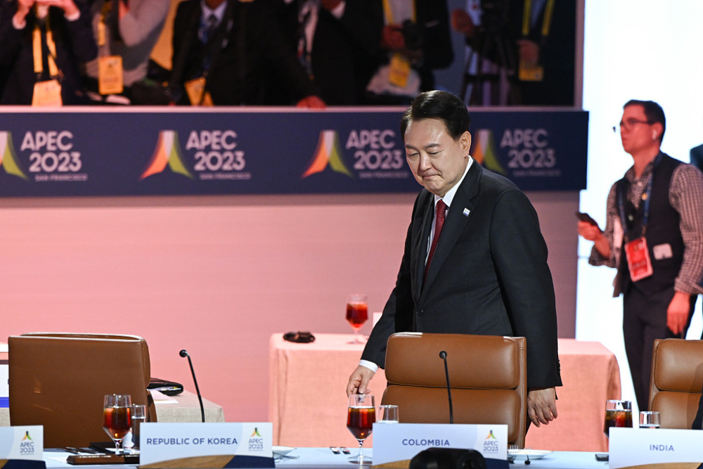

# 尹锡悦涉华表态在韩引质疑，韩国教授：访问英国为什么要攻击中国？

【环球时报驻韩国特约记者
丁玲】在亚太经合组织（APEC）第三十次领导人非正式会议行程结束后，韩国总统尹锡悦自20日起对英国进行为期4天的国事访问，并将于23日启程对法国进行访问。然而，尹锡悦在出访前接受英国《每日电讯报》专访时发表一系列涉华言论，不仅引起中方不满，同时也在韩国国内引发质疑。

_2023年11月16日，韩国总统尹锡悦参加亚太经合组织（APEC）领导人非正式会议第一阶段会议。（视觉中国）_

据韩联社20日报道，尹锡悦在《每日电讯报》的专访中表示，在维护东亚及国际社会的自由、和平、繁荣方面，中国的作用至关重要。尹锡悦宣称，韩国政府一贯坚持基于相互尊重、互利互惠的原则发展健康成熟的韩中关系，韩国推进与美、英、澳等国的“密切安全合作”，是因为俄乌冲突、巴以冲突、俄朝合作、南海局势紧张等。他强调维护台海和平稳定、基于规则树立南海等域内海洋秩序的重要性。

针对尹锡悦的上述言论，中国外交部发言人毛宁20日在例行记者会上强调称，作为负责任大国，中方一直在国际地区事务中发挥着重要的建设性作用。中方清楚自己的责任和利益，我们做什么和不做什么不需要别人指手画脚。台湾问题纯属中国内政，决不允许任何外部势力干涉。关于南海问题，中国和东盟国家有能力、有信心、有智慧处理好这个问题。韩国不是南海问题当事方，没必要凑热闹。

“尹锡悦访问英国为啥要攻击中国？”韩国《税收日报》22日以此为题报道称，由于未能在APEC峰会期间与中国领导人举行正式元首会谈，尹锡悦的外交政策正受到批评。在这一背景下，韩国光云大学教授金希教21日下午在韩国MBC电视台一档时事新闻节目中表示，尹锡悦在访英前接受《每日电讯报》的书面采访内容很是异常。“鉴于这是书面采访，采访内容肯定都经过总统办公室秘书官、外交和安保高官审阅，但这似乎跟走过场一样”，金希教质疑道，“访问英国为什么要攻击中国？”

金希教认为，中国之所以对尹锡悦发表的内容表示不满，是因为即使不太懂外交的人也“能看出（尹锡悦总统的）言辞是对中国的攻击”，“我认为这番话是他访问英国前故意说的”。

金希教接着直言不讳地批评称，如果此次接受英媒采访不是故意的，那么也是一次失败的采访。他提及在APEC峰会期间最受瞩目的中美元首会晤，称“连美国在台湾问题上的立场都有所松动，韩国现在提出台湾问题有什么好处？我怀疑他们这样做是因为一些与国家利益毫无关系的原因”。金希教认为，韩国现任政府寻求与中国进行经济和军事对抗是出于国内政治需要，如果是口头采访出现上述言论可以看作一种“失误”，但作为书面采访，这个就是龙山总统府“有意对外放话”。

韩国《中央日报》22日也评论称，如同此次APEC峰会期间中韩没能举行正式元首会谈一样，难道韩国已经在中国外交上成为可有可无的存在吗？实际上，中韩之间仍然互为重要国家。为此，韩国需要制定更加缜密的对华战略。

文章认为，虽然韩国不应对华奉行“低姿态外交”，但也应避免不必要地刺激对方。尹锡悦总统每次与外媒见面时都毫不避讳地提及南海或台湾问题，这并不是一个好策略。文章警告称，中国外交部已对尹锡悦总统接受英媒采访的涉台言论提出批评，如果此类事件不断发生，韩方就无法将韩中关系引导到想要的方向。

