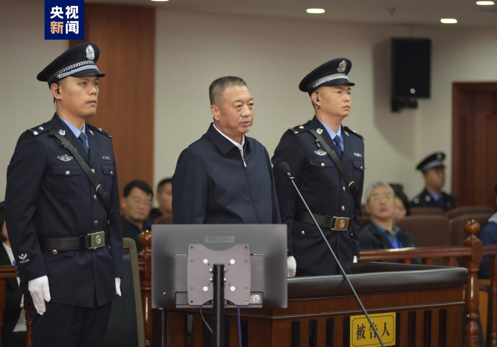
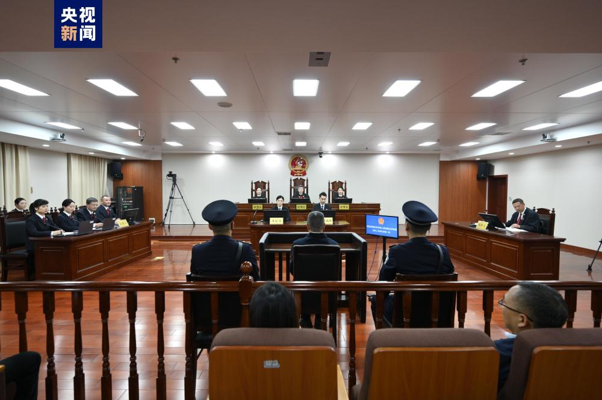
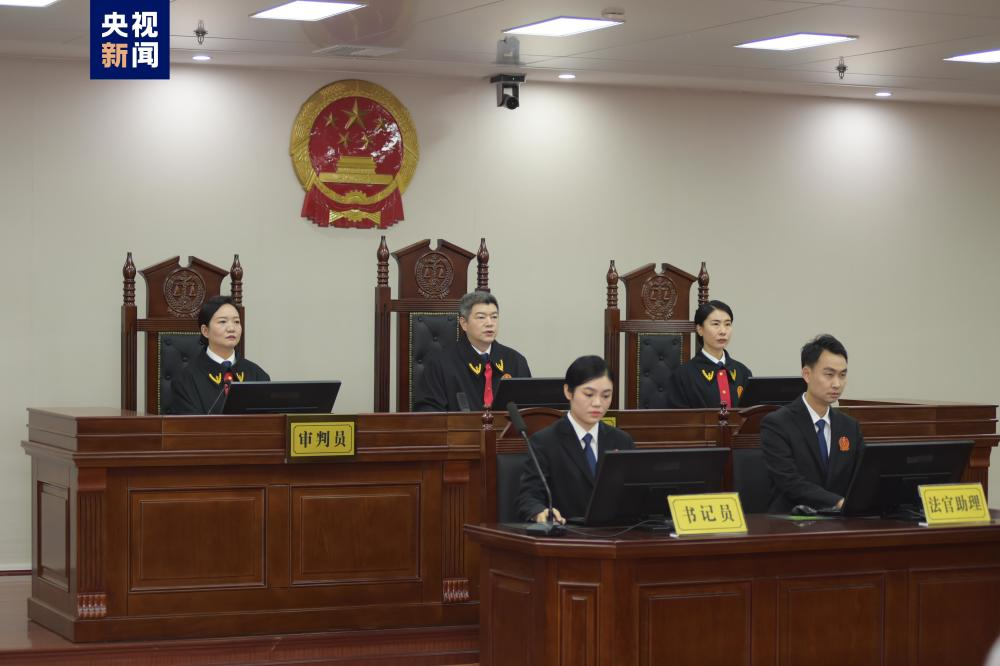

# 广东省人大常委会原副主任李春生受贿案一审开庭

2023年11月23日，湖南省郴州市中级人民法院一审公开开庭审理了广东省人大常委会原党组副书记、副主任李春生受贿一案。

郴州市人民检察院指控：2001年下半年至2022年5月，被告人李春生利用担任河南省新县县长、县委书记，公安部政治部副主任、人事训练局局长，广东省副省长、省公安厅厅长，广东省人大常委会党组副书记、副主任等职务便利以及职权、地位形成的便利条件，为有关单位和个人在企业经营、项目推进、工程承揽、职务晋升等事项上提供帮助，非法收受他人给予的财物，折合人民币共计7940万余元。检察机关提请以受贿罪追究李春生的刑事责任。

庭审中，检察机关出示了相关证据，被告人李春生及其辩护人进行了质证，控辩双方在法庭的主持下充分发表了意见，李春生进行了最后陈述，并当庭表示认罪悔罪。庭审最后，法庭宣布休庭，择期宣判。

人大代表、政协委员及各界群众三十余人旁听了庭审。

（总台央视记者 奚丹霓 张赛）

来源：央视新闻客户端

