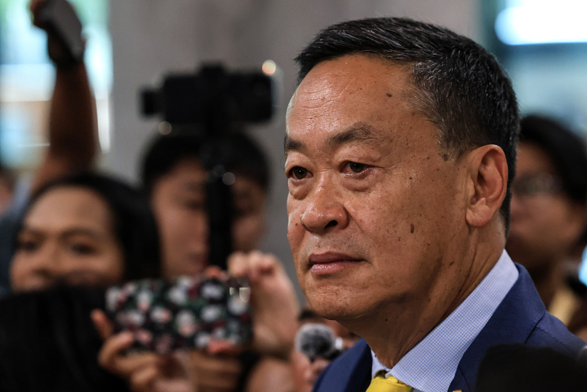

# 曼谷街头现数名中国乞讨者，泰总理澄清：与此前实施的免签政策无关

【环球时报驻泰国特派记者 杨一】曼谷街头出现数名中国籍乞讨者的情况近日在泰国引发关注。泰国总理赛塔22日澄清称，此事与泰国对中国游客实行免签政策无关。

_泰国总理赛塔 资料图_

19日下午，泰国社会发展与人类安全部与曼谷警方在一家百货公司逮捕了一名试图躲避警方的中国籍女性乞讨者。在现场搜查中，警方发现大量硬币和面额为20泰铢（约合4元人民币）的纸币，猜测是女子乞讨所得，但未在其身上找到护照或其他身份证明。该女子有手部残疾且面部有烧伤痕迹，此类乞讨者近日引发警方关注，泰国社会发展与人类安全部部长也下令对此进行紧急调查，以查明是否涉及国际人口贩运。

据泰国《曼谷邮报》等媒体22日报道，11月10日至20日，泰国警方在曼谷逮捕6名中国籍乞讨者，对他们处以100至500泰铢不等的罚款，并将他们全部列入黑名单，禁止其在未来10年入境泰国。据报道，这些乞讨者每天收入可高达1万铢。警方怀疑，这个乞讨团伙可能是一个跨国人口贩卖集团。

目前，泰国警方已成立行动小组，准备对该乞讨团伙的幕后黑手实施抓捕。同时，曼谷警方也与移民警察开展信息协调合作，旨在加强对中国游客的入境检查和管理，并观察他们的身体状况，如是否有烧伤等，以防非法乞讨行为再次发生。

面对中国籍乞讨者与泰国对中国游客实行免签政策有关的质疑，泰国总理赛塔22日表示，政府部门正在跟进相关情况，中国籍乞讨者和中资灰产团伙在泰国存在已久，与此前实施的免签政策无关。泰国有关部门会对相关情况作进一步调查，并依法采取相关措施。

中国驻泰使馆22日也就相关报道回应称，已派领事官员对当事人进行了领事探视。中方一贯要求来泰中国公民遵守泰国法律、尊重当地习俗，也重视维护其合法权益。中方相信泰政府有关部门和警方会尽快查明真相，依法妥善处理。

**此前报道：**

[泰媒：曼谷街头现多名中国籍毁容乞讨者 警方称或涉及人口贩卖](https://news.qq.com/rain/a/20231122A02ETX00)

