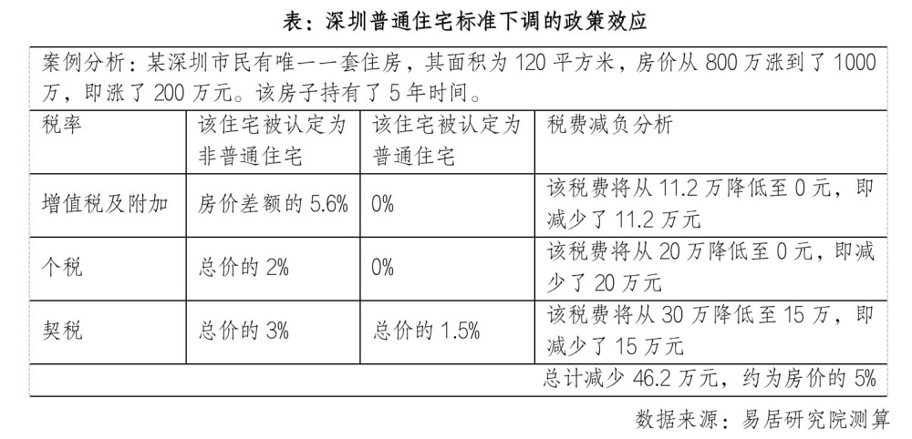

# 深圳楼市降首付首日：市场反应平淡，期待更多支持政策落地

界面新闻记者 | 王妤涵

在打造房地产新模式的政策框架下，各地新一轮楼市支持政策密集出台。

11月22日晚间，深圳发布了两条重要的购房政策。一是深圳二套房的首付降至40%；二是调整了普通住宅的认定标准，取消了原有的750万“豪宅线”。两大政策均从今日（11月23日）起开始执行。

深圳贝壳研究院院长肖小平认为，本次新政对一些改善性购房群体会有实际支持，预计这部分购房者会加速入市，最终推动成交量上升；二是对整体市场信心也会有提振作用，各个类型的购房者入市意愿会有所提升。

“但此次深圳调整楼市政策，没有从限购退出的角度入手，而是普通住房优惠标准和二套房首付比例，遵从降低住房交易成本，满足改善型住房需求的政策本源，也就是政策小步快跑，给下一步政策的调整预留了空间，落地的效果仍需观察”，广东省住房政策研究中心首席研究员李宇嘉表示。

11月23日晚间，对于政策出台首日线下门店的表现，福田区链家的一名中介对界面新闻表示：“今天线下门店和之前相比没有太大变化，咨询量也是正常水平，整体较为平淡，政策下来短期肯定会刺激，利好一部分买家，但大部分人目前还是处于观望状态。”

二套房首付比例由之前的70%、80%统一降至40%

据新华社消息，11月22日，中国人民银行深圳市分行发布通知，从11月23日起调整二套住房最低首付款比例。二套住房个人住房贷款最低首付款比例由原来的普通住房70%、非普通住房80%统一调整为40%。

深圳也成为四个一线城市之中，继广州之后，第二个将二套住房首付比例进行下调的城市。

对此，易居研究院研究总监严跃进表示，该政策一方面有助于降低购房门槛和购房成本，利好购房需求的积极释放，是从支持合理住房消费需求尤其是改善型住房需求的角度出发的。

而另一方面，将过去按普通住宅和非普通住宅分类的标准，全部统一下调至40%首付这一操作，将有助于政策更好的执行和消化，尤其是对于认购非普通住宅的购房者来说，首付的减负效应会更加明显。

_首付减负效应分析图 图源：易居研究院_

据深圳贝壳研究院的问卷调查表明，近期计划在深圳购房的市民，第二次在深圳购房的占比为21%、第三次及以上在深圳购房的比例约13%，这些购房者或将是二套首付四成政策的直接受益者。

调整普通住宅的认定标准，取消此前的750万“豪宅线”

与此同时，深圳住房和建设局也在11月22日晚间，发布了关于调整享受优惠政策普通住房认定标准的通告。

通告显示，将原来规定的同时满足住宅小区建筑容积率1.0以上（含1.0）、单套住房套内建筑面积120平方米以下（含120平方米）或者单套住房建筑面积144平方米以下（含144平方米）、实际成交总价750万元以下（含750万元）等三个条件，调整为同时满足住宅小区建筑容积率1.0以上（含1.0）、单套住房套内建筑面积120平方米以下（含120平方米）或者单套住房建筑面积144平方米以下（含144平方米）等两个条件。

_截图来源：深圳住建局门户网站_

该政策的变化之处在于取消了此前的第三条“实际成交总价750万元以下（含750万元）”的规定，也就是取消了此前民间所说的750万“豪宅线”。

根据最新政策，“豪宅税”征税只依据面积和容积率作判定，对于总价已没有了要求。

政策实施后，相关房子从非普通住房性质调整为普通住房性质，在增值税、个税和契税等方面都会产生影响，将有效降低144平米以下高总价新房的交易税费，减少交易成本，对于房东或购房者压力的减少都具有非常重要的作用，利好二手房交易成本的降低。

_普宅标准下调减负效应分析图 图源：易居研究院_

据贝壳研究院统计，从深圳二手房挂牌房源的总价来看，目前约26%的房源挂牌价在750万以上，这部分房源当中有64%是建筑面积在144平方米以下的，换算一下，约17%的挂牌房源是这次豪宅线调整的直接受益者。

“此轮深圳楼市调整的幅度在一线城市中是最大的”，广东省住房政策研究中心首席研究员李宇嘉介绍，从2021年5月份至今，深圳二手房价格连续下跌了两年半左右，目前新房和二手房成交量依旧在历史低位徘徊，市场预期同其他几个一线城市相比较为悲观。

在经历了8月底“认房不认贷”政策、9月下调个人住房贷款利率后，深圳楼市复苏仍显乏力，市场表现并不乐观。

据国家统计局最新数据显示，10月深圳二手房售价环比上月降低0.5%，同比下降1.3%。在乐有家研究中心此前统计的数据显示，10月乐有家门店成交的二手房源中，已经有超七成是低于参考价出售的。

而位于深圳福田皇岗、龙岗坂田、罗湖蔡屋围、龙华民治等地区的二手房均价已从去年的8-9万元/平方米下降至目前的5-7万元/平方米。

在新房市场上，据乐有家研究中心监测，10月深圳一手商品住宅成交2654套，环比上升27.8%，同比下跌20.3%；成交面积261130.82平方米，环比上升24.8%，同比下跌21.3%。

新房成交数据虽然在10月份有了小幅回升，结束了8、9月的“两连降”局面，但整体规模依旧处于较低水平。

此次两大重磅政策叠加出台，将给深圳楼市带来极大的提振，对刚需和改善型购房需求的释放，以及二手房的盘活等带来积极作用。

据严跃进预测，政策落实后，深圳市场势必会做出相应反应，其中包括购房意向的明显增强、中介营销公司调整营销策略、房源挂牌量的增加、某些大户型或大平层的交易量的上升等等。而随着此类市场的活跃，一些受政策影响较大的区域如南山、前海等豪宅区域其交易会明显提振。

与此同时，深圳此举也具有风向标得意义，为后续一线城市的政策动向预判创造了更好的条件。

