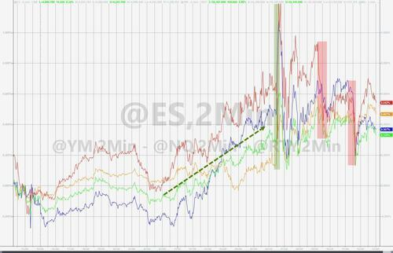
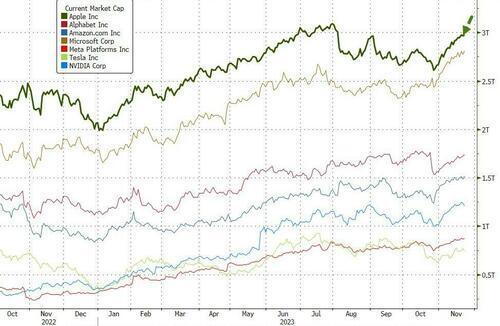
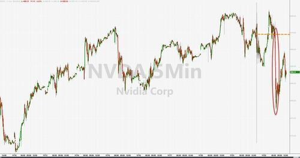
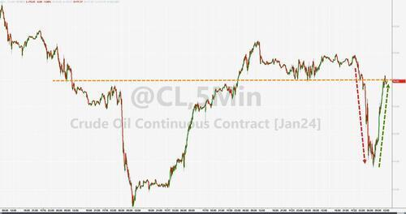
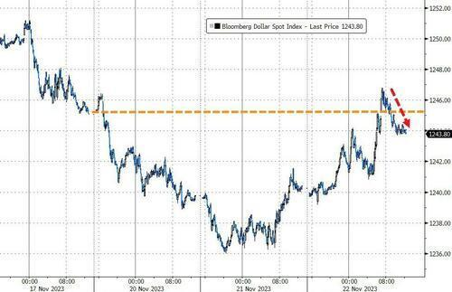

# 美股收盘：道指标普重返三个多月高位，油价盘中大跌5%，美债V型反弹

**美国经济数据好坏参半。**
上周首申失业救济人数低于预期和前值，跌至20.9万创五周新低，表示劳动力市场持续紧张。但10月耐用品订单环比下跌5.4%，创三个月最大降幅且远逊预期，扣除飞机的非国防资本耐用品订单环比跌0.1%，代表商业投资指标不振。11月密歇根大学消费者信心指数连降四个月至六个月低位，一年通胀预期七个月最高，五年通胀预期十二年最高。

欧洲央行副行长金多斯警告，市场不要对经济软着陆抱有一厢情愿的乐观幻想，地缘政治风险升级可能引发金融市场调整。他认为2024年欧元区不会衰退，但现在谈论降息为时过早。鹰派票委、德国央行行长内格尔称，无法判断是否还将加息，欧洲央行接近终端利率应有的水平。

美联储11月会议纪要发布后，期货市场押注12月不加息概率为95%，略低于一天前的接近100%。最早明年3月降息的概率从29%降至24%，5月开始降息概率维持在60%的高位。高盛预期欧洲央行从2024年三季度开始降息，且当前已完成加息，明年欧美央行或都降息100个基点。

英国财长宣布个人与企业减税、制造业投资和提高最低工资等政策，将投资5亿英镑使英国成为人工智能“强国”，削减2023/24财年的债券发行，但总规模仍高于市场预期，并上调2024/25财年至2027/28财年的赤字预期，令英国长债收益率大幅上涨。

美股齐涨，道指涨超180点，与标普重返三个多月新高，微软再新高，英伟达一度跌4.5%

**11月22日周三是感恩节假期前美股和美债市场最后一个交易日**
，美股集体高开，道指开盘便涨超百点，盘中最高涨超220点。科技股居多的纳指涨1%后涨幅砍半，标普能源板块跌超1%、追随重挫5%的油价。纳指科技指数则在盘初涨超1%，时隔一个交易日再度刷新盘中历史最高。

**截至收盘，**
道指重返8月14日以来的三个多月最高，标普大盘和纳指均在七个交易日里第六天上涨，标普重返8月1日来最高，纳指接近周一所创的7月31日来最高，罗素小盘股也接近周一所创的两个月高位，纳指100重上1.6万点，逼近周一所创的2022年1月以来近两年最高：

标普500指数收涨18.43点，涨幅0.41%，报4556.62点。道指收涨184.74点，涨幅0.53%，报35273.03点。纳指收涨65.88点，涨幅0.46%，报14265.86点。

罗素2000小盘股指数涨0.7%，纳指100涨0.4%，衡量纳指100中科技公司表现的纳斯达克科技市值加权指数（NDXTMC，简称纳指科技指数）涨0.3%，接近周一所创的历史收盘最高。“恐慌指数”VIX跌近4%并失守13，多日连创9月15日以来的两个月低位。

_纳指涨1%后涨幅砍半，道指标普重返三个多月新高_

美股三大指数均将月内累涨，纳指11月迄今累涨11%，道指和标普500指数分别涨超6%和8%。其中，标普科技板块飙升超12%领跑，涨约10%的通信服务和非必需消费品类股紧跟，月内仅能源板块唯一下跌，而年内迄今科技和通信服务板块均大涨50%，非必需消费品涨近32%。

瑞银全球财富管理的美国首席投资官Solita Marcelli称，人工智能需求将在今年带动科技股上涨。数据供应商Adobe
Analytics表示，美国消费者假日购物季初期的网上消费增幅超出预期，预计在本周的黑五促销活动期间消费额将达96亿美元，同比增长5.7%。RBC展望标普明年创新高。

**明星科技股齐涨，**
仅特斯拉跌近3%至一周低位，结束三日连涨。元宇宙”Meta涨1.3%重返两年最高，亚马逊涨约2%至19个月最高，微软涨1.3%至历史盘中和收盘最高，苹果涨0.4%至三个半月最高，奈飞涨0.6%至22个月最高，谷歌A涨超1%至四周最高。

_大型科技股除特斯拉外齐涨，苹果盘中市值触及3万亿美元_

**芯片股也普涨，**
但英伟达跌4.5%后收跌2.5%至一周多最低，从历史最高连跌两日。费城半导体指数涨0.3%，重新逼近三个半月最高。英特尔接近抹去盘初2.3%的涨幅，离19个月高位不远，AMD涨近3%至五个月最高。

_英伟达跌4.5%后收跌2.5%，从历史最高连跌两日_

**AI概念股涨跌不一** ，C3.ai和BigBear.ai的涨幅均显著收窄至1%，SoundHound.ai涨超2%，昨日跌超7%的Palantir
Technologies再度小幅下跌，进一步脱离两年高位。

消息面上，Sam
Altman重返OpenAI担任CEO，董事会大换血。微软未来两年投资5亿美元，扩大在加拿大魁北克的超大规模云计算和人工智能基础设施。苹果市值一度重返3万亿美元。英伟达第三财季营收、盈利和数据中心收入均超预期，下季度将受芯片出口限制负面拖累，但预言将连续两个季度营收增长超200%，摩根士丹利等多家投行上调目标价，最高或再涨40%。

**热门中概指数上涨。** ETF
KWEB涨0.5%，CQQQ跌0.4%，纳斯达克金龙中国指数（HXC）涨0.5%，周一曾创近六周最高，在九日里第七天上涨。

纳斯达克100成份股中，京东涨0.8%，百度涨近6%，拼多多微涨。其他个股中，阿里巴巴微涨，腾讯ADR跌0.1%，B站跌1%。蔚来汽车跌0.5%，小鹏汽车涨0.1%，理想汽车跌近2%后收跌0.3%。

消息面上，阿里内网披露，马云一股都没有出售，未来也会长期持有阿里股票，上周监管文件显示，马云计划出售1000万股、价值约8.7亿美元。Nomura将百度ADR评级上调至买进，目标价145美元。估值或达900亿美元，SHEIN被曝秘密交表赴美IPO。

**银行股指徘徊一周低位**
。行业基准费城证交所KBW银行指数（BKX）涨0.2%，继续脱离8月14日以来的三个月最高，10月底曾创2020年9月以来的三年最低。KBW纳斯达克地区银行指数（KRX）涨0.4%，仍远离9月1日以来高位，5月11日曾创2020年11月来最低。

**其他变动较大的个股包括：**

农机巨头迪尔公司一度跌7%，2024年净利润指引逊于预期，显示农民对设备的需求放缓。

服装零售商盖尔斯（Guess）一度跌近14%，三季度净营收逊于预期。连锁百货诺德斯特龙（Nordstrom）最深跌8%，三季度营收不佳。服装与家居用品零售商Urban
Outfitters跌超12%创两年最大跌幅，三季度同店可比销售未达预期。

波音涨1.5%后涨幅砍半，连涨四日至两个半月最高。美国联邦航空管理局FAA批准737 Max
10喷气式飞机进行认证飞行测试，为明年首次商用交付这一Max系列最大机型铺路。

昨日涨近11%的“越南特斯拉”VinFast Auto一度涨近10%，券商Wedbush
Securities首次给出跑赢大盘评级并暗示股价将翻倍，看好未来几年实现可盈利的增长。

**欧股普涨仅英股下跌。** 泛欧Stoxx
600指数收涨0.30%，刷新9月20日以来的两个月最高，旅游休闲板块涨1.5%领跑，油气股跌1.7%。德国股指创逾三个月新高，法国股指创两个月新高。

10年期美债收益率跌至两个月最低后V型反弹，转涨至日高，11月骤降约50个基点

美国消费者通胀预期连续第二个月上升，且劳动力市场数据保持韧性，美债收益率短线拉升。两年期收益率突破4.9%，10年期基债收益率从美股盘初跌至的两个月最低反弹。

对货币政策更敏感的两年期美债收益率最高上行约6个基点至4.94%，收复上周二以来近半跌幅。30年期长债收益率跌3个基点至4.55%，是11月16日以来最大单日跌幅。

“全球资产定价之锚”10年期美债收益率一度跌5个基点至4.36%，创9月20日来最低，随后转涨并最高涨3个基点至4.45%，尾盘再度下跌且连跌五个交易日，创4月5日以来最长连跌周期。11月迄今，10年期美债收益率下行约50个基点，由于市场笃定美联储已完成加息。

_10年期美债收益率跌至两个月最低后V型反弹_

欧元区基准的10年期德债收益率尾盘微跌至2.56%，10月初曾触及十二年最高至3.024%，上周五跌至2.55%创两个半月最低；两年期收益率涨约4个基点并站稳3%，上周跌穿2.92%至五个月最低，7月曾创十五年最高3.39%。负债较深外围国家基准的10年期意债收益率持平于4.32%，10月曾创十一年最高5.025%。10年期英债收益率涨5个基点，30年期收益率涨10个基点。

OPEC+会议延期带来减产无能担忧，油价盘中重挫5%或跳水4美元，尾盘跌幅显著收窄

原定于周日举行的OPEC+产量决策会议推迟四天至11月30日，国际油价盘中重挫5%。WTI
1月期货收跌0.67美元，跌幅0.86%，报77.10美元/桶。布伦特1月期货收跌0.49美元，跌幅0.59%，报81.96美元/桶。

美油WTI最深跌近4美元或跌5.1%，日低失守74美元，盘中抹去上周五以来大部分涨幅，美股午盘后跌幅显著收窄并重返77美元。布油最深跌4美元或跌4.9%，日低下逼78美元，随后重上80美元心理整数位关口。

 _油价盘中重挫5%或跳水4美元，尾盘跌幅显著收窄_

有分析称，OPEC+推迟重要会议被解读为沙特与其他成员国无法就明年减产达成一致，加速油价抛售，也带动商品货币澳元兑美元下跌。同时，美国上周EIA商用原油库存增近900万桶，远超预期和前值，汽油库存不降反升，都暗示需求不振。

而油价尾盘跌幅显著收窄的原因在于，有报道称，沙特及其盟友对安哥拉和尼日利亚等非洲产油国的配额左右为难，迫使OPEC+推迟11月产油政策会议，与中东产油大国之间的意见分歧无关。

欧洲基准的TTF荷兰天然气期货涨2%，脱离六周低位，ICE英国期货也小幅上涨0.6%，重返110便士/千卡整数位上方。美国天然气一度涨超2%脱离近七周低位。

美元指数一度升破104脱离两个半月最低，离岸人民币最深跌320点并失守7.17元

衡量兑六种主要货币的一篮子美元指数DXY最高涨0.6%并一度升破104关口，脱离8月31日以来的两个半月最低，周内止跌转涨。但美元11月累跌约2.6%，或创一年来最差单月表现。

_美元指数一度升破104脱离两个半月最低_

**非美货币普跌。**
欧元兑美元进一步脱离三个月最高且失守1.09，英镑跌穿1.25脱离两个月高位。日元兑美元跌穿149或最深跌0.9%，止步四日连涨脱离两个月最高，全年累跌12%。

离岸人民币一度跌穿7.17元，较上日收盘最深跌320点，暂离近四个月最高，为五个交易日首日走低，周二盘中曾升破7.13元。

**主流加密货币上涨。**
市值最大的龙头比特币站稳3.7万美元上方，逼近上周所创的去年4月来最高。第二大的以太坊涨5%并突破2070美元，月初曾升破2100美元至七个月高位。币安币跌8%后转涨4%，美国司法部与币安达成和解以结束刑事调查，币安一天内资金流出超10亿美元。

_比特币站稳3.7万美元上方_

黄金失守2000美元脱离三周新高，伦铜跌1%脱离两个多月高位，镍跌超3%至两年半最低

美元和美债收益率转涨并刷新日高压低金价。COMEX 12月黄金期货收跌0.44%，报1992.80美元/盎司，脱离三周高位。COMEX
12月白银期货收跌0.76%，报23.688美元/盎司。

现货黄金在美股盘中转跌0.6%并失守2000美元心理整数位，日低一度跌穿1990美元，昨日曾升破2007美元创三周最高。

但澳新银行称，美国通胀降温提高了加息周期结束的前景，宏观经济背景正在转向支持黄金，美债收益率和美元因此走弱增加了黄金的投资吸引力。瑞银认为，考虑到美联储将在某个时刻降息，金价下跌或为很好的买入契机，预测金价将在2024年底涨至2150美元创历史最高。

_黄金失守2000美元脱离三周新高_

**美元走高和感恩节假期前获利了结，压低伦敦工业基本金属价格。**
经济风向标“铜博士”止步三日连涨，跌超1%并失守8400美元，脱离9月15日以来的两个多月最高。

伦铝跌1.8%脱离两周高位。伦锌跌2%至三周最低。伦铅跌2.2%进一步远离去年5月来最高。伦锡跌超1%至一周半最低。伦镍跌3.3%刷新2021年4月以来的两年半最低。有分析称，LME锌库存在一周内增加两倍多至逾两年最高水平，供应增加也在冲击镍价。

此外，内盘燃油期货夜盘收跌超5.7%，低硫燃油跌超4.6%，追随WTI跌超5%的表现，内盘沪镍期货夜盘收跌2.4%，沪铅跌约1.3%。

