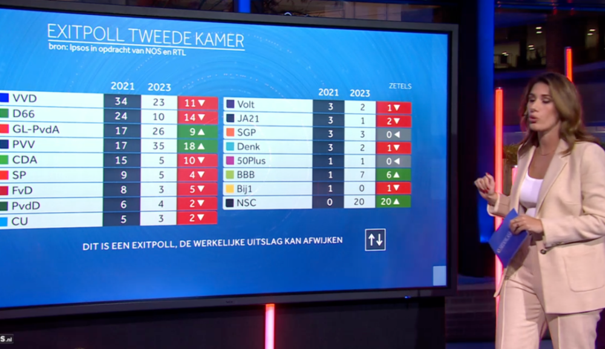

# 荷兰要变天了？大选出口民调初步结果：右翼自由党成为第一大党

当地时间11月22日是荷兰大选的投票日，定时发布投票率。据荷兰媒体NOS报道，晚 9 点，投票站关闭，投票的初步结果将陆续公布，从这个时刻开始，NOS
将通过电视、电台、网站NOS.nl 和应用程序公布这次选举的结果。

根据9时发布的初步结果，投票率比2017年的大选投票率81.9%要低。

而出口民调公布的初步结果，自由党以35席的绝对的胜利成为了第一大党！

“出口民调”
（exitpolls），是指在选举进行期间，设于票站出口，访问刚完成投票的人其投票意向的民意调查。其主要目的是为了分析及解读选民的投票行为，并即时知道选举的形势。但是，这种民调有误差，不过，只会相差一到两个席位。

计票的机制和程序具体是怎样运作的？

**第一步：出口民意调查**

NOS的电视(NPO1) 和广播电台 (NPO Radio1) 从晚上 8时30分左右开始直播选举的结果。
晚上九点整，所有的注意力都集中在初步的出口民意调查（exitpolls）上。

“出口民调”，是指在选举进行期间，设于票站出口，访问刚完成投票的人其投票意向之民意调查。其主要目的是为了分析及解读选民的投票行为，并即时知道选举的形势。

这是调查机构益普索（Ipsos）的调查人员代表荷兰两大媒体 NOS 和 RTL News 在全国 60
个投票站进行的一种影子选举结果调查，这些投票站的选择方式，能够基本反映荷兰所有选民的投票行为，还有投票率。但是，这并非最后的精确结果。

实践表明，出口民意调查可以比较可靠地反映第二议院席位的分配情况。重要的是要记住，益普索的这个结果，每个党派都有一个席位的误差幅度，在特殊情况下也可以是两个席位。

换句话说，如果在出口民意调查中，一个政党获得 28 个议会席位，另一个政党获得 26 席，但是，他们最终都可能获得 27 个席位。
因此，出口民意调查不可能说谁是最大的政党，因为有两个席位或更小的差距。

半小时后，益普索将再次发布更新的最新消息。虽然第一次出口民意调查基于晚上 8时30分
之前的投票，但这也能包括最后半小时的投票。通常，会导致很少甚至不会产生变化，这是有可能的。

**第二步：每个城市的结果**

晚上 9 点到 10 点之间，第一批选举结果将通过荷兰新闻通讯社 ANP的选举服务机构陆续公布。
荷兰三个最小的城市，每个城市的投票居民都不超过一千人，历年来在每次选举中都竭尽全力获得第一名。近年来，一直是斯希蒙尼克奥格（Schiermonnikoog）赢得了这场竞争的胜利，弗利兰（Vlieland）和海尔德兰省的罗森达尔（Rozendaal）被抛在后面。

第一批稍大的城市只会在晚上 10时30分 开始公布投票率和选举结果，从晚上11时开始，结果的传递速度更加放慢
，选举结果的计算需要较长时间的市政府，较晚才能到达。

在上一次的荷兰国会选举中，直到周四上午零时44分，第一个居民超过 10
万的城市其选举结果才出现在选举委员会的资料中，当时是北荷兰省的阿尔克马尔。政府的内政部希望今年事情进展会更快一些。

**第三步：预测**

当晚深夜，荷兰新闻通讯社ANP 将首次发布第二议院席位分配的“临时”预测，注意，是“临时”的预测。
由于这些结果是基于实际的结果，因此应该比先前的出口民意调查更加准确。

NOS晚间广播很可能已经停止，但早上 6 点广播（NOS Radio 1 Journaal）和早上 6时30分（NPO1的NOS Journaal
）早间节目再次开始，其中选举结果的报道是重中之重。

周四晚些时候，当收到所有结果后，ANP 希望能将“临时预测”转变为“最终的预测”。如果尚未收到主要城市的结果，这是不可能的。
该新闻通讯机构继续谈论的只是“预测”，因为选举的结果，必须正式由选举委员会确定。

**第四步：最终结果的公布**

一周后，即 12 月 1 日，结果将在荷兰中央选举委员会的公开会议上正式公布。
到那时我们就知道谁将在议会席位上就座，因为届时优先选票的票数也将公布。如果名单上排名靠后的候选人获得足够多的优先选票，他们可以越过排名较高的本党同志而当选。

