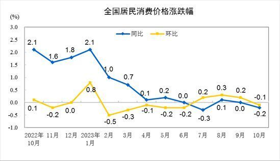

# 31省份10月CPI出炉：20地物价下降，黔豫晋“七连降”

中新经纬11月24日电
(王永乐)日前，国家统计局公布了31省份2023年10月居民消费价格指数(CPI)。中新经纬梳理发现，10月，20省份CPI同比下降。其中，贵州、河南、山西等3省份物价连续七个月回落。

_图源：国家统计局网站_

**20省份CPI同比下降**

**贵州等3地“七连降”**

国家统计局数据显示，2023年10月，全国CPI环比下降0.1%，同比下降0.2%，同比时隔两个月后再度出现负增长。

中新经纬梳理发现，31省份10月CPI同比延续“跌多涨少”格局。其中9省份同比上涨，20省份同比下降，涨、跌省份较上月分别减少1个和增加3个。

具体来看，青海、天津、内蒙古、上海、河北、黑龙江、广东、海南、甘肃等9省份同比上涨，北京、浙江持平，江苏、江西、安徽、辽宁、湖南、云南、陕西、宁夏、吉林、福建、山东、广西、四川、湖北、山西、重庆、西藏、河南、贵州、新疆等20省份同比下降，其中，贵州、河南、山西等3省份物价连续七个月回落，新疆是唯一降超1%的省份。

另外，从增减幅来看，海南增幅最大，为0.7个百分点；新疆降幅最大，为1.4个百分点。

中国民生银行首席经济学家温彬分析称，10月CPI走势是继9月之后的第二个月走弱，整体物价运行尚未远离“类通缩”特征。

从原因看，一方面食品价格对物价的拖累影响较为明显，另一方面，耐用消费品价格整体偏弱。尽管2023年以来服务需求整体在复苏，但也易受到节日等季节性因素影响而出现波动。

**未来CPI怎么走？**

展望下阶段物价走势，机构普遍预计CPI同比仍将维持在低位区间徘徊。

渤海证券宏观报告分析称，当前猪肉供给充足，但基数开始步入走低阶段，食品价格对CPI同比的拖累或将有所好转。同时，原油供给压力边际缓解，11月上旬油价回落，能源通胀对CPI同环比的支撑将有减弱。整体上看，CPI同比仍将以稳为主。

东方金诚首席宏观分析师王青表示，受上年同期基数较快下沉影响，11月CPI同比有望回正，但在消费需求不振影响下，环比走势仍将温和，这也意味着物价还将低位运行一段时间。

华西证券认为，去年11月及12月基数相对较低叠加气温转冷猪肉需求恢复带动猪价小幅回升，年内小幅转正问题不大，CPI年底同比增速或在0.5%附近，全年平均0.4%。

国家统计局新闻发言人、总经济师、国民经济综合统计司司长刘爱华11月15日在发布会上表示，下阶段价格低位运行的状况将会逐步缓解，不会出现通货紧缩。
(中新经纬APP)

**(文中观点仅供参考，不构成投资建议，投资有风险，入市需谨慎。)**

**中新经纬版权所有，未经书面授权，任何单位及个人不得转载、摘编以其它方式使用。**

